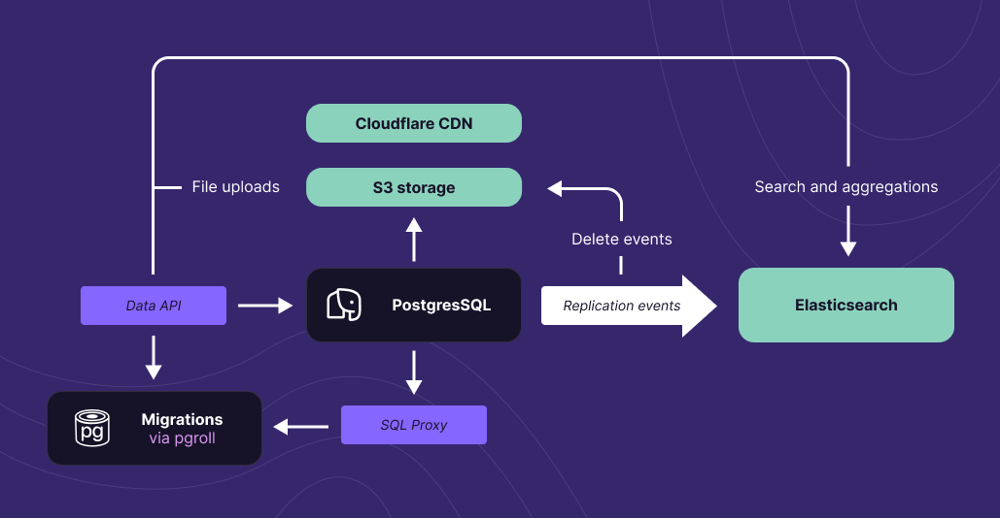
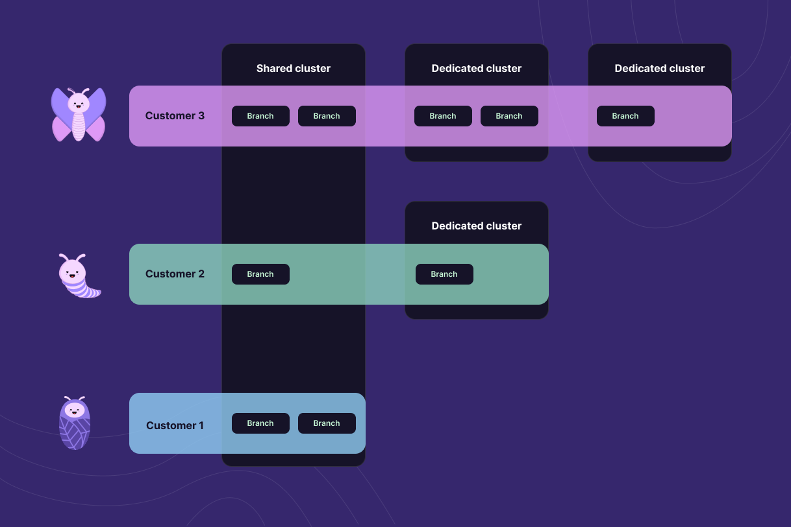

**Xata is a serverless data platform for PostgreSQL that optimizes for reliability, scalability, and developer experience.**

On top of the usual Postgres functionality, Xata provides a set of features that make it easier to build modern applications:

- **Branching**: Create a new branch of your data to work on new features or experiments without affecting the main branch. The branching can also be used for tenant separation, allowing you to create a branch for each of your customers.
- **[Zero-downtime schema migrations](/docs/getting-started/workflow)**: Make changes to your production database with zero-downtime, reversible schema migrations and data backfilling. This functionality is powered by our open-source project [pgroll](https://github.com/xataio/pgroll).
- **[File attachments](/docs/sdk/file-attachments)**: Store and retrieve files up to 1GB, including images, videos, and audio files. The files are stored in object storage and automatically cached on a global CDN for fast delivery. From the application point of view, however, it's just another column in the database.
- **[Image transformations](/docs/sdk/image-transformations)**: Any images stored with File Attachments can perform powerful at-will image transformations.
- **[Full-text search](/docs/sdk/search)**: Data is automatically replicated into a full-text search engine, making it easy to build search experiences, supporting fuzzy search, weights, and relevancy boosters.
- **[Vector search](/docs/sdk/vector-search)**: Easily store embeddings and implement similarity search to power your AI applications.
- **Collaborative dashboard**: A web-based console to manage your data, including schema and data.
- **SDKs**: Xata comes with vertically integrated SDKs for popular programming languages, including [TypeScript](/docs/sdk/typescript/overview), [JavaScript](/docs/sdk/typescript/overview), [Python](/docs/sdk/python/overview), and [Go](/docs/sdk/go/overview). In addition, Xata works with any [PostgreSQL client or ORM](/docs/postgres/).

In order to provide these features, Xata uses other data stores in addition to PostgreSQL, namely [Elasticsearch](https://github.com/elastic/elasticsearch/) for full-text search, aggregations and vector search, [S3](https://aws.amazon.com/s3/) for file attachments, and the [Cloudflare CDN](https://www.cloudflare.com/application-services/products/cdn/) for file delivery and image transformations. The Postgres logical replication events are used to keep these data stores in sync with the main database.

Access to the underlying data is provided in two main ways:

- Via the PostgreSQL wire protocol, which is mediated by our SQL Proxy.
- Via our SDKs, which provide a higher-level interface to the data.

## Who is Xata built for?

Individuals and indie developers like Xata because it is easy to get started, has a generous free-tier, accelerates development speed and solves common problems in a developer-first way (e.g. file attachments, full-text search, vector search).

Companies and larger teams like Xata because it is cost-efficient, consolidates tooling and reduces the operational load with its auto-scaling nature. Branching, and zero-downtime migration workflows means that your team can iterate faster when performing complex schema changes.

## PostgreSQL, the Xata way

As per the [StackOverflow survey of 2023](https://survey.stackoverflow.co/2023/#section-most-popular-technologies-databases), PostgreSQL is currently the most popular database system on the planet. Started in 1983, the PostgreSQL open source project has a long history of reliability and an ever growing community. For many developers, PostgreSQL is the first choice for a database system, because of its ACID transactions, planner performance, JSON support, extensibility, and much more.

At Xata, we strive to provide the best PostgreSQL cloud service, on a few particular dimensions:

### Reliability

When it comes to the reliability of the core database service, we have a very [good track record](https://www.xatastatus.com/history) and offer [SLAs](TODO) on our Pro plans and above. Our technology choices are relatively conservative, as we make use of [AWS Aurora](https://aws.amazon.com/rds/aurora/), a managed PostgreSQL service used at scale by some of the largest businesses in the world.

Even on the free tier we offer high-availability and redundancy, with replicas running in multiple availability zones. The failover from the primary instance to a replica is automatic and it's guaranteed to have no data loss. At the storage layer, the data is synchronously replicated to six storage nodes across three availability zones.

On the paid plans, we offer point-in-time-recovery (PITR) and our support team will help you restore the whole database or only parts of the database (e.g. specific tables or rows) as per our support [SLA times](TODO).

### Cost efficiency

Xata achieves cost efficiency for as many use cases as possible is by offering a high degree of optionality. The innovation of the Xata service is that we make it really easy to move from one type of cluster to another, without downtime. This means that you can easily try your workload on different types of clusters and see which one is the most cost-efficient for you.

At small scale, we offer a free tier that includes high-availability and read replicas, no cold-starts, and no instance-pausing after a few days. We can offer this sustainably because the free tier makes use of [shared clusters](#Infrastructure-optionality) and auto-scaling.

At large scale, you pay for the resources you use and you have a high degree of control. For example, for predictable load, you can configure a particular instance size, while for unpredictable load, auto-scaling will likely be more cost-efficient. Similarly, you can choose between standard storage and I/O optimized storage, which is more cost-efficient for I/O-heavy workloads.

### Scalability

Available instance types in Xata go up to 128 vCPUs and 1TB of RAM (for example, `db.r6i.32xlarge`). Storage can be scaled up to 128TiB per cluster. That is quite a lot of headroom for vertical scaling.

When it comes to horizontal scaling, the fact that you can create databases and branches instantly and that you can move them between clusters without downtime, opens up several architectural possibilities. For example, you can create a logical database for each of your customers, and place them in different regions. See the section on [Global control plane for databases and branches](#global-control-plane-for-databases-and-branches) for more details.

### Infrastructure optionality

There are two types of clusters powering the Xata service: shared and dedicated. Database branches can be created on both types of clusters, and they can be moved seamlessly between them, without downtime. A common scenario is to use a dedicated cluster for the production branch and shared clusters for the dev branches.

#### Shared Postgres clusters

These are multi-tenant clusters that are shared between multiple customers. This is the default in the Xata service, and if you don't have a dedicated cluster, your databases will be automatically created on a shared cluster.

Shared clusters are cost-efficient and are the reason we can sustainably offer a generous free-tier. The main billing metric for shared clusters is the storage size, with compute being bundled in. Shared clusters come with [rate and concurrency limits](/docs/rest-api/limits) to prevent abuse. This means that they are typically cost efficient for applications with relatively small database sizes and low to moderate traffic.

Shared clusters are limited when it comes to the PostgreSQL functionality that is enabled. Custom functions, extensions and triggers are not allowed in order to protect the security of the cluster.

Nevertheless, branches on shared clusters have zero cold starts, they are never paused, and come with high-availability and redundancy built-in, even on the free tier. The shared clusters are powered by AWS Aurora, which separates storage from compute and offers fast failover and point-in-time-recovery (PITR) backups.

#### Dedicated Postgres clusters

These are single-tenant clusters that are dedicated to a single customer. You can create multiple Xata databases or branches on a dedicated cluster, and you can move them between clusters (including shared clusters) without downtime.

Unlike the shared clusters, the dedicated clusters offer the full set of PostgreSQL functionality, including custom functions, extensions, and triggers. They have no rate limits and no concurrency limits, and are limited only by the compute size.

Xata dedicated clusters separate storage from compute. Storage and compute are billed separately for dedicated clusters. As storage scales automatically you will only get billed for what you use. In addition, the storage pricing is significantly cheaper than the storage pricing for shared clusters. The compute is billed by the hour depending on the instance size and characteristics.

The above means that the dedicated clusters are typically cost-efficient for applications with larger database sizes and higher traffic.

There are two kind of instance types to be used in dedicated clusters:

- **Provisioned**, which are more cost effective for applications with predictable workloads.
- **Auto-scaling**, which are more cost effective for applications with unpredictable workloads.

The dedicated clusters, both provisioned and auto-scaling, are powered by AWS Aurora. The auto-scaling functionality is provided by AWS Aurora Serverless v2.

You can find more information about Dedicated Postgres clusters [here](/docs/dedicated-cluster).

### Integrated secondary data stores

While PostgreSQL is an incredibly versatile database good for almost any starting application, we are of the opinion that it is not the best tool for every job.

A good example of this is our [File Attachments](/docs/sdk/file-attachments) feature. While it is possible to store files as BLOBs in PostgreSQL, it would be expensive and inefficient to do so. Instead, we use S3 for file storage and the Cloudflare CDN for file delivery and image transformations.

Similarly, while PostgreSQL has full-text search capabilities, we can provide a significantly better full-text search experience by using Elasticsearch. A blog post comparing the two approaches is available [here](/blog/postgres-full-text-search-postgres-vs-elasticsearch).

The difference between Xata and a cloud provider that provides multiple DBaaS offerings is that in Xata the secondary data stores are **integrated**, meaning that the data is automatically replicated and kept in sync. Also, they are available via the same SDKs and APIs and authorization works the same way.

### Global control plane for databases and branches

Xata databases and branches are `logical` entities, represented in the underlying PostgreSQL databases as schemas. This means that they can be created and destroyed instantly, and can be moved between clusters without downtime. They can be created in any of the regions where Xata is available and accessed via the same credentials.

This provides a lot of flexibility in a number of scenarios, for example:

- A user might start a personal project using the free tier on shared clusters. As the project grows, they might move it to a dedicated cluster, and then to a different region, without downtime.
- A company might have two dedicated clusters: one for their production branch, and one for all their dev branches. Or they can use shared clusters for the dev branches.
- A company might create a different Xata database for each of their micro-services, ensuring that there is isolation between the services, yet they can all share the same dedicated cluster.
- A company might have databases in multiple regions, either on shared clusters or dedicated clusters, depending on the size of each region.
- A company might create a branch for each of their customers, potentially with different schemas for each and potentially in multiple regions. The largest customers get dedicated clusters, while others are kept on shared clusters.

### Vertically integrated Data API and SDKs

Xata provides several ways to access your data:

- Via the [Postgres wire protocol](/docs/postgres/), using any Postgres client, ORM, or BI tool.
- Via [SQL over HTTP](/docs/sdk/sql/overview), which especially is useful when calling Xata from serverless functions, because it doesn't require persistent connections.
- Via the Xata Data API, which is a [RESTful API](/docs/rest-api) that provides a higher-level abstraction over the database, and provides access to data platform functionality like full-text search, aggregations, and file attachments.

The Xata SDKs support all three methods above, so it easy to switch between them depending on the use case. The SDKs are available for multiple programming languages, including [TypeScript](/docs/sdk/typescript/overview), [JavaScript](/docs/sdk/typescript/overview), [Python](/docs/sdk/python/overview), and [Go](/docs/sdk/go/overview) and are continuously tested with the Xata service.
