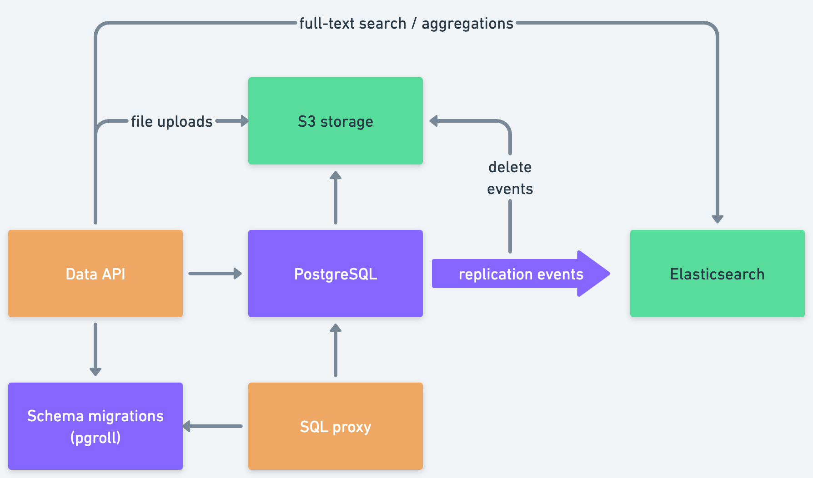

Xata is a serverless data platform for PostgreSQL that optimizes for reliability, scalability, and developer experience.

On top of the usual Postgres functionality, Xata provides a set of features that make it easier to build modern applications:

- **Branching**: Create a new branch of your data to work on new features or experiments without affecting the main branch. The branching can also be used for tenant separation, allowing you to create a branch for each of your customers.
- **Zero-downtime schema migrations**: Make changes to your production database with zero-downtime, reversible schema migrations and data backfilling. This functionality is powered by our open-source project [pgroll](https://github.com/xataio/pgroll).
- **File attachments**: Store and retrieve files up to 1GB, including images, videos, and audio files. The files are stored in object storage and automatically cahced on a global CDN for fast delivery. From the application point of view, however, it's just another column in the database.
- **Full-text search**: Data is automatically replicated into a full-text search engine, making it easy to build search experiences, supporting fuzzy search, weights, and relevancy boosters.
- **Vector search**: Easily store embeddings and implement similarity search to power your AI applications.
- **Admin UI**: A web-based console to manage your data, including schema and data.
- **SDKs**: Xata comes with vertically integrated SDKs for popular programming languages, including TypeScript, JavaScript, Python, and Go. In addition, Xata works with any PostgreSQL client or ORM.

In order to provide these features, Xata uses other data stores in addition to PostgreSQL, namely Elasticsearch for full-text search and aggregations, S3 for file attachments, and the Cloudflare CDN for file delivery and image transformations. The Postgres logical replication events are used to keep these data stores in sync with the main database.

Access to the underlying data is provided in two main ways: via the PostgreSQL wire protocol, which is mediated by our SQL Proxy, and via our SDKs, which provide a higher-level interface to the data.

Individual and indie developers like Xata because it is easy to get started, has a generous free-tier, offers a nice admin UI, and solves common problems in a developer centric way (e.g. file attachments, full-text search, vector search).

Companies and larger teams like Xata because it is cost-efficient and reduces the operation load. Branching and the zero-downtime migration workflow mean that the team can move faster when it comes to complex schema changes.

## Why Postgres?

As per the [StackOverflow survey of 2023](https://survey.stackoverflow.co/2023/#section-most-popular-technologies-databases), PostgreSQL is currently the most popular database system on the planet. Started in 1983, the PostgreSQL open source project has a long history of reliability and a huge and growing community. Here are some of the reasons why we chose Postgres as the foundation for Xata:

**Safe**: Postgres comes with ACID transactions and its transaction isolation levels are [well documented](https://www.postgresql.org/docs/current/transaction-iso.html), making it easy to create correct applications that are easy to reason about. It also provides a lot of mechanisms for data integrity, including constraints, triggers, and foreign keys.

**Performant**: Postgres transactions are implemented via a multi-version concurrency control (MVCC) system, which means it is very good at handling concurrent writes. The Postgres query planner is sophisticated and can handle complex queries efficiently.

**No vendor lock-in**: PostgreSQL is offered as a managed service by many cloud providers and it is open-source, so you can also always self-host if you choose to. In addition to this, the Postgres wire protocol is open and well-documented, and because of this it was adopted by other database systems as well (e.g. CockroachDB and YugabyteDB). This means that if your application depends on PostgreSQL, you are guaranteed to have a lot of options when it comes to hosting and scaling.

**Versatile**: Besides the usual relational database features, Postgres also has a rich set of data types, including JSON and geospacial data (via the PostGis extension). It also has row-level security, inverted indexes (GIN), and many other features that make it a good fit for a wide range of applications.

**Extensible**: Postgres has a rich ecosystem of extensions and new extensions can be written in multiple programming languages, including C, [Rust](https://github.com/pgcentralfoundation/pgrx), and [Zig](https://github.com/xataio/pgzx) (pgzx is maintained by Xata). New extensions can add new data types, new indexing methods, new query operators, and new procedural languages.

## Shared or dedicated clusters

There are two types of clusters powering the Xata service: shared and dedicated. Database branches can be created on both types of clusters, and they can be moved seamlessly between them, without downtime. It is common to use a dedicated cluster for the production branch and shared clusters for the dev branches.

### Shared Postgres clusters

These are multi-tenant clusters that are shared between multiple customers. This is the default in the Xata service, and if you don't have a dedicated cluster, your databases will be automatically created on a shared cluster.

Shared clusters are cost-efficient and are the reason for which we can sustainably offer such a generous free-tier. The main billing metric for shared clusters is the storage size, with compute being bundled in. They come with rate limits and concurrency limits to prevent abuse. This means that they are typically cost efficient for applications with relatively small database sizes and low to moderate traffic.

The shared clusters are limited when it comes to the PostgreSQL functionality that is enabled. For example, custom functions and triggers are not allowed, in order protect the security of the cluster.

Nevertheless, branches on shared clusters have zero cold starts, they are never paused, and come with high-availability and redundancy built-in, even on the free tier. The shared clusters are powered by AWS Aurora, which separates storage from compute and offers fast failover and point-in-time-recovery (PITR) backups.

### Dedicated Postgres clusters

<Alert status="warning">Dedicated clusters are currently in private alpha. Please reach out to request access.</Alert>

These are single-tenant clusters that are dedicated to a single customer. You can create multiple Xata databases or branches on a dedicated cluster, and you can move them between clusters (including shared clusters) without downtime.

Unlike the shared clusters, the dedicated clusters offer the full set of PostgreSQL functionality, including custom functions and triggers. They have no rate limits and no concurrency limits, and are limited only by the compute size.

Xata dedicated clusters separate storage from compute and the storage and compute are billed separately for dedicated clusters. The storage grows automatically and you only get billed for what you use. In addition, the storage pricing is significantly cheaper than the storage pricing for shared clusters. The compute is billed by the hour depending on the instance size and characteristics.

The above means that the dedicated clusters are typically cost-efficient for applications with larger database sizes and higher traffic.

There are two kind of instance types to be used in dedicated clusters:

- **Provisioned**, which are more cost effective for applications with predictable workloads.
- **Auto-scaling**, which are more cost effective for applications with unpredictable workloads.

The dedicated clusters, both provisioned and auto-scaling, are powered by AWS Aurora. The auto-scaling functionality is provided by AWS Aurora Serverless v2.

## More than PostgreSQL

While Xata is built on top of PostgreSQL, it is not a typical PostgreSQL DBaaS, but a _data platform around PostgreSQL_. The following are the charateristics of the data platform.

### Integrated secondary data stores

While PostgreSQL is an incredibly versitile database, and it's an excelent starting dataabse for almost any application, we are of the opinion that it is not the best tool for every job.

A good example of this is the File Attachments faeture. While it is possible to store files as BLOBs in PostgreSQL, it would be expensive and inefficient to do so. Instead, we use S3 for file storage and the Cloudflare CDN for file delivery and image transformations.

Similarly, while PostgreSQL has full-text search capabilities, we can provide a significantly better full-text search experience by using Elasticsearch. A blog post comparing the two approaches is available [here](https://xata.io/blog/postgres-full-text-search-postgres-vs-elasticsearch).

The difference between Xata and a cloud provider that provides multiple DBaaS offerings is that in Xata the secondary data stores are **integrated**, meaning that the data is automatically replicated and kept in sync. Also, they are avaiable via the same SDKs and APIs and authorization works the same way.

### Global control plane for databases and branches

Xata databases and branches are _logical_ entitites, represented in the underlying PostgreSQL databases as schemas. This means that they can be created and destroyed instantly, and they can be moved between clusters without downtime. They can also be created in any of the regions where Xata is available, yet accessed via the same credentials.

This provides a lot of flexibility in a number of scenarios, for example:

- A user might start a personal project using the free tier on shared clusters. As the project grows, they might move it to a dedicated cluster, and then to a different region, without downtime.

- A company might have two dedicated clusters: one for their production branch, and one for all their dev branches. Or they can use shared clusters for the dev branches.

- A company might create a different Xata database for each of their microservices, ensuring that there is isolation between the services, yet they can all share the same dedicated cluster.

- A company might have databases in multiple regions, either on shared clusters or dedicated clusters, depending on the size of each region.

- A company might create a branch for each of their customers, potentially with different schemas for each and potentially in multiple regions. The largest customers get dedicated clusters, while others are kept on shared clusters.

### Vertically integrated Data API and SDKs

Xata provides several ways to access your data:

- Via the Postgres wire protocol, using any Postgres client, ORM, or BI tool.
- Via SQL over HTTP, which especially is useful when calling Xata from serverless functions, because it doesn't require persistent connections.
- Via the Xata Data API, which is a RESTful API that provides a higher-level abstraction over the database, and provides access to data platform functionality like full-text search, aggregations, and file attachments.

The Xata SDKs support all three methods above, so it easy to switch between them depending on the use case. The SDKs are available for multiple programming languages, including TypeScript, JavaScript, Python, and Go and are continuously tested with the Xata service.
