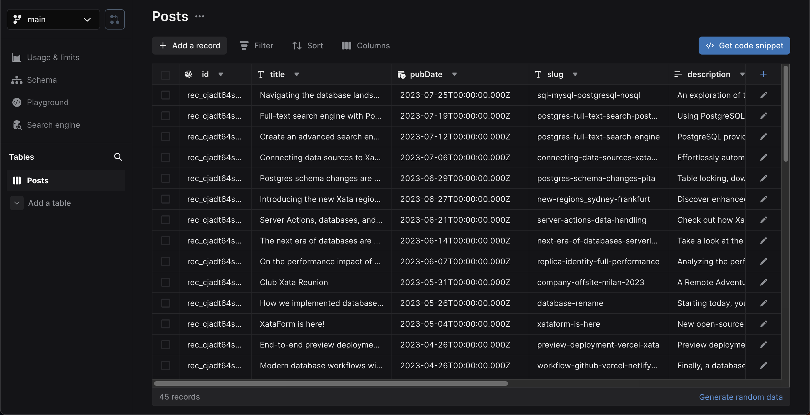
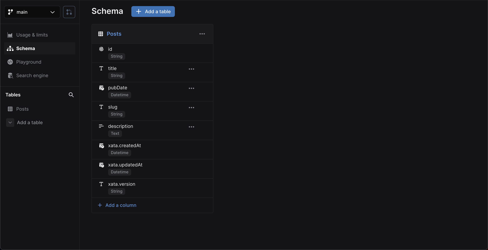
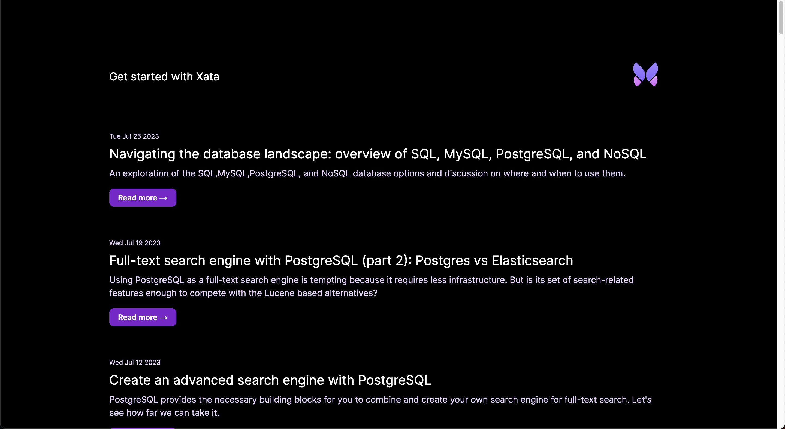
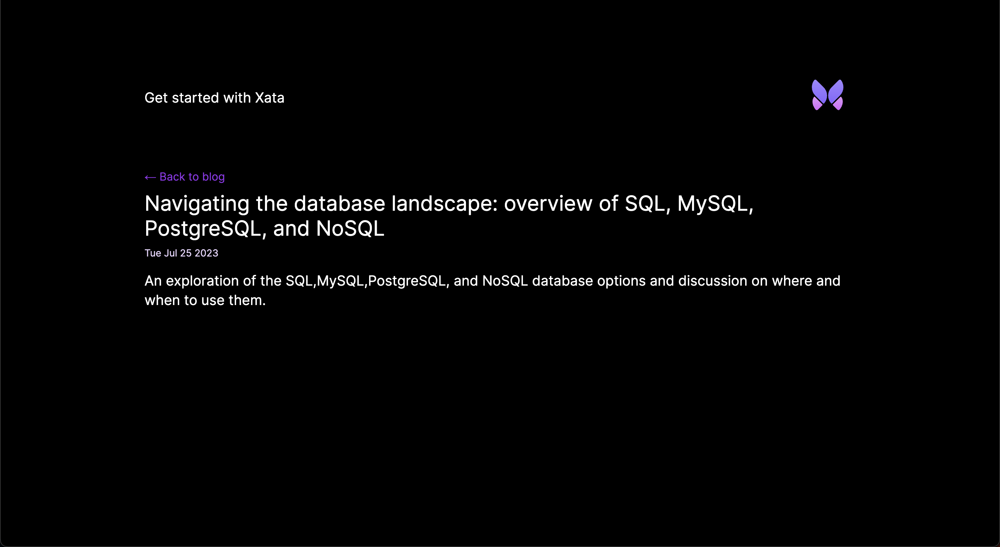
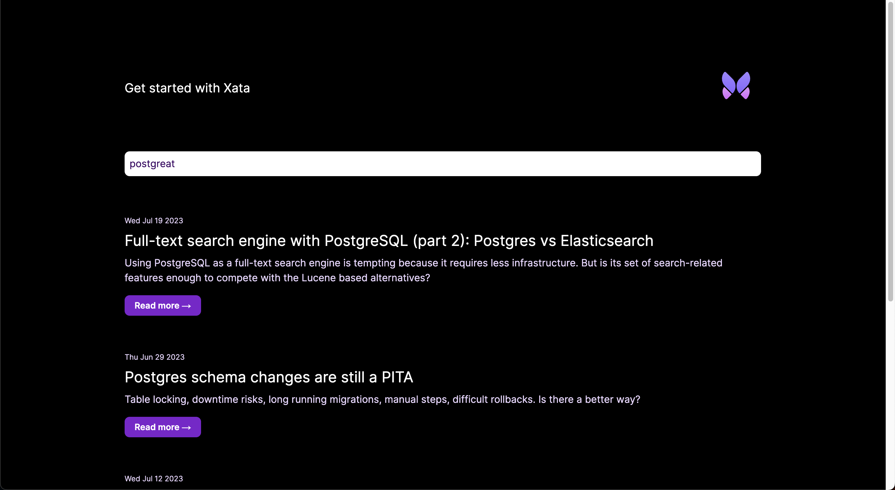

In this guide, you'll create a new [Next.js][2] application and walk through adding Xata database and search
functionality. You'll build the following basic blog application features:

1.  List all blog posts
2.  Retrieve and view a single blog post
3.  Full-text fuzzy search of blog posts

Although this application is a simple blog, you can apply these basics to other types of Next.js applications.

<ArticleVideo
  platform="html"
  src="https://github.com/xataio/mdx-docs/raw/main/010-Getting-started/videos/getting-started-app.mp4"
/>

The completed [Next.js and Xata code](https://github.com/xataio/examples/tree/main/apps/getting-started-nextjs) for this
guide is available via the [Xata `examples` repo](https://github.com/xataio/examples) on GitHub.

## Before you begin

Install the Xata CLI:

<TabbedCode tabs={['Shell', 'PowerShell']}>

```sh
npm install -g @xata.io/cli
```

```sh
npm install -g '@xata.io/cli'
```

</TabbedCode>

Once installed, authenticate the Xata CLI with your Xata account. If you don't already have an account, you can use the
same workflow to sign up for a new account. Run the following command to begin the authentication workflow:

```sh
xata auth login
```

Once completed, the command will create a new API key for your user account, which you should see in the ["Account
Settings" page in the Xata UI][1]. That key will also be stored locally on your computer (the location might vary for
depending on your operating system). It looks like this:

```toml
# .config/xata/credentials
[default]
apiKey=YOUR_API_KEY_HERE
```

## Create a new Next.js app

Begin by creating a new Next.js application:

```sh
npx create-next-app@latest --typescript xata-nextjs
```

<Expand title="Output for command: npx create-next-app">

```sh
$ npx create-next-app@latest --typescript xata-nextjs
Need to install the following packages:
create-next-app@13.4.13
Ok to proceed? (y)
✔ Would you like to use ESLint? … No / Yes
✔ Would you like to use Tailwind CSS? … No / Yes
✔ Would you like to use `src/` directory? … No / Yes
✔ Would you like to use App Router? (recommended) … No / Yes
✔ Would you like to customize the default import alias? … No / Yes
Creating a new Next.js app in ./xata-nextjs.

Using npm.

Initializing project with template: app-tw

Installing dependencies:

- react
- react-dom
- next
- typescript
- @types/react
- @types/node
- @types/react-dom
- tailwindcss
- postcss
- autoprefixer
- eslint
- eslint-config-next

added 314 packages, and audited 315 packages in 22s

107 packages are looking for funding run `npm fund` for details

found 0 vulnerabilities Initialized a git repository.

Success! Created xata-nextjs at ./xata-nextjs
```

</Expand>

Once the command has completed, go to the `xata-nextjs` directory and run the application:

```sh
cd xata-nextjs
npm run dev
```

By default, the application will run on `http://localhost:3000`.

## Create a new database

Once you have the Xata CLI installed, are logged in, and have set up a new Next JS application, you are ready to use the Xata CLI to generate a new database. Accept all the prompt defaults for the following command except for the region selection, where
you should choose the region closest to your application users:

```sh
xata init
```

<Expand title="Output for command: xata init">

```sh
$ xata init
🦋 Initializing project... We will ask you some questions.

You have a single workspace, using it by default: my-workspace-123456
✔ Select a database or create a new one › <Create a new database>
✔ New database name … xata-nextjs
✔ Select a region › eu-west-1
✔ Add .env to .gitignore? … yes
✔ Generate code and types from your Xata database › TypeScript
✔ Choose the output path for the generated code … src/xata.ts

Setting up Xata...

Created Xata config: .xatarc

Creating .env file
set XATA_API_KEY=xau**********************************
set XATA_BRANCH=main

Added .env file to .gitignore

i Running npm install --save @xata.io/client

added 1 package, and audited 316 packages in 992ms

107 packages are looking for funding
run `npm fund` for details

found 0 vulnerabilities

No new migrations to pull from main branch
Generated Xata code to ./src/xata.ts

✔ Project setup with Xata 🦋

i Setup tables and columns at https://app.xata.io/workspaces/my-workspace-123456/dbs/xata-nextjs:eu-west-1

i Use xata pull main to regenerate code and types from your Xata database
```

</Expand>

On completion, the CLI will create `.env`, `.xatarc`, and `src/xata.ts` files within your project folder with the
correct credentials to access your database.

Your `.env` file should look something like this:

```bash title=".env"
XATA_API_KEY=YOUR_API_KEY_HERE
XATA_BRANCH=main
```

Since you selected TypeScript support, it also created files that provide typings and functions to call using Xata's
TypeScript SDK. This will also be referenced in the `.xatarc` file as follows:

```json
{
  "databaseUrl": "https://my-xata-app-database-url",
  "codegen": {
    "output": "src/xata.ts"
  }
}
```

The `src/xata.ts` file includes generated code you should typically never manually configure.

## Define the database schema and import CSV data

You can use the [Xata UI][0] to manually define your schema and add data. However, for this guide, you'll use the Xata CLI and a CSV file to:

1.  Auto-generate a schema based on column headings for names and data types inferred from the column values
2.  Import data to the database

First, download the
[example blog posts CSV file](https://raw.githubusercontent.com/xataio/examples/main/seed/blog-posts.csv).
You can either do this manually or by running the following command:

<TabbedCode tabs={['Shell', 'PowerShell']}>

```sh
curl --create-dirs -o seed/blog-posts.csv https://raw.githubusercontent.com/xataio/examples/main/seed/blog-posts.csv
```

```sh
curl.exe --create-dirs -o seed/blog-posts.csv https://raw.githubusercontent.com/xataio/examples/main/seed/blog-posts.csv
```

</TabbedCode>

Next, import the CSV:

```sh
xata import csv seed/blog-posts.csv --table Posts --create
```

<Expand title="Output for command: xata import csv">

```sh
$ xata import csv seed/blog-posts.csv --table Posts --create
i 45 rows successfully imported 0 errors. 100% complete
✔ Completed
```

</Expand>

Now, if you open up the [Xata UI][1] and navigate to your database, you will see the **Posts** table. Alternatively,
you can run the command `xata browse` to open a browser window:



Click **Schema** to see the schema definition with the inferred data types:



You'll also see `xata.*` [special columns](/docs/concepts/data-model#special-columns) automatically
created and maintained by Xata.

With the database schema in place, the final step is to generate the code that allows you to access and query the data
from our Next.js application. To do this, run:

```sh
xata pull main
```

<Expand title="Output for command: xata pull main">

```sh
$ xata pull main
Successfully pulled 1 migrations from main branch
Running codegen...
Generated Xata code to ./src/xata.ts
```

</Expand>

This updates the contents of `src/xata.ts` based on the schema defined on the `main` branch of our database. If you
make any further changes to the schema, run `xata pull <branch>` to update the auto-generated code.

## Basic styling and layout

Update `src/app/layout.tsx` to contain the following code to add some basic common structure to the application:

```tsx title="src/app/layout.tsx" {26}
import './globals.css';
import type { Metadata } from 'next';
import { Inter } from 'next/font/google';

const inter = Inter({ subsets: ['latin'] });

export const metadata: Metadata = {
  title: 'Get started with Xata and Next.js'
};

export default function RootLayout({ children }: { children: React.ReactNode }) {
  return (
    <html lang="en">
      <body className={inter.className}>
        <main className="flex flex-col items-center p-8 lg:p-24 min-h-screen">
          <div className="z-10 h-50 w-full max-w-5xl items-center justify-between text-xl lg:flex">
            <p className="fixed left-0 top-0 flex w-full justify-center pb-6 pt-8 lg:static lg:w-auto bg-gradient-to-b from-white via-white via-65% dark:from-black dark:via-black lg:bg-none">
              <a href="/">Get started with Xata and Next.js</a>
            </p>
            <div className="fixed bottom-0 left-0 flex w-full items-end justify-center bg-gradient-to-t from-white via-white dark:from-black dark:via-black lg:static lg:h-auto lg:w-auto lg:bg-none">
              <a href="https://xata.io" className="w-20">
                
              </a>
            </div>
          </div>
          {children} // [!code highlight]
        </main>
      </body>
    </html>
  );
}
```

Ensure the `{children}` are rendered before the closing `</main>` element.

## Query and list the posts

Now, you're ready to integrate Xata into the Next.js codebase. Let's start by stripping back the landing page,
`src/app/page.tsx`, to a bare template:

```tsx title="src/app/page.tsx"
export default async function Home() {
  return (
    <>
      <div className="w-full max-w-5xl mt-16">No posts</div>
    </>
  );
}
```

Next, import the auto-generated `getXataClient` function from `src/xata.ts`, get all the posts using the client, and
list them within the page:

```tsx title="src/app/page.tsx" {1-3,6,10-27}
import { getXataClient } from '@/xata';

const xata = getXataClient();

export default async function Home() {
  const posts = await xata.db.Posts.getAll();

  return (
    <>
      <div className="w-full max-w-5xl mt-16">
        {posts.length === 0 && <p>No blog posts found</p>}
        {posts.map((post) => (
          <div key={post.id} className="mb-16">
            <p className="text-xs mb-2 text-purple-950 dark:text-purple-200">{post.pubDate?.toDateString()}</p>
            <h2 className="text-2xl mb-2">
              <a href={`posts/${post.slug}`}>{post.title}</a>
            </h2>
            <p className="text-purple-950 dark:text-purple-200 mb-5">{post.description}</p>
            <a
              href={`posts/${post.slug}`}
              className="px-4 py-2 font-semibold text-sm bg-purple-700 text-white rounded-lg shadow-sm w-fit"
            >
              Read more &rarr;
            </a>
          </div>
        ))}
      </div>
    </>
  );
}
```

Let's break down what's happening in the code above.

First, import the `getXataClient` function and assign the result of calling that function to a variable named `xata`:

```tsx
import { getXataClient } from '@/xata';

const xata = getXataClient();
```

Then, in the `Home` function, use the `xata` client instance to get all the posts stored in the database. You achieve this via the auto-generated `Posts` property, which exposes a number of helper functions. In this case, use the [`getAll`](/docs/sdk/get#the-typescript-sdk-functions-for-querying) function to get all the Post records.

```tsx
export default async function Home() {
  const posts = await xata.db.Posts.getAll();

  ...
}
```

<Alert status="warning">
  `getAll()` returns all the records in the query results. This is dangerous on large tables (more than 10,000 records),
  as it will potentially load a lot of data into memory and create a lot of requests to the server. In most situations,
  you should use `getMany()` or `getPaginated()`. See the [querying
  documentation](/docs/sdk/get#the-typescript-sdk-functions-for-querying) for more information.
</Alert>

Finally, update the UI to display the result of the `getAll` call. If no Post records are present (`posts.length === 0`), the message
"No blog posts found" is displayed. Otherwise, loop through the `posts` using `posts.map` and access the columns of
each Post record using their properties: `id` as a unique identifier for the `key` attribute, `pubDate` to show the date
the blog post was published, `slug` to link to individual blog posts (which you'll use later), `title` for the title of
the post, and `description` for the textual description of the post:

```tsx
<div className="w-full max-w-5xl mt-16">
  {posts.length === 0 && <p>No blog posts found</p>}
  {posts.map((post) => (
    <div key={post.id} className="mb-16">
      <p className="text-xs mb-2 text-purple-950 dark:text-purple-200">{post.pubDate?.toDateString()}</p>
      <h2 className="text-2xl mb-2">
        <a href={`posts/${post.slug}`}>{post.title}</a>
      </h2>
      <p className="text-purple-950 dark:text-purple-200 mb-5">{post.description}</p>
      <a
        href={`posts/${post.slug}`}
        className="px-4 py-2 font-semibold text-sm bg-purple-700 text-white rounded-lg shadow-sm w-fit"
      >
        Read more &rarr;
      </a>
    </div>
  ))}
</div>
```

This results in the page looking like the following:



You'll notice that the post heading and "Read more →" text use the `slug` property to link to a page that doesn't
presently exist. That's the next step in this guide.

## Query and show a single posts

To handle the single post identified by a `slug`, use Next.js
[dynamic routes](https://nextjs.org/docs/app/building-your-application/routing/dynamic-routes).

Create a new file, `src/app/posts/[slug]/page.tsx`, where the Next.js framework uses the directory `[slug]` to capture
the name of the slug:

```tsx title="src/app/posts/[slug]/page.tsx" {1,10}
export default async function Post({ params }: { params: { slug: string } }) { // [!code highlight]
  return (
    <div className="w-full max-w-5xl mt-16">
      <p className="mb-2">
        <a href="/" className="text-purple-600">
          &larr; Back to blog
        </a>
      </p>

      <h1 className="text-3xl mb-2">{params.slug}</h1> // [!code highlight]
    </div>
  );
}
```

Above, the slug value is passed into the function via a `params` parameter and accessed using `params.slug`.

Next, let's update the page to bring in the Xata client and use the slug value to fetch the post from the database:

```tsx title="src/app/posts/[slug]/page.tsx" {1-3,5-6,16-18}
import { getXataClient } from '@/xata'; // [!code highlight]
 // [!code highlight]
const xata = getXataClient(); // [!code highlight]

export default async function Post({ params }: { params: { slug: string } }) { // [!code highlight]
  const post = await xata.db.Posts.filter({ slug: params.slug }).getFirst(); // [!code highlight]

  return (
    <div className="w-full max-w-5xl mt-16">
      <p className="mb-2">
        <a href="/" className="text-purple-600">
          &larr; Back to blog
        </a>
      </p>

      <h1 className="text-3xl mb-2">{post?.title}</h1> // [!code highlight]
      <p className="text-sm mb-4 text-purple-950 dark:text-purple-200">{post?.pubDate?.toDateString()}</p> // [!code highlight]
      <p className="text-xl">{post?.description}</p> // [!code highlight]
    </div>
  );
}
```

The Xata client is imported and initialized in the same way as it is in the landing page by assigning the return value
of `getXataClient` to a `xata` variable.

```tsx
import { getXataClient } from '@/xata';

const xata = getXataClient();
```

Retrieve the single post from the database via the auto-generated `Posts` property. Use the
[`filter` function](/docs/typescript-client/get#the-typescript-sdk-functions-for-querying) to query
the table for a row where the `slug` column equals the value of `params.slug`. Finally, use the
[`getFirst` function](/docs/typescript-client/get#the-typescript-sdk-functions-for-querying) to return
the first (and only) Post result.

```tsx
export default async function Post({ params }: { params: { slug: string } }) {
  const post = await xata.db.Posts.filter({ slug: params.slug }).getFirst();

  ...
}
```

Finally, the values, `title`, `pubDate`, and `description`, for the Post are added to the UI:

```tsx
<h1 className="text-3xl mb-2">{post?.title}</h1>
<p className="text-sm mb-4 text-purple-950 dark:text-purple-200">
  {post?.pubDate?.toDateString()}
</p>
<p className="text-xl">{post?.description}</p>
```

The single blog post page will look as follows:



## Search posts

The last piece of functionality to be added to the application is full-text fuzzy search of blog posts.

When you insert data into a Xata database, it is automatically indexed for full-text search. You don't need to change
any configuration to enable search, you just need to use the [TypeScript SDK search feature](/docs/sdk/search).

Let's add this functionality to the landing page:

```tsx title="src/app/page.tsx" {5,6-11,15-24}
import { getXataClient } from '@/xata';

const xata = getXataClient();

export default async function Home({ searchParams }: { searchParams: { q: string } }) { // [!code highlight]
  let posts = null; // [!code highlight]
  if (searchParams.q) { // [!code highlight]
    const { records } = await xata.db.Posts.search(searchParams.q, { fuzziness: 2 }); // [!code highlight]
    posts = records; // [!code highlight]
  } else { // [!code highlight]
    posts = await xata.db.Posts.getAll(); // [!code highlight]
  }

  return (
    <> // [!code highlight]
      <div className="w-full max-w-5xl mt-16"> // [!code highlight]
        <form> // [!code highlight]
          <input // [!code highlight]
            name="q" // [!code highlight]
            defaultValue={searchParams.q} // [!code highlight]
            placeholder="Search..." // [!code highlight]
            className="w-full rounded-lg p-2 dark:text-purple-950" // [!code highlight]
          /> // [!code highlight]
        </form> // [!code highlight]
      </div>
      ...
    </>
  );
}
```

Here's a breakdown of the changes introduced above.

First, update the main function to accept search parameters. You achieve this by having the function accept an object
with a `searchParams` property. When a search has been performed, `searchParams` will optionally have a `q` property
access via `searchParams.q`.

```tsx
export default async function Home({ searchParams }: { searchParams: { q: string } }) {
  ...
}
```

Secondly, the landing page should list all blog posts if the `searchParams.q` property isn't present. However, if
the property is present, a search is performed on the Posts table using the
[`search` function](/docs/typescript-client/search#searching-in-a-single-table) exposed on the
auto-generated `Posts` property. Pass `searchParams.q` as the text value to search for, and use a
second options parameter with `fuzziness` set to `2`, which informs the fuzzy search behavior to allow for two
letters changed/added/removed. See
[fuzziness and typo tolerance](/docs/sdk/search#fuzziness-and-typo-tolerance) for more
details.

```tsx
export default async function Home({ searchParams }: { searchParams: { q: string } }) {
  let posts = null;
  if (searchParams.q) {
    const { records } = await xata.db.Posts.search(searchParams.q, { fuzziness: 2 });
    posts = records;
  } else {
    posts = await xata.db.Posts.getAll();
  }

  ...
}
```

The third and last change is to add a `<form>` to the page to allow a search value to be entered and submitted. The
default behavior of a form is to submit a `GET` request to the current URL with any form inputs added to the query
string in the format `{url}/?{input-name}={input-value}`. For our search form, the result of a form submission is
a `GET` request in the format `?q={q-value}`. Since this is precisely the behavior you need, and you've already updated
the page function to accept the object with a `searchParams` property, everything is in place.

```tsx
<div className="w-full max-w-5xl mt-16">
  <form>
    <input
      name="q"
      defaultValue={searchParams.q}
      placeholder="Search..."
      className="w-full rounded-lg p-2 dark:text-purple-950"
    />
  </form>
</div>
```



The application now supports listing posts, viewing single posts via a dynamic route, and full-text fuzzy search of
posts.

<ArticleVideo
  platform="html"
  src="https://github.com/xataio/mdx-docs/raw/main/020-Getting-started/videos/getting-started-app.mp4"
/>

## What you've learned

In this guide, you've learned that Next.js App Router applications and Xata are a powerful combination. You created an
application from scratch that lists blog posts, supports viewing a single blog post, and performs full-text fuzzy search
on all posts.

You walked through setting up the Xata CLI and using it to:

- Create a new Xata project
- Create a database schema and populate it with data from an imported CSV file
- Update the auto-generated code (in `src/xata.ts`) using `xata pull main` to reflect the updated schema

You then updated the landing page to list all blog posts, making use of the auto-generated `xata.db.Posts.getAll`
function. You also added the single post page making use of Next.js dynamic routes where a `slug` was passed and used
with `xata.db.Posts.filter({ slug: params.slug }).getFirst()`.

Finally, you added full-text fuzzy search functionality to the landing page, leveraging Xata's automatic table
indexing. The search used a `q` query string and the auto-generated `xata.db.Posts.search` function.

## Learn more

If you enjoyed this guide, you could continue working on improving the application. Here are some suggestions:

- Add [pagination](/docs/sdk/get#paginating-results) for the blog post listing
- Add [pagination](/docs/sdk/search#pagination) for blog post search results
- Handle single post view page not finding a result for a `slug`
- Add a `body` field to the database schema to contain the full text of the blog post and update the single page view to
  use that new field

You can explore some of the features covered in more detail:

- [Getting records](/docs/sdk/get)
- [Filtering records](/docs/sdk/filtering)
- [Searching records](/docs/sdk/search)

Or dive into some of Xata's more advanced features, such as:

- [Aggregations](/docs/sdk/aggregate)
- [Transactions](/docs/sdk/transaction)
- [Vector search](/docs/sdk/vector-search)

[0]: https://app.xata.io
[1]: https://app.xata.io/settings
[2]: https://nextjs.org/
