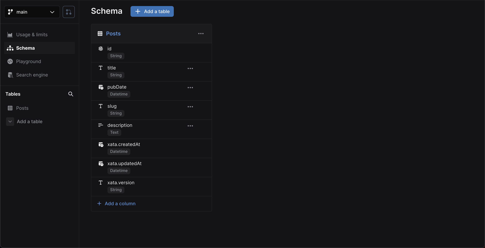

In this guide, you'll create a new [Astro][2] application and walk through adding Xata database and search
functionality. you'll build the following basic blog application features:

1.  List all blog posts
2.  Retrieve and view a single blog post
3.  Full-text fuzzy search of blog posts

Although this application is a simple blog, you can apply these basics to other types of Astro applications.

<ArticleVideo
  platform="html"
  src="https://github.com/xataio/mdx-docs/raw/main/020-Getting-started/videos/getting-started-app.mp4"
/>

The completed [Astro and Xata code](https://github.com/xataio/examples/tree/main/apps/getting-started-astro) for this
guide is available via the [Xata `examples` repo](https://github.com/xataio/examples) on GitHub.

## Before you begin

Install the Xata CLI:

```sh
npm install -g @xata.io/cli
```

Once installed, authenticate the Xata CLI with your Xata account. If you don't already have an account, you can use the
same workflow to sign up for a new account. Run the following command to begin the authentication workflow:

```sh
xata auth login
```

Upon completion, the command will generate a new API key for your user account. You should be able to view this key in the [account
settings page within the Xata UI][1]. That key will also be stored locally on your computer (the location might vary for
each OS). It looks like this:

```toml
# .config/xata/credentials
[default]
apiKey=YOUR_API_KEY_HERE
```

## Create a new Astro app

Begin by creating a new Astro application with a template setup to use Tailwind CSS for some styling.
Run the following command and accept all the prompt defaults:

```sh
npm create astro@latest -- --template with-tailwindcss xata-astro
```

<Expand title="npm create astro output">

```sh
$ npm create astro@latest -- --template with-tailwindcss xata-astro

╭─────╮ Houston:
│ ◠ ◡ ◠ Time to build a faster website.
╰─────╯

astro v2.10.7 Launch sequence initiated.

        ◼  dir Using xata-astro as project directory
        ◼  tmpl Using with-tailwindcss as project template
        ✔  Template copied

    deps   Install dependencies?
           Yes
        ✔  Dependencies installed

      ts   Do you plan to write TypeScript?
           Yes

     use   How strict should TypeScript be?
           Strict
        ✔  TypeScript customized

     git   Initialize a new git repository?
           Yes
        ✔  Git initialized

    next   Liftoff confirmed. Explore your project!

           Enter your project directory using cd ./xata-astro
           Run npm run dev to start the dev server. CTRL+C to stop.
           Add frameworks like react or tailwind using astro add.

           Stuck? Join us at https://astro.build/chat

╭─────╮ Houston:
│ ◠ ◡ ◠ Good luck out there, astronaut! 🚀
╰─────╯
```

</Expand>

Once the command has completed, go to the `xata-astro` directory and run the application:

```sh
cd xata-astro
npm run dev
```

By default, the application will run on `http://localhost:3000`.

## Create a new database

Once you have the Xata CLI installed, are logged in, and have set up a new Astro application, you are ready to use the Xata CLI to generate a new database.
database. Accept all the prompt defaults for the following command except for the region selection where
you should choose the region closest to your application users:

```sh
xata init
```

<Expand title="xata init output">

```sh
$ xata init
🦋 Initializing project... We will ask you some questions.

You have a single workspace, using it by default: xata-workspace-hc84d7
✔ Select a database or create a new one › <Create a new database>
✔ New database name … xata-astro
✔ Select a region › eu-west-1
✔ Generate code and types from your Xata database › TypeScript
✔ Choose the output path for the generated code … src/xata.ts

Setting up Xata...

Created Xata config: .xatarc

Creating .env file
set XATA_API_KEY=xau_**********************************
set XATA_BRANCH=main

i Running npm install --save @xata.io/client

added 1 package, and audited 462 packages in 2s

181 packages are looking for funding
run `npm fund` for details

found 0 vulnerabilities

No new migrations to pull from main branch
Generated Xata code to ./src/xata.ts

✔ Project setup with Xata 🦋

i Setup tables and columns at https://app.xata.io/workspaces/xata-workspace-hc84d7/dbs/xata-astro:eu-west-1

i Use xata pull main to regenerate code and types from your Xata database

```

</Expand>

On completion, the CLI will create `.env`, `.xatarc`, and `src/xata.ts` files within your project folder with the
correct credentials to access your database.

Your `.env` file should look something like this:

```bash title=".env"
XATA_API_KEY=YOUR_API_KEY_HERE
XATA_BRANCH=main
```

To inform the TypeScript typechecking about these new environment variables, update `src/env.d.ts` as follows:

```ts title="src/env.d.ts"
/// <reference types="astro/client" />

interface ImportMetaEnv {
  readonly XATA_API_KEY: string;
  readonly XATA_BRANCH?: string;
}

interface ImportMeta {
  readonly env: ImportMetaEnv;
}
```

Since TypeScript support was selected, it also created files that provide typings and functions to call using Xata's
[TypeScript SDK](/docs/sdk/overview). This will additionally be referenced in the `.xatarc`
file as follows:

```json
{
  "databaseUrl": "https://my-xata-app-database-url",
  "codegen": {
    "output": "src/xata.ts"
  }
}
```

The `src/xata.ts` file includes generated code you should typically never touch manually.

## Define the database schema and import CSV data

You can use the [Xata UI][0] to manually define your schema and add data. However, for this guide, you'll walk through
using the Xata CLI and a CSV file to:

1.  Auto-generate a schema based on column headings for names and data types inferred from the column values
2.  Import data to the database

First, download the [CSV file of blog posts](https://raw.githubusercontent.com/xataio/examples/main/seed/blog-posts.csv).
You can either do this manually or by running the following command:

```sh
curl --create-dirs -o seed/blog-posts.csv https://raw.githubusercontent.com/xataio/examples/main/seed/blog-posts.csv
```

Next, import the CSV:

```sh
xata import csv seed/blog-posts.csv --table Posts --create
```

<Expand title="xata import csv output">

```sh
$ xata import csv seed/blog-posts.csv --table Posts --create
i 45 rows successfully imported 0 errors. 100% complete
✔ Completed
```

</Expand>

Now, if you open up the [Xata UI][1] and navigate to your database, you will see the **Posts** table. Alternatively,
you can run the command `xata browse` to open a browser window:


Click **Schema** to see the schema definition with the inferred data types:



You'll also see `xata.*` [special columns](/docs/concepts/data-model#special-columns) automatically
created and maintained by Xata.

With the database schema in place, the final step is to generate the code to access and query the data
from our Astro application. To do this, run:

```sh
xata pull main
```

<Expand title="xata pull main output">

```sh
$ xata pull main
Successfully pulled 1 migrations from main branch
Running codegen...
Generated Xata code to ./src/xata.ts
```

</Expand>

This updates the contents of `src/xata.ts` based on the schema defined on the `main` branch of our database. So, if you
make any further changes to the schema, run `xata pull <branch>` to update the auto-generated code.

## Basic styling and layout

Replace the contents of `src/layouts/main.astro` with the following:

```astro title="src/layouts/main.astro" {2,10,49}
---
const { title } = Astro.props;
---

<html lang="en">
  <head>
    <meta charset="utf-8" />
    <meta name="viewport" content="width=device-width" />
    <link rel="icon" type="image/svg+xml" href="/favicon.svg" />
    <title>{title}</title>
    <style>
      :root {
        --foreground-rgb: 0, 0, 0;
        --background-start-rgb: 214, 219, 220;
        --background-end-rgb: 255, 255, 255;
      }

      @media (prefers-color-scheme: dark) {
        :root {
          --foreground-rgb: 255, 255, 255;
          --background-start-rgb: 0, 0, 0;
          --background-end-rgb: 0, 0, 0;
        }
      }

      body {
        color: rgb(var(--foreground-rgb));
        background: linear-gradient(
            to bottom,
            transparent,
            rgb(var(--background-end-rgb))
          )
          rgb(var(--background-start-rgb));
      }
    </style>
  </head>
  <body>
    <main class="flex flex-col items-center p-8 lg:p-24 min-h-screen">
      <div class="z-10 h-50 w-full max-w-5xl items-center justify-between text-xl lg:flex">
        <p class="fixed left-0 top-0 flex w-full justify-center pb-6 pt-8 lg:static lg:w-auto bg-gradient-to-b from-white via-white via-65% dark:from-black dark:via-black lg:bg-none">
          <a href="/">Get started with Xata and Astro</a>
        </p>
        <div class="fixed bottom-0 left-0 flex w-full items-end justify-center bg-gradient-to-t from-white via-white dark:from-black dark:via-black lg:static lg:h-auto lg:w-auto lg:bg-none">
          <a href="https://xata.io" class="w-20">
            
          </a>
        </div>
      </div>
      <slot />
    </main>
  </body>
</html>
```

The two main points to be aware of in this layout are:

1. This layout has a `title` property that sets the page `<title />`.
2. The contents of the pages that use this layout will appear where `<slot />` is defined.

## Query and list the posts

Now, you are ready to integrate Xata into the Astro codebase. Start by updating the landing page,
`src/pages/index.astro`, to use the layout:

```astro title="src/pages/index.astro"
---
import MainLayout from '../layouts/main.astro';
---

<MainLayout title="Get started with Xata and Astro">

  <div class="w-full max-w-5xl mt-16">No posts</div>

</MainLayout>
```

Next, import the auto-generated `XataClient` class definition from `src/xata.ts`, get all the posts using the client, and
list them within the page:

```astro title="src/pages/index.astro" {4-9,11,16-37}
---
import MainLayout from '../layouts/main.astro';

import { XataClient } from '../xata';

const xata = new XataClient({
  apiKey: import.meta.env.XATA_API_KEY,
  branch: import.meta.env.XATA_BRANCH
});

let posts = await xata.db.Posts.getAll();
---

<MainLayout title="Get started with Xata and Astro">

  <div class="w-full max-w-5xl mt-16">
    {posts.length === 0 && <p>No blog posts found</p>}
    {posts.map((posts) => (
      <div class="mb-16">
        <p class="text-xs mb-2 text-purple-950 dark:text-purple-200">
          {posts.pubDate?.toDateString()}
        </p>
        <h2 class="text-2xl mb-2">
          <a href={`posts/${posts.slug}`}>{posts.title}</a>
        </h2>
        <p class="text-purple-950 dark:text-purple-200 mb-5">
          {posts.description}
        </p>
        <a
          href={`posts/${posts.slug}`}
          class="px-4 py-2 font-semibold text-sm bg-purple-700 text-white rounded-lg shadow-sm w-fit"
        >
          Read more &rarr;
        </a>
      </div>
    ))}
  </div>

</MainLayout>
```

Here's a breakdown of what's happening in the code above.

First, import the `XataClient` constructor and create a new instance, passing in the `apiKey` and `branch` with
the values set via the `XATA_API_KEY` and `XATA_XATA_BRANCH` environment variables, respectively.
Then assign the `XataClient` instance to a variable named `xata`:

```tsx
import { XataClient } from '../xata';

const xata = new XataClient({
  apiKey: import.meta.env.XATA_API_KEY,
  branch: import.meta.env.XATA_BRANCH
});
```

Then, in the Astro page Component Script (the section within `---`), use the `xata` client instance to get all the posts stored in the database. This is
achieved via the auto-generated `Posts` property, which exposes a number of helper functions. In this case, use the
[`getAll`](/docs/sdk/get#the-typescript-sdk-functions-for-querying) function to get
all the Post records.

```tsx
let posts = await xata.db.Posts.getAll();
```

<Alert status="warning">
  `getAll()` returns all the records in the query results. This is dangerous on large tables (more than 10,000 records),
  as it will potentially load a lot of data into memory and create a lot of requests to the server. In most situations,
  you should use `getMany()` or `getPaginated()`. See the [querying
  documentation](/docs/sdk/get#the-typescript-sdk-functions-for-querying) for more information.
</Alert>

Finally, update the UI to display the result of the `getAll` call. If no Post records are present (`posts.length === 0`), show a message
saying, "No blog posts found". Otherwise, loop through the `posts` using `posts.map` and access the columns of
each Post record using their properties: `id` as a unique identifier for the `key` attribute, `pubDate` to show the date
the blog post was published, `slug` to link to individual blog posts (which we'll use later), `title` for the title of
the post, and `description` for the textual description of the post:

```tsx
<div class="w-full max-w-5xl mt-16">
  {posts.length === 0 && <p>No blog posts found</p>}
  {posts.map((posts) => (
    <div class="mb-16">
      <p class="text-xs mb-2 text-purple-950 dark:text-purple-200">{posts.pubDate?.toDateString()}</p>
      <h2 class="text-2xl mb-2">
        <a href={`posts/${posts.slug}`}>{posts.title}</a>
      </h2>
      <p class="text-purple-950 dark:text-purple-200 mb-5">{posts.description}</p>
      <a
        href={`posts/${posts.slug}`}
        class="px-4 py-2 font-semibold text-sm bg-purple-700 text-white rounded-lg shadow-sm w-fit"
      >
        Read more &rarr;
      </a>
    </div>
  ))}
</div>
```

This results in the page looking like the following:


You'll notice that the post heading and "Read more →" text use the `slug` property to link to a page that doesn't
presently exist. That's the next step in this guide.

## Generate the static paths for single posts

You access a single post via the `slug` value of the Post in the application's URL. For example, `/posts/awesome-blog-post`
where `awesome-blog-post` is the slug. You achieve this using Astro's
[dynamic routes](https://docs.astro.build/en/core-concepts/routing/#dynamic-routes). You identify parameters within Astro
dynamic routes by a name within square brackets in the file path. For example, `lang` and `version` within `src/pages/[lang]/[version]/info.astro`.

Astro is in [SSG (Static Site Generator) mode](https://docs.astro.build/en/core-concepts/routing/#static-ssg-mode) by default, meaning that all
routes are identified within the `getStaticPaths` function, and site content is generated at build time. Since all the blog posts and their
`slug` are defined within the Posts table, you can query the table for all posts and inform the framework about all possible routes and content.

Create a new file, `src/pages/posts/[slug].astro` to enable access to a `slug` parameter:

```tsx astro="src/pages/posts/[slug].astro" {2,4,6-21,23-43}
---
import MainLayout from '../../layouts/main.astro'

import { XataClient } from '../../xata';

export async function getStaticPaths() {
  const xata = new XataClient({
    apiKey: import.meta.env.XATA_API_KEY,
    branch: import.meta.env.XATA_BRANCH
  });
  const posts = await xata.db.Posts.getAll();

  const routes = posts.map(({ slug, title, description, pubDate }) => {
    return {
      params: { slug },
      props: { title, description, pubDate },
    };
  });

  return routes;
}

const post = Astro.props;
---

<MainLayout title={post.title}>

  <div class="w-full max-w-5xl mt-16">
    <p class="mb-2">
      <a href="/" class="text-purple-600">
        &larr; Back to blog
      </a>
    </p>

    <h1 class="text-3xl mb-2">{post?.title}</h1>
    <p class="text-sm mb-4 text-purple-950 dark:text-purple-200">
      {post?.pubDate?.toDateString()}
    </p>
    <p class="text-xl">{post?.description}</p>

  </div>

</MainLayout>

```

As discussed, this defines all static pages, their content, and how to render the post details for a single blog post view. Here's a breakdown.

From the code above, the `MainLayout` is imported to be used within the Astro Component Template:

```tsx astro title="src/pages/posts/[slug].astro"
import MainLayout from '../../layouts/main.astro';
```

Next, import the `XataClient` class definition from the auto-generated `xata.ts` file to be used within `getStaticPaths`:

```ts
import { XataClient } from '../../xata';
```

The `getStaticPaths` Astro framework function is then declared. First, instantiate an instance of the `XataClient` object, passing in the `apiKey` with a value assigned via the `XATA_API_KEY` environment variable. Then, get all the Post records using `xata.db.Posts.getAll`. The next step is to create a map to inform Astro of the possible routes with a `slug` parameter and pass the properties associated with each route: the `title`, `description`, and `pubDate` are returned as `props` for each `slug`. Finally, return the `routes` array from the function.

```ts
export async function getStaticPaths() {
  const xata = new XataClient({
    apiKey: import.meta.env.XATA_API_KEY,
    branch: import.meta.env.XATA_BRANCH
  });
  const posts = await xata.db.Posts.getAll();

  const routes = posts.map(({ slug, title, description, pubDate }) => {
    return {
      params: { slug },
      props: { title, description, pubDate }
    };
  });

  return routes;
}
```

<Alert status="info">
  The `new XataClient` is instantiated within the `getStaticPaths` function and not within the top-level scope because
  only imports are available within the scope of `getStaticPaths`.
</Alert>

The last line within the Component Script section of `[slug].astro` pulls the properties returned
from `getStaticPaths` for the current `slug` generated as part of the Astro Static Site Generate process.
So, `post` represents a single post and contains properties for `title`, `description`, and `pubDate`.

The Component Template (the contents after the second `---`) uses the `MainLayout` component and passes
the blog post title, `post.title`, used within `<title>`. Finally, the values
for `post.title`, `post.description`, and `post.pubDate` are then used within the UI.

```tsx
...

const post = Astro.props;
---

<MainLayout title={post.title}>

  <div class="w-full max-w-5xl mt-16">
    <p class="mb-2">
      <a href="/" class="text-purple-600">
        &larr; Back to blog
      </a>
    </p>

    <h1 class="text-3xl mb-2">{post?.title}</h1>
    <p class="text-sm mb-4 text-purple-950 dark:text-purple-200">
      {post?.pubDate?.toDateString()}
    </p>
    <p class="text-xl">{post?.description}</p>

  </div>

</MainLayout>
```

The single blog post page will look as follows:


## Search posts

The last piece of functionality to add to the application is full-text fuzzy search of blog posts.

When you insert data into a Xata database, it is automatically indexed for full-text search. So you don't need to change
any configuration to enable search, you just need to use the
[TypeScript SDK search feature](/docs/sdk/search).

As mentioned earlier, by default, Astro is in [SSG Mode](https://docs.astro.build/en/core-concepts/routing/#static-ssg-mode).
However, generating static paths for all possible user search values is impossible. So, for dynamically generated pages
such as search results,
[Server Side Rendering (SSR)](https://docs.astro.build/en/core-concepts/routing/#server-ssr-mode) is required. Astro supports
a "hybrid" mode for sites that use SSG and SSR. You enable this within `apps/getting-started-astro/astro.config.mjs` as follows:

```ts title="apps/getting-started-astro/astro.config.mjs" {8}
import { defineConfig } from 'astro/config';

import tailwind from '@astrojs/tailwind';

// https://astro.build/config
export default defineConfig({
  integrations: [tailwind()],
  output: 'hybrid'
});
```

With `output` set to `hybrid`, static pages continue to work as they did previously. Now, you are ready to add the search functionality.

Adding search is as simple as updating the landing page as follows:

```astro title="src/app/page.tsx" {11,13-18,22-31}
---
import MainLayout from '../layouts/main.astro';

import { XataClient } from '../xata';

const xata = new XataClient({
  apiKey: import.meta.env.XATA_API_KEY,
  branch: import.meta.env.XATA_BRANCH
});

const search = Astro.url.searchParams.get('q')! || '';

let posts = null;
if (search) {
  const { records } = await xata.db.Posts.search(search, { fuzziness: 2 });
	posts = records
} else {
  posts = await xata.db.Posts.getAll();
}
---

<MainLayout title="Get started with Xata and Astro">
  <div class="w-full max-w-5xl mt-16">
    <form action="/">
      <input
        name="q"
        value={search}
        placeholder="Search..."
        class="w-full rounded-lg border-2 p-2 dark:text-purple-950"
      />
    </form>
  </div>

  ...

</MainLayout>
```

First, update the Component Script to retrieve the `q` query string value and assign the result to a `search` variable.
If the query string parameter is not present, set the value to an empty string.

```tsx
const search = Astro.url.searchParams.get('q')! || '';
```

Second, the landing page should list all blog posts if `search` is an empty string. However, if
the `search` contains a value, a search is performed on the Posts table using the
[`search` function](/docs/sdk/search#searching-in-a-single-table) exposed on the
auto-generated `Posts` property. Pass `search` as the text value to search for, and use a
second options parameter with `fuzziness` set to `2`, which informs the fuzzy search behavior to allow for two
letters changed/added/removed. See
[fuzziness and typo tolerance](/docs/sdk/search#fuzziness-and-typo-tolerance) for more
details.

```tsx
let posts = null;
if (search) {
  const { records } = await xata.db.Posts.search(search, { fuzziness: 2 });
  posts = records;
} else {
  posts = await xata.db.Posts.getAll();
}
```

The third and last change is to add a `<form>` to the page to allow a search value to be entered and submitted. The
default behavior of a form is to submit a `GET` request to the current URL with any form inputs added to the query
string in the format `{url}/?{input-name}={input-value}`. For our search form, the result of a form submission is
a `GET`request in the format`?q={q-value}`.

In addition to `posts` being dynamically populated based on the search result, the `search` value is also used within
the `<input value={search} />` of the `<form />` to inform the user of the current search.

Since this is precisely the behavior required, and the page is already updated
to get the value of `q` via `Astro.url.searchParams.get('q')`, everything is now in place.

```tsx
<div class="w-full max-w-5xl mt-16">
  <form action="/">
    <input
      name="q"
      value={search}
      placeholder="Search..."
      class="w-full rounded-lg border-2 p-2 dark:text-purple-950"
    />
  </form>
</div>
```


The application now supports listing posts, viewing single posts via a dynamic route, and full-text fuzzy search of
posts.

<ArticleVideo
  platform="html"
  src="https://github.com/xataio/mdx-docs/raw/main/020-Getting-started/videos/getting-started-app.mp4"
/>

## What you've learned

In this guide, you've learned Astro with SSG (Static Site Generation) and SSR (Server-Side Rendering),
and Xata is a powerful combination. You created an application from scratch that lists blog posts,
supports viewing a single blog post, and performs full-text fuzzy search on all posts.

You walked through setting up the Xata CLI and using it to:

- Create a new Xata project
- Create a database schema and populate it with data from an imported CSV file
- Update the auto-generated code (in `src/xata.ts`) using `xata pull main` to reflect the updated schema

You then updated the landing page to list all blog posts, making use of the auto-generated `xata.db.Posts.getAll`
function. You also added the single post page using Astro SSG, where the `slug` Posts record column was used in combination
with Astro's `getStaticPaths` to identify all possible routes and, thus, the static files to be generated.

Finally, You added full-text fuzzy search functionality to the landing page, leveraging Xata's automatic table
indexing. To do this, you enabled Astro's hybrid mode to generate search results using SSR based on the search query passed
in the `q` query string and the results from the auto-generated `xata.db.Posts.search` function.

## Learn more

If you enjoyed this guide, you could continue working on improving the application. Here are some suggestions:

- Add [pagination](/docs/sdk/get#paginating-results) for the blog post listing
- Add [pagination](/docs/sdk/search#pagination) for blog post search results
- Handle single post view page not finding a result for a `slug`
- Add a `body` field to the database schema to contain the full text of the blog post and update the single page view to
  use that new field

You can also explore some of the features we've covered in more detail:

- [Getting records](/docs/sdk/get)
- [Filtering records](/docs/sdk/filtering)
- [Searching records](/docs/sdk/search)

Or dive into some of Xata's more advanced features, such as:

- [Aggregations](/docs/sdk/aggregate)
- [Transactions](/docs/sdk/transaction)
- [Vector search](/docs/sdk/vector-search)

[0]: https://app.xata.io
[1]: https://app.xata.io/settings
[2]: https://astro.build/
