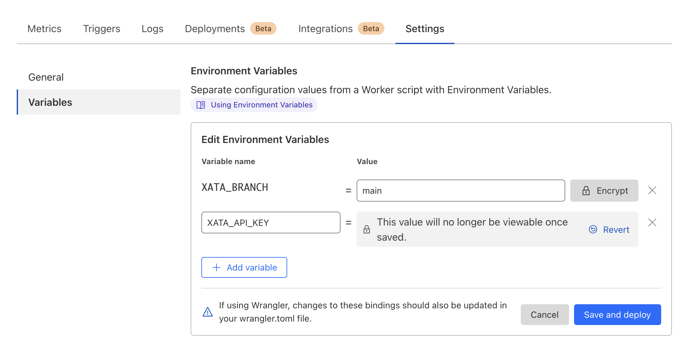

In this guide, you'll learn how to add Xata database and search functionality to a [Cloudfalre Workers][2] application.
You'll build the following basic blog application features:

1.  List all blog posts

You will need a cloudflare account to deploy your application. 

The completed [Cloudflare and Xata code](https://github.com/xataio/examples/tree/main/apps/getting-started-cloudflare-workers) for this
guide is available via the [Xata `examples` repo](https://github.com/xataio/examples) on GitHub.

## Before you begin

Install the Xata CLI:

```sh
npm install -g @xata.io/cli
```

Once installed, authenticate the Xata CLI with your Xata account. If you don't already have an account, you can use the
same workflow to sign up for a new account. Run the following command to begin the authentication workflow:

```sh
xata auth login
```

On completion, the command will create a new API key for your user account, which you should see in the [account
settings page within the Xata UI][1]. That key will also be stored locally on your computer (the location might vary for
each OS). It looks like this:

```toml
# .config/xata/credentials
[default]
apiKey=YOUR_API_KEY_HERE
```

## Create a new Cloudflare app

Begin by creating a new Cloudflare workers endpoint, accepting the default prompt options:

```sh
npm create cloudflare@latest
```

<Expand title="npm create cloudflare@latest">

```sh
├  APPLICATION CREATED  Deploy your application with npm run deploy
│ 
│ Navigate to the new directory cd morning-boat-eb85
│ Run the development server npm run start
│ Deploy your application npm run deploy
│ Read the documentation https://developers.cloudflare.com/workers
│ Stuck? Join us at https://discord.gg/cloudflaredev
│ 
╰ See you again soon!
```

</Expand>

Once the command has completed, go to the `gettings-started-cloudflare-workers` directory, and run the application:

```sh
$ npm run wrangler dev
```

By default, the application will run on `http://localhost:8787`. When visiting this URL "Hello World" should be shown in your browser. 


## Create a new database

With the Xata CLI installed and logged in and a new application in place, use the Xata CLI to create a new
database. Accept all the prompt defaults for the following command except for the region selection, where
you should choose the region closest to your application users:

```sh
xata init
```

<Expand title="xata init output">

```sh
$ 🦋 Initializing project... We will ask you some questions.

You have a single workspace, using it by default: xata-workspace-hc84d7
✔ Select a database or create a new one › <Create a new database>
✔ New database name … getting-started-cloudflare-workers
✔ Select a region › eu-west-1
✔ Add .env to .gitignore? … yes
✔ Generate code and types from your Xata database › TypeScript
✔ Choose the output path for the generated code … src/xata.ts

Setting up Xata...

Created Xata config: .xatarc

Creating .env file
  set XATA_API_KEY=xau_*********************************
  set XATA_BRANCH=main

Added .env file to .gitignore

i Running npm install --save @xata.io/client

added 2 packages, and audited 895 packages in 5s

142 packages are looking for funding
  run `npm fund` for details

found 0 vulnerabilities

No new migrations to pull from main branch
Generated Xata code to ./src/xata.ts

✔ Project setup with Xata 🦋

i Setup tables and columns at https://app.xata.io/workspaces/xata-workspace-hc84d7/dbs/getting-started-cloudflare-workers:eu-west-1

i Use xata pull main to regenerate code and types from your Xata database
```

</Expand>

On completion, the CLI will create `.env`, `.xatarc`, and `src/xata.ts` files within your project folder with the
correct credentials to access your database.

Your `.env` file should look something like this:

```bash title=".env"
XATA_API_KEY=YOUR_API_KEY_HERE
XATA_BRANCH=main
```

Since you selected TypeScript support after running `xata init`, it also created files that provide typings and functions to call using Xata's
TypeScript SDK. This will additionally be referenced in the `.xatarc` file as follows:

```json
{
  "databaseUrl": "https://my-xata-app-database-url",
  "codegen": {
    "output": "src/xata.ts"
  }
}
```

The `src/xata.ts` file includes generated code you should typically never touch manually.


## Inject into wrangler during development
Create a new file called `.dev.vars` at the root of your project
Copy these env vars into this file so you have access to them in dev mode. 

```
XATA_API_KEY="xau_*********************************"
XATA_BRANCH="main"
```

Note the quotatino marks.

## Define the database schema and import CSV data

You can use the [Xata UI][0] to manually define your schema and add data. However, for this guide, you'll use
the Xata CLI and a CSV file to:

1.  Auto-generate a schema based on column headings for names and data types inferred from the column values
2.  Import data to the database

First, download the
[example blog posts CSV file](https://raw.githubusercontent.com/xataio/examples/main/seed/blog-posts.csv).
You can either do this manually or by running the following command:

```sh
curl --create-dirs -o seed/blog-posts.csv https://raw.githubusercontent.com/xataio/examples/main/seed/blog-posts.csv
```

Next, import the CSV:

```sh
xata import csv seed/blog-posts.csv --table Posts --create
```

<Expand title="xata import csv output">

```sh
$ xata import csv seed/blog-posts.csv --table Posts --create
i 45 rows successfully imported 0 errors. 100% complete
✔ Completed
```

</Expand>

Now, if you open up the [Xata UI][1] and navigate to your database, you will see the **Posts** table. Alternatively,
you can run the command `xata browse` to open a browser window:


Click **Schema** to see the schema definition with the inferred data types:


You'll also see `xata.*` [special columns](/docs/concepts/data-model#special-columns) automatically
created and maintained by Xata.

With the database schema in place, the final step is to generate the code that allows you to access and query the data
from our application. To do this, run:

```sh
xata pull main
```

<Expand title="xata pull main output">

```sh
$ xata pull main
Successfully pulled 1 migrations from main branch
Running codegen...
Generated Xata code to ./src/xata.ts
```

</Expand>

This updates the contents of `src/xata.ts` based on the schema defined on the `main` branch of your database. So, if you
make any further changes to the schema, run `xata pull <branch>` to update the auto-generated code.


## Deploying your project
```
npx wrangler deploy
```

Preview your Worker at `<YOUR_WORKER>.<YOUR_SUBDOMAIN>.workers.dev.` When you visit this URL in your browser you should see "Hello World" returned.


## Initializing Xata Client

### Install Xata Client so we can use it to query our database from our cloudflare worker.
```
npm i @xata.io/client
```

## Query and list the posts

There are two ways of initiailizing the xata client with cloudflare workers: "Service Worker" format and "ES Modules" format. We recommend the modules one and mentioning that service worker is deprecated.

### Service Workers (Deprecated)

```ts title="index.ts"
import { XataClient } from './xata';

async function handler(request:Request) {
		const xata = new XataClient({
			// @ts-ignore
			apiKey: XATA_API_KEY,
			// @ts-ignore
			branch: XATA_BRANCH,
		});
		const posts = await xata.db.Posts.getAll()
		return new Response(`Total Posts: ${posts.length}`);
  }
  
  // Initialize Worker
  addEventListener('fetch', (event) => {
	event.respondWith(handler(event.request));
  });
```

### ES Module Syntax (Recommended)

```ts title="index.ts"
import { XataClient } from './xata';

export interface Env {
	XATA_BRANCH: string;
	XATA_API_KEY: string;
}

export default {
	async fetch(request: Request, env: Env, ctx: ExecutionContext): Promise<Response> {
		const xata = new XataClient({
			apiKey: env.XATA_API_KEY,
			branch: env.XATA_BRANCH,
		});
		const posts = await xata.db.Posts.getAll()
		return new Response(`Total Posts: ${posts.length}`);
	},
};
```

## Deploying your changed project

To make these envs that you've set up locally available in your remote deployment with the xata client running in cloudflare will need access to the environment variables. There are
two ways to populate them. The first is creating them manualyl through the Cloudflare dashboard. The second is through our one click integration. We recommend the second. 

### Creating the env variables manually from Cloudflare dashboard 

If you deploy without adding the .env vars to Cloudflare, your remote endpoint will throw. 

- Go the Cloudflare UI
- Go to Workers tab in the left navigation
- Find your deployed worker (getting-started-cloudflare-workers)
- Settings tab > Variables > Add variable
- Refresh your deployment and the post count should be shown. 



### Using the one click guided workflow from the Cloudflare dashboard (Recommended)

Going through this flow automatically sets the environment variables necessary to interact with your database from a remote Cloudflare worker. 

[Video going through the integration flow on Cloudflare]

Your endpoint response should also be available remotely at `<YOUR_WORKER>.<YOUR_SUBDOMAIN>.workers.dev.`
