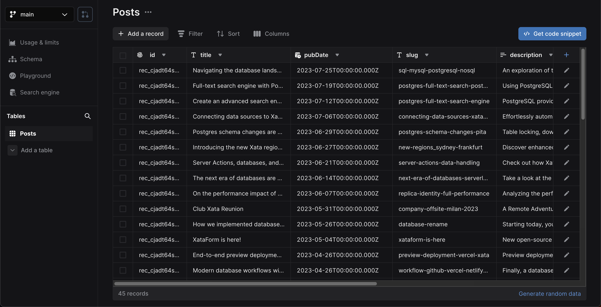
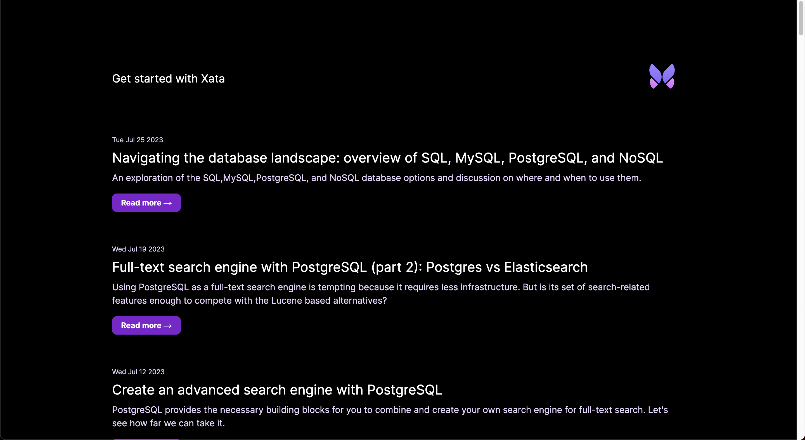
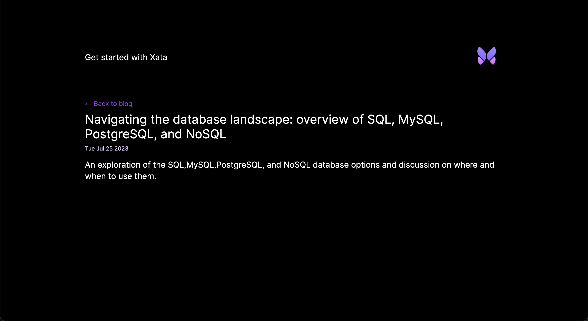

In this guide, we'll create a new [Astro][2] application and walk through adding Xata database and search
functionality. We'll build the following basic blog application features:

1.  Lists all posts
2.  Retrieve and view a single post
3.  Blog post full-text fuzzy search

Although this application is a simple blog, you can apply these basics to other types of Astro applications.

<ArticleVideo
  platform="html"
  src="https://github.com/xataio/mdx-docs/raw/main/020-Getting-started/videos/getting-started-app.mp4"
/>

The completed [Astro and Xata code](https://github.com/xataio/examples/tree/main/apps/astro-getting-started) for this
guide is available via the [Xata `examples` repo](https://github.com/xataio/examples) on GitHub.

## Before you begin

Install the Xata CLI:

```sh
npm install -g @xata.io/cli
```

Once installed, authenticate the Xata CLI with your Xata account. If you don't already have an account, you can use the
same workflow to signup for a new account. Run the following command to begin the authentication workflow:

```sh
xata auth login
```

On completion, the command will create a new API key for your user account, which you should see in the [account
settings page within the Xata UI][1]. That key will also be stored locally on your computer (the location might vary for
each OS). It looks like this:

```toml
# .config/xata/credentials
[default]
apiKey=YOUR_API_KEY_HERE
```

## Create a new Astro app

Let's begin by creating a new Astro application that makes use of a template setup to use Tailwind CSS for some styling.
Run the following command and accept all the prompt defaults:

```sh
npm create astro@latest -- --template with-tailwindcss xata-astro
```

<Expand title="npm create astro output">

```sh
$ npm create astro@latest -- --template with-tailwindcss xata-astro

╭─────╮ Houston:
│ ◠ ◡ ◠ Time to build a faster website.
╰─────╯

astro v2.10.7 Launch sequence initiated.

        ◼  dir Using xata-astro as project directory
        ◼  tmpl Using with-tailwindcss as project template
        ✔  Template copied

    deps   Install dependencies?
           Yes
        ✔  Dependencies installed

      ts   Do you plan to write TypeScript?
           Yes

     use   How strict should TypeScript be?
           Strict
        ✔  TypeScript customized

     git   Initialize a new git repository?
           Yes
        ✔  Git initialized

    next   Liftoff confirmed. Explore your project!

           Enter your project directory using cd ./xata-astro
           Run npm run dev to start the dev server. CTRL+C to stop.
           Add frameworks like react or tailwind using astro add.

           Stuck? Join us at https://astro.build/chat

╭─────╮ Houston:
│ ◠ ◡ ◠ Good luck out there, astronaut! 🚀
╰─────╯
```

</Expand>

Once the command has completed, go to the `xata-astro` directory and run the application:

```sh
cd xata-astro
npm run dev
```

By default, the application will run on `http://localhost:3000`.

## Create a new database

With the Xata CLI installed and logged in and a new Next.js application in place, use the Xata CLI to create a new
database. Accept all the prompt defaults for the following command except for the region selection where
you should choose the region closest to your application users:

```sh
xata init
```

<Expand title="xata init output">

```sh
$ xata init
🦋 Initializing project... We will ask you some questions.

You have a single workspace, using it by default: Phil-Leggetter-s-workspace-hc84d7
✔ Select a database or create a new one › <Create a new database>
✔ New database name … xata-astro
✔ Select a region › eu-west-1
✔ Generate code and types from your Xata database › TypeScript
✔ Choose the output path for the generated code … src/xata.ts

Setting up Xata...

Created Xata config: .xatarc

Creating .env file
set XATA_API_KEY=xau_**********************************
set XATA_BRANCH=main

i Running npm install --save @xata.io/client

added 1 package, and audited 462 packages in 2s

181 packages are looking for funding
run `npm fund` for details

found 0 vulnerabilities

No new migrations to pull from main branch
Generated Xata code to ./src/xata.ts

✔ Project setup with Xata 🦋

i Setup tables and columns at https://app.xata.io/workspaces/xata-workspace-hc84d7/dbs/xata-astro:eu-west-1

i Use xata pull main to regenerate code and types from your Xata database

```

</Expand>

On completion, the CLI will create `.env`, `.xatarc`, and `src/xata.ts` files within your project folder with the
correct credentials to access your database.

Your `.env` file should look something like this:

```bash title=".env"
XATA_API_KEY=YOUR_API_KEY_HERE
XATA_BRANCH=main
```

To inform the TypeScript compiler about these new environment variables, update `src/env.d.ts` as follows:

```ts title="src/env.d.ts"
/// <reference types="astro/client" />

interface ImportMetaEnv {
  readonly XATA_API_KEY: string;
  readonly XATA_BRANCH?: string;
}

interface ImportMeta {
  readonly env: ImportMetaEnv;
}
```

Since we selected TypeScript support, it also created files that provide typings and functions to call using Xata's
TypeScript SDK. This will additionally be referenced in the `.xatarc` file as follows:

```json
{
  "databaseUrl": "https://xata-nextjs-database-url",
  "codegen": {
    "output": "src/xata.ts"
  }
}
```

The `src/xata.ts` file includes generated code you should typically never touch manually.

## Define the database schema and import CSV data

You can use the [Xata UI][0] to manually define your schema and add data. However, for this guide, we'll walk through
using the Xata CLI and a CSV file to:

1.  Auto-generate a schema based on column headings for names and data types inferred from the column values
2.  Import data to the database

First, download the
[example blog posts CSV file](https://raw.githubusercontent.com/xataio/examples/main/seed/blog-posts.csv).
You can either do this manually or by running the following command:

```sh
curl --create-dirs -o seed/blog-posts.csv https://raw.githubusercontent.com/xataio/examples/main/seed/blog-posts.csv
```

Next, import the CSV:

```sh
xata import csv seed/blog-posts.csv --table Posts --create
```

<Expand title="xata import csv output">

```sh
$ xata import csv seed/blog-posts.csv --table Posts --create
i 45 rows successfully imported 0 errors. 100% complete
✔ Completed
```

</Expand>

Now, if you open up the [Xata UI][1] and navigate to your database, you will see the **Posts** table. Alternatively,
you can run the command `xata browse` to open a browser window:



Click **Schema** to see the schema definition with the inferred data types:


You'll also see `xata.*` [special columns](https://xata.io/docs/concepts/data-model#special-columns) automatically
created and maintained by Xata.

With the database schema in place, the final step is to generate the code that allows us to access and query the data
from our Astro application. To do this, run:

```sh
xata pull main
```

<Expand title="xata pull main output">

```sh
$ xata pull main
Successfully pulled 1 migrations from main branch
Running codegen...
Generated Xata code to ./src/xata.ts
```

</Expand>

This updates the contents of `src/xata.ts` based on the schema defined on the `main` branch of our database. So, if you
make any further changes to the schema, run `xata pull <branch>` to update the auto-generated code.

## Basic styling and layout

Replace the contents of `src/layouts/main.astro` with the following:

```astro title="src/layouts/main.astro" {2,49}
---
const { title } = Astro.props;
---

<html lang="en">
	<head>
		<meta charset="utf-8" />
		<meta name="viewport" content="width=device-width" />
		<link rel="icon" type="image/svg+xml" href="/favicon.svg" />
		<title>{title}</title>
		<style>
			:root {
				--foreground-rgb: 0, 0, 0;
				--background-start-rgb: 214, 219, 220;
				--background-end-rgb: 255, 255, 255;
			}

			@media (prefers-color-scheme: dark) {
				:root {
					--foreground-rgb: 255, 255, 255;
					--background-start-rgb: 0, 0, 0;
					--background-end-rgb: 0, 0, 0;
				}
			}

			body {
				color: rgb(var(--foreground-rgb));
				background: linear-gradient(
						to bottom,
						transparent,
						rgb(var(--background-end-rgb))
					)
					rgb(var(--background-start-rgb));
			}
		</style>
	</head>
	<body>
		<main class="flex flex-wrap justify-center content-start p-8 lg:p-24 min-h-screen">
			<div class="z-10 h-50 w-full max-w-5xl items-center justify-between text-xl lg:flex">
				<p class="fixed left-0 top-0 flex w-full justify-center pb-6 pt-8 lg:static lg:w-auto bg-gradient-to-b from-white via-white via-65% dark:from-black dark:via-black lg:bg-none">
					<a href="/">Get started with Xata and Astro</a>
				</p>
				<div class="fixed bottom-0 left-0 flex w-full items-end justify-center bg-gradient-to-t from-white via-white dark:from-black dark:via-black lg:static lg:h-auto lg:w-auto lg:bg-none">
					<a href="https://xata.io" class="w-20">
						
					</a>
				</div>
			</div>
			<slot />
		</main>
	</body>
</html>
```

The two main points to be aware of in this layout are:

1. This layout has a `title` property that sets the page title.
2. The contents of the pages that use this layout will appear where `<slot />` is defined.

## Query and list the posts

Now we're ready to integrate Xata into the Astro codebase. Let's start by updating the landing page,
`src/pages/index.astro`, to use the layout:

```astro title="src/pages/index.astro"
---
import MainLayout from '../layouts/main.astro';
---

<MainLayout title="Get started with Xata and Astro">

	<div class="w-full max-w-5xl mt-16">No posts</div>

</MainLayout>
```

Next, import the auto-generated `XataClient` class definition from `src/xata.ts`, get all the posts using the client, and
list them within the page:

```astro title="src/pages/index.astro" {4-6,13-34}
---
import MainLayout from '../layouts/main.astro';

import { XataClient } from '../xata';

const xata = new XataClient({ apiKey: import.meta.env.XATA_API_KEY });

let posts = await xata.db.Posts.getAll();
---

<MainLayout title="Get started with Xata and Astro">

  <div class="w-full max-w-5xl mt-16">
    {posts.length === 0 && <p>No blog posts found</p>}
    {posts.map((posts) => (
      <div class="mb-16">
        <p class="text-xs mb-2 text-purple-950 dark:text-purple-200">
          {posts.pubDate?.toDateString()}
        </p>
        <h2 class="text-2xl mb-2">
          <a href={`posts/${posts.slug}`}>{posts.title}</a>
        </h2>
        <p class="text-purple-950 dark:text-purple-200 mb-5">
          {posts.description}
        </p>
        <a
          href={`posts/${posts.slug}`}
          class="px-4 py-2 font-semibold text-sm bg-purple-700 text-white rounded-lg shadow-sm w-fit"
        >
          Read more &rarr;
        </a>
      </div>
    ))}
  </div>

</MainLayout>

```

Let's break down what's happening in the code above.

First, import the `XataClient` constructor and create a new instance, passing in the `apiKey` with the value set via the `XATA_API_KEY` environment variable.
Then assign the `XataClient` instance to a variable named `xata`:

```tsx
import { XataClient } from '../xata';

const xata = new XataClient({ apiKey: import.meta.env.XATA_API_KEY });
```

Then, in the Component Script, use the `xata` client instance to get all the posts stored in the database. This is
achieved via the auto-generated `Posts` property which exposes a number of helper functions. In this case, we use the
[`getAll`](https://xata.io/docs/typescript-client/get#the-typescript-sdk-functions-for-querying) function to get
all the Post records.

```tsx
let posts = await xata.db.Posts.getAll();
```

<Alert status="warning">
  `getAll()` returns all the records in the query results. This is dangerous on
  large tables (more than 10,000 records), as it will potentially load a lot of
  data into memory and create a lot of requests to the server. In most
  situations, you should use `getMany()` or `getPaginated()`. See the [querying
  documentation](https://xata.io/docs/typescript-client/get#the-typescript-sdk-functions-for-querying)
  for more information.
</Alert>

Finally, we update the UI to display the result of the `getAll` call. If no Post records are present (`posts.length === 0`), we show a message
saying, "No blog posts found". Otherwise, we loop through the `posts` using `posts.map` and access the columns of
each Post record using their properties: `id` as a unique identifier for the `key` attribute, `pubDate` to show the date
the blog post was published, `slug` to link to individual blog posts (which we'll use later), `title` for the title of
the post, and `description` for the textual descript of the post:

```tsx
<div class="w-full max-w-5xl mt-16">
  {posts.length === 0 && <p>No blog posts found</p>}
  {posts.map((posts) => (
    <div class="mb-16">
      <p class="text-xs mb-2 text-purple-950 dark:text-purple-200">
        {posts.pubDate?.toDateString()}
      </p>
      <h2 class="text-2xl mb-2">
        <a href={`posts/${posts.slug}`}>{posts.title}</a>
      </h2>
      <p class="text-purple-950 dark:text-purple-200 mb-5">
        {posts.description}
      </p>
      <a
        href={`posts/${posts.slug}`}
        class="px-4 py-2 font-semibold text-sm bg-purple-700 text-white rounded-lg shadow-sm w-fit"
      >
        Read more &rarr;
      </a>
    </div>
  ))}
</div>
```

This results in the page looking like the following:



You'll notice that the post heading and "Read more →" text use the `slug` property to link to a page that doesn't
presently exist. That's the next step in this guide.

TODO: FROM HERE ------------------------------------------------>

## Query and show a single posts

To handle the single posts identified by a `slug` we need to make use of Next.js
[dynamic routes](https://nextjs.org/docs/app/building-your-application/routing/dynamic-routes).

Create a new file, `src/app/posts/[slug]/page.tsx`, where the Next.js framework uses the directory `[slug]` to capture
the name of the slug:

```tsx title="src/app/posts/[slug]/page.tsx" {1,22}
export default async function Post({ params }: { params: { slug: string } }) {
  return (
    <main className="flex flex-wrap justify-center content-start p-8 lg:p-24 min-h-screen">
      <div className="z-10 h-50 w-full max-w-5xl items-center justify-between text-xl lg:flex">
        <p className="fixed left-0 top-0 flex w-full justify-center pb-6 pt-8 lg:static lg:w-auto bg-gradient-to-b from-white via-white via-65% dark:from-black dark:via-black lg:bg-none">
          <a href="/">Get started with Xata and Next.js</a>
        </p>
        <div className="fixed bottom-0 left-0 flex w-full items-end justify-center bg-gradient-to-t from-white via-white dark:from-black dark:via-black lg:static lg:h-auto lg:w-auto lg:bg-none">
          <a href="https://xata.io" className="w-20">
            
          </a>
        </div>
      </div>

      <div className="w-full max-w-5xl mt-16">
        <p className="mb-2">
          <a href="/" className="text-purple-600">
            &larr; Back to blog
          </a>
        </p>

        <h1 className="text-3xl mb-2">{params.slug}</h1>
      </div>
    </main>
  );
}
```

There's a lot more markup in this page than there is dynamic functionality. The important functionality is that the slug
value is passed into the function via a `params` parameter and accessed using `params.slug`.

Next, let's update the page to bring in the Xata client and use the slug value to fetch the post from the database:

```tsx title="src/app/posts/[slug]/page.tsx" {1-6,28-32}
import { getXataClient } from '@/xata';

const xata = getXataClient();

export default async function Post({ params }: { params: { slug: string } }) {
  const post = await xata.db.Posts.filter({ slug: params.slug }).getFirst();

  return (
    <main className="flex flex-wrap justify-center content-start p-8 lg:p-24 min-h-screen">
      <div className="z-10 h-50 w-full max-w-5xl items-center justify-between text-xl lg:flex">
        <p className="fixed left-0 top-0 flex w-full justify-center pb-6 pt-8 lg:static lg:w-auto bg-gradient-to-b from-white via-white via-65% dark:from-black dark:via-black lg:bg-none">
          <a href="/">Get started with Xata and Next.js</a>
        </p>
        <div className="fixed bottom-0 left-0 flex w-full items-end justify-center bg-gradient-to-t from-white via-white dark:from-black dark:via-black lg:static lg:h-auto lg:w-auto lg:bg-none">
          <a href="https://xata.io" className="w-20">
            
          </a>
        </div>
      </div>

      <div className="w-full max-w-5xl mt-16">
        <p className="mb-2">
          <a href="/" className="text-purple-600">
            &larr; Back to blog
          </a>
        </p>

        <h1 className="text-3xl mb-2">{post?.title}</h1>
        <p className="text-sm mb-4 text-purple-950 dark:text-purple-200">
          {post?.pubDate?.toDateString()}
        </p>
        <p className="text-xl">{post?.description}</p>
      </div>
    </main>
  );
}
```

The Xata client is imported and initialized in the same way as it is in the landing page via assigning the return value
of `getXataClient` to a `xata` variable.

```tsx
import { getXataClient } from '@/xata';

const xata = getXataClient();
```

The single post is retrieved from the database via the auto-generated `Posts` property. The
[`filter` function](https://xata.io/docs/typescript-client/get#the-typescript-sdk-functions-for-querying) is used to query
the table for a row where the `slug` column equals the value of `params. slug`. Finally the
[`getFirst` function](https://xata.io/docs/typescript-client/get#the-typescript-sdk-functions-for-querying) to return
the first (and only) result for a post with this slug value.

```tsx
export default async function Post({ params }: { params: { slug: string } }) {
  const post = await xata.db.Posts.filter({ slug: params.slug }).getFirst();

  ...
}
```

Finally, the values, `title`, `pubDate`, and `description`, for the Post are added to the UI:

```tsx
<h1 className="text-3xl mb-2">{post?.title}</h1>
<p className="text-sm mb-4 text-purple-950 dark:text-purple-200">
  {post?.pubDate?.toDateString()}
</p>
<p className="text-xl">{post?.description}</p>
```

The single blog post page will look as follows:



## Search posts

The last piece of functionality to be added to the application is full-text fuzzy search of blog posts.

When you insert data into a Xata database, it is automatically indexed for full-text search. So we don't need to change
any configuration to enable search, we just need to use the
[TypeScript SDK search feature](https://xata.io/docs/typescript-client/search).

Let's add this functionality to the landing page:

```tsx title="src/app/page.tsx" {4-14,29-39}
import { getXataClient } from '@/xata';

const xata = getXataClient();

export default async function Home({
  searchParams
}: {
  searchParams: { q: string };
}) {
  let posts = null;
  if (searchParams.q) {
    posts = await xata.db.Posts.search(searchParams.q, { fuzziness: 2 });
  } else {
    posts = await xata.db.Posts.getAll();
  }

  return (
    <main className="flex flex-wrap justify-center content-start p-8 lg:p-24 min-h-screen">
      <div className="z-10 h-50 w-full max-w-5xl items-center justify-between text-xl lg:flex">
        <p className="fixed left-0 top-0 flex w-full justify-center pb-6 pt-8 lg:static lg:w-auto bg-gradient-to-b from-white via-white via-65% dark:from-black dark:via-black lg:bg-none">
          <a href="/">Get started with Xata and Next.js</a>
        </p>
        <div className="fixed bottom-0 left-0 flex w-full items-end justify-center bg-gradient-to-t from-white via-white dark:from-black dark:via-black lg:static lg:h-auto lg:w-auto lg:bg-none">
          <a href="https://xata.io" className="w-20">
            
          </a>
        </div>
      </div>
      <div className="w-full max-w-5xl mt-16">
        <form>
          <input
            name="q"
            defaultValue={searchParams.q}
            placeholder="Search..."
            className="w-full rounded-lg p-2 dark:text-purple-950"
          />
        </form>
      </div>
      ...
    </main>
  );
}
```

Add search with three changes.

First, update the main function to accept search parameters. This is achieved by having the function accept an object
with a `searchParams` property. When a search has been performed, `searchParams` will optionally have a `q` property
access via `searchParams.q`.

```tsx
export default async function Home({
  searchParams
}: {
  searchParams: { q: string };
}) {
  ...
}
```

Secondly, the landing page should list all blog posts if the `searchParams.q` property isn't present. However, if
the property is present, a search is performed on the Posts table using the
[`search` function](https://xata.io/docs/typescript-client/search#searching-in-a-single-table) exposed on the
auto-generated `Posts` property. The value of `searchParams.q` is passed as the text value to search for, and a
second options parameter is populated with `fuzziness` set to `2`, which instructs the search behavior to allow for two
letters changed/added/removed. See
[fuzziness and typo tolerance](https://xata.io/docs/typescript-client/search#fuzziness-and-typo-tolerance) for more
details.

```tsx
export default async function Home({ searchParams }: { searchParams: { q: string } }) {
  let posts = null;
  if (searchParams.q) {
    posts = await xata.db.Posts.search(searchParams.q, { fuzziness: 2 });
  } else {
    posts = await xata.db.Posts.getAll();
  }

  ...
}
```

The third and last change is to add a `<form>` to the page to allow a search value to be entered and submitted. The
default behavior of a form is to submit a `GET` request to the current URL with any form inputs added to the query
string in the format `{url}/?{input-name}={input-value}`. For our search form, the result of a form submission is
a `GET`request in the format`?q={q-value}`. Since this is precisely the behavior we need, and we've already updated
the page function to accept the object with a`searchParams` property already, everything is in place.

```tsx
<div className="w-full max-w-5xl mt-16">
  <form>
    <input
      name="q"
      defaultValue={searchParams.q}
      placeholder="Search..."
      className="w-full rounded-lg p-2 dark:text-purple-950"
    />
  </form>
</div>
```


The application now supports listing posts, viewing single posts via a dynamic route, and full-text fuzzy search of
posts.

## What you've learned

In this guide, you've learned that Next.js App Router applications and Xata are a powerful combination. You created an
application from scratch that lists blog posts, supports viewing a single blog post, and performs full-text fuzzy search
on all posts.

We walked through setting up the Xata CLI and using it to:

- Create a new Xata project
- Create a database schema and populate it with data from an imported CSV file
- Update the auto-generated code (in `src/xata.ts`) using `xata pull main` to reflect the updated schema

We then updated the landing page to list all blog posts, making use of the auto-generated `xata.db.Posts.getAll`
function. We also added the single post page making use of Next.js dynamic routes where a `slug` was passed and used
with `xata.db.Posts.filter({ slug: params.slug }).getFirst()`.

Finally, we added full-text fuzzy search functionality to the landing page, leveraging Xata's automatic table
indexing. The search used a `q` query string and the auto-generated `xata.db.Posts.search` function.

## Learn more

If you enjoyed this guide, you could continue working on improving the application. Here are some suggestions:

- Add [pagination](https://xata.io/docs/typescript-client/get#paginating-results) for the blog post listing
- Add [pagination](https://xata.io/docs/typescript-client/search#pagination) for blog post search results
- Handle single post view page not finding a result for a `slug`
- Add a `body` field to the database schema to contain the full text of the blog post and update the single page view to
  use that new field.
- Move common code from the two pages into `src/app/layout.tsx` or reusable components.

You can also explore some of the features we've covered in more detail:

- [Getting records](https://xata.io/docs/typescript-client/get)
- [Filtering records](https://xata.io/docs/typescript-client/filtering)
- [Searching records](https://xata.io/docs/typescript-client/search)

Or dive into some of Xata's more advanced features, such as:

- [Aggregations](https://xata.io/docs/typescript-client/aggregate)
- [Transactions](https://xata.io/docs/typescript-client/transaction)
- [Vector search](https://xata.io/docs/typescript-client/vector-search)

[0]: https://app.xata.io
[1]: https://app.xata.io/settings
[2]: https://astro.build/
