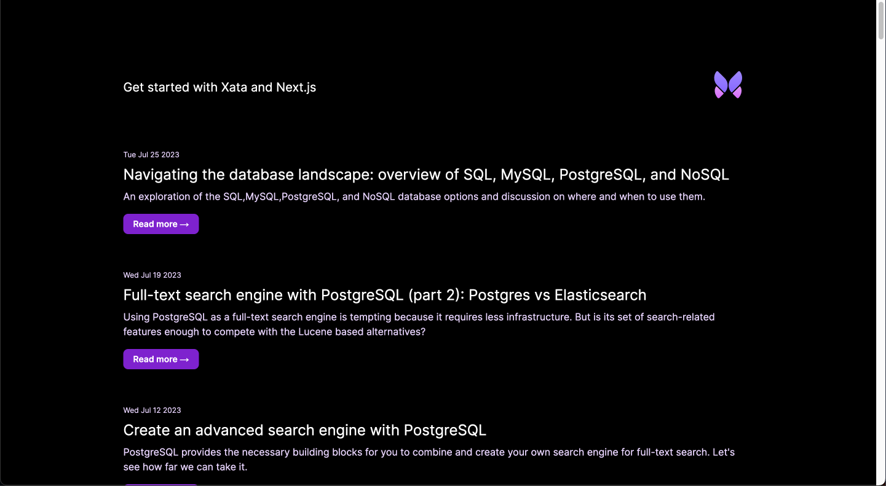
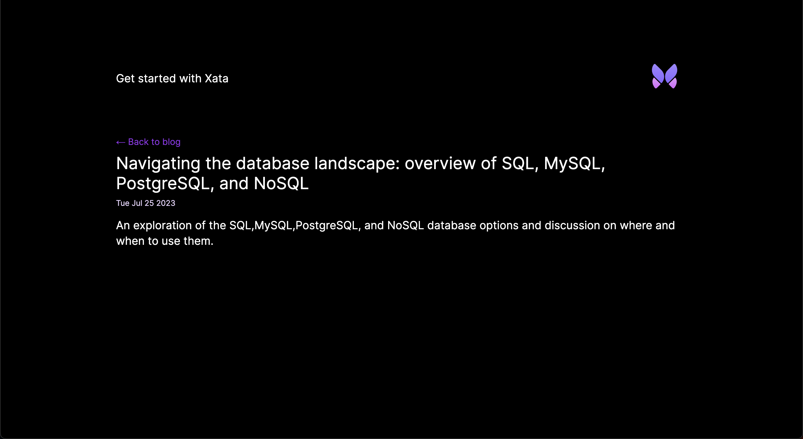
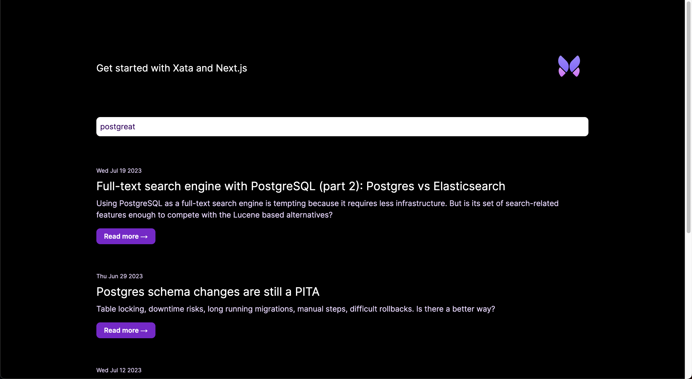

In this guide, you'll learn how to add Xata database and search functionality to a [Nuxt][2] application.
You'll build the following basic blog application features:

1.  List all blog posts
2.  Retrieve and view a single blog post
3.  Full-text fuzzy search of blog posts

Although this application is a simple blog, you can apply these basics to other types of Nuxt applications.

<ArticleVideo
  platform="html"
  src="https://github.com/xataio/mdx-docs/raw/main/020-Getting-started/videos/getting-started-app.mp4"
/>

The completed [Nuxt and Xata code](https://github.com/xataio/examples/tree/main/apps/nuxt-getting-started) for this
guide is available via the [Xata `examples` repo](https://github.com/xataio/examples) on GitHub.

## Before you begin

Install the Xata CLI:

```sh
npm install -g @xata.io/cli
```

Once installed, authenticate the Xata CLI with your Xata account. If you don't already have an account, you can use the
same workflow to sign up for a new account. Run the following command to begin the authentication workflow:

```sh
xata auth login
```

On completion, the command will create a new API key for your user account, which you should see in the [account
settings page within the Xata UI][1]. That key will also be stored locally on your computer (the location might vary for
each OS). It looks like this:

```toml
# .config/xata/credentials
[default]
apiKey=YOUR_API_KEY_HERE
```

## Create a new Nuxt app

Begin by creating a new Nuxt application, accepting the default prompt options:

```sh
npx nuxi@latest init xata-nuxt
```

<Expand title="npx nuxi@latest init xata-nuxt">

```sh
$ npx nuxi@latest init xata-nuxt

Nuxi 3.6.5                                                                            4:40:59 PM
✨ Nuxt project is created with v3 template. Next steps:                              4:40:59 PM
 › cd xata-nuxt                                                                       4:40:59 PM
 › Install dependencies with npm install or yarn install or pnpm install              4:40:59 PM
 › Start development server with npm run dev or yarn dev or pnpm run dev
```

</Expand>

Once the command has completed, go to the `xata-nuxt` directory, install the dependencies, and run the application:

```sh
cd xata-nuxt
npm i
npm run dev
```

By default, the application will run on `http://localhost:3000/`.

## Create a new database

With the Xata CLI installed and logged in and a new Nuxt application in place, use the Xata CLI to create a new
database. Accept all the prompt defaults for the following command except for the region selection, where
you should choose the region closest to your application users:

```sh
xata init
```

<Expand title="xata init output">

```sh
$ 🦋 Initializing project... We will ask you some questions.

You have a single workspace, using it by default: xata-workspace-hc84d7
✔ Select a database or create a new one › <Create a new database>
✔ New database name … xata-nuxt
✔ Select a region › eu-west-1
✔ Add .env to .gitignore? … yes
✔ Generate code and types from your Xata database › TypeScript
✔ Choose the output path for the generated code … src/xata.ts

Setting up Xata...

Created Xata config: .xatarc

Creating .env file
  set XATA_API_KEY=xau_*********************************
  set XATA_BRANCH=main

Added .env file to .gitignore

i Running npm install --save @xata.io/client

added 2 packages, and audited 895 packages in 5s

142 packages are looking for funding
  run `npm fund` for details

found 0 vulnerabilities

No new migrations to pull from main branch
Generated Xata code to ./src/xata.ts

✔ Project setup with Xata 🦋

i Setup tables and columns at https://app.xata.io/workspaces/xata-workspace-hc84d7/dbs/xata-nuxt:eu-west-1

i Use xata pull main to regenerate code and types from your Xata database
```

</Expand>

On completion, the CLI will create `.env`, `.xatarc`, and `src/xata.ts` files within your project folder with the
correct credentials to access your database.

Your `.env` file should look something like this:

```bash title=".env"
XATA_API_KEY=YOUR_API_KEY_HERE
XATA_BRANCH=main
```

Since you selected TypeScript support after running `xata init`, it also created files that provide typings and functions to call using Xata's
TypeScript SDK. This will additionally be referenced in the `.xatarc` file as follows:

```json
{
  "databaseUrl": "https://my-xata-app-database-url",
  "codegen": {
    "output": "src/xata.ts"
  }
}
```

The `src/xata.ts` file includes generated code you should typically never touch manually.

## Define the database schema and import CSV data

You can use the [Xata UI][0] to manually define your schema and add data. However, for this guide, you'll use
the Xata CLI and a CSV file to:

1.  Auto-generate a schema based on column headings for names and data types inferred from the column values
2.  Import data to the database

First, download the
[example blog posts CSV file](https://raw.githubusercontent.com/xataio/examples/main/seed/blog-posts.csv).
You can either do this manually or by running the following command:

```sh
curl --create-dirs -o seed/blog-posts.csv https://raw.githubusercontent.com/xataio/examples/main/seed/blog-posts.csv
```

Next, import the CSV:

```sh
xata import csv seed/blog-posts.csv --table Posts --create
```

<Expand title="xata import csv output">

```sh
$ xata import csv seed/blog-posts.csv --table Posts --create
i 45 rows successfully imported 0 errors. 100% complete
✔ Completed
```

</Expand>

Now, if you open up the [Xata UI][1] and navigate to your database, you will see the **Posts** table. Alternatively,
you can run the command `xata browse` to open a browser window:


Click **Schema** to see the schema definition with the inferred data types:


You'll also see `xata.*` [special columns](/docs/concepts/data-model#special-columns) automatically
created and maintained by Xata.

With the database schema in place, the final step is to generate the code that allows you to access and query the data
from our Nuxt application. To do this, run:

```sh
xata pull main
```

<Expand title="xata pull main output">

```sh
$ xata pull main
Successfully pulled 1 migrations from main branch
Running codegen...
Generated Xata code to ./src/xata.ts
```

</Expand>

This updates the contents of `src/xata.ts` based on the schema defined on the `main` branch of your database. So, if you
make any further changes to the schema, run `xata pull <branch>` to update the auto-generated code.

## Basic styling and layout

Begin by following step 2 onwards of the [Tailwind CSS and Nuxt 3 integration guide](https://tailwindcss.com/docs/guides/nuxtjs#3).
Once completed, add the following global styling to the newly created `assets/css/main.css`:

```css title="assets/css/main.css" {5-26}
@tailwind base;
@tailwind components;
@tailwind utilities;

:root {
  --foreground-rgb: 0, 0, 0;
  --background-start-rgb: 214, 219, 220;
  --background-end-rgb: 255, 255, 255;
}

@media (prefers-color-scheme: dark) {
  :root {
    --foreground-rgb: 255, 255, 255;
    --background-start-rgb: 0, 0, 0;
    --background-end-rgb: 0, 0, 0;
  }
}

body {
  color: rgb(var(--foreground-rgb));
  background: linear-gradient(to bottom, transparent, rgb(var(--background-end-rgb))) rgb(var(--background-start-rgb));
}
```

Finally, update `app.vue` to add some shared structure across application pages. The code will end up as follows:

```tsx title="app.vue"
<script setup lang="ts">
useHead({
  title: 'Get started with Xata and Nuxt',
})
</script>
<template>
  <main class="flex flex-col justify-center items-center p-8 lg:p-24 min-h-screen">
    <div class="z-10 h-50 w-full max-w-5xl items-center justify-between text-xl lg:flex">
      <p class="fixed left-0 top-0 flex w-full justify-center pb-6 pt-8 lg:static lg:w-auto bg-gradient-to-b from-white via-white via-65% dark:from-black dark:via-black lg:bg-none">
        <a href="/">Get started with Xata and Nuxt</a>
      </p>
      <div class="fixed bottom-0 left-0 flex w-full items-end justify-center bg-gradient-to-t from-white via-white dark:from-black dark:via-black lg:static lg:h-auto lg:w-auto lg:bg-none">
        <a href="https://xata.io" class="w-20">
          
        </a>
      </div>
    </div>
    <NuxtPage />
  </main>
</template>
```

Ensure the `<NuxtPage />` component is before the closing `</main>` element.

## Query and list the posts

The Nuxt app is now ready for integrating Xata into the codebase.

Start by making use of
[Nuxt's server routes](https://nuxt.com/docs/guide/directory-structure/server#server-routes) to retrieve all the blog posts from Xata.
Create `server/api/posts.ts` with the following contents:

```ts title="server/api/posts.ts"
import { getXataClient } from '../../src/xata';
const xata = getXataClient();

export default defineEventHandler(async (event) => {
  const posts = await xata.db.Posts.getAll();

  return posts;
});
```

First, import the `getXataClient` function and assign the result of calling that function to a variable named `xata`. This client uses the configuration set in the `.env` file.

Then, define and export a call to the `defineEventHandler` that returns a handler function. Within that handler function, use the `xata` client instance to get all
the posts stored in the database. Active this via the auto-generated `Posts` property, which exposes a number of
helper functions. In this case, use the [`getAll`](/docs/sdk/get#the-typescript-sdk-functions-for-querying)
function to get all the Post records. Finally, return the `posts` as the function return value.

You can access `http://localhost:3000/api/posts` to see the posts represented as JSON.

<Alert status="warning">
  `getAll()` returns all the records in the query results. This is dangerous on large tables (more than 10,000 records),
  as it will potentially load a lot of data into memory and create a lot of requests to the server. In most situations,
  you should use `getMany()` or `getPaginated()`. See the [querying
  documentation](/docs/sdk/get#the-typescript-sdk-functions-for-querying) for more information.
</Alert>

Next, create a `pages/index.vue` file as a landing page to load the data and render the list of blog posts:

```vue title="pages/index.vue"
<script setup lang="ts">
const { data: posts } = await useFetch(`/api/posts`);
</script>

<template>
  <div class="w-full max-w-5xl mt-16">
    <p v-if="posts && posts.length === 0">No blog posts found</p>
    <div v-for="post in posts" class="mb-16">
      <p class="text-xs mb-2 text-purple-950 dark:text-purple-200">
        {{ new Date(post.pubDate || '').toDateString() }}
      </p>
      <h2 class="text-2xl mb-2">
        <a :href="`/posts/${post.slug}`">{{ post.title }}</a>
      </h2>
      <p class="text-purple-950 dark:text-purple-200 mb-5">{{ post.description }}</p>
      <a
        :href="`/posts/${post.slug}`"
        class="px-4 py-2 font-semibold text-sm bg-purple-700 text-white rounded-lg shadow-sm w-fit"
      >
        Read more &rarr;
      </a>
    </div>
  </div>
</template>
```

Here's a walkthrough of the code above.

First, fetch the data from the `/api/posts` endpoint and assign the result to a `posts` variable, making use of
object destructuring and renaming `data` to `posts`.

Next, the UI is rendered. Check no records are present using Vue's
[`v-if` directive](https://vuejs.org/guide/essentials/conditional.html#v-if) (`v-if="posts && posts.length === 0"`).
If there are no posts, show a message saying, "No blog posts found". Otherwise, loop through the `posts`
(`v-for="post in posts"`) using Vue's [`v-for` directive](https://vuejs.org/guide/essentials/list.html#v-for) and access the columns of
each Post record using their properties: `pubDate` to show the date the blog post was published, `slug` to link to individual
blog posts (which will be used use later), `title` for the title of the post, and `description` for the textual description of
the post.

This results in the page looking like the following:



You'll notice that the post heading and "Read more →" text use the `slug` property to link to a page that doesn't
presently exist. That's the next step in this guide.

## Query and show a single posts

Create a new API endpoint to retrieve a single post by blog post via a new file, `server/api/posts/[slug].ts`:

```ts title="server/api/posts/[slug].ts"
import { getXataClient } from '../../../src/xata';
const xata = getXataClient();

export default defineEventHandler(async (event) => {
  const slug = getRouterParam(event, 'slug');
  const post = await xata.db.Posts.filter({ slug }).getFirst();

  return post;
});
```

Access the Xata client instance using the `getXataClient` auto-generated function as it is in `server/api/posts.ts`.

To handle the single posts identified by a `slug`, make use of [Nuxt dynamic parameters](https://nuxt.com/docs/guide/directory-structure/server#matching-route-parameters)
that are defined and passed based on file and directory naming conventions.

Within the function wrapped in the call to `defineEventHandler`, the value of `slug` is retrieved using the `getRouterParam`, passing in the `event` and the name of the parameter to be retrieved. Then, use the Xata client instance [`filter` function](/docs/sdk/get#the-typescript-sdk-functions-for-querying) on the
auto-generated `Posts` property to perform a query on the Posts table and find the
record where the `slug` column equals the value of `slug`. Use the
[`getFirst` function](/docs/sdk/get#the-typescript-sdk-functions-for-querying) to access
the first (and only) Post result and return the `post` from the function.

You can test this endpoint out by accessing it with a slug value. For example, `http://localhost:3000/api/posts/sql-mysql-postgresql-nosql`.

Next, create a page to retrieve the post data from the new endpoint and render the contents of the single post to the UI. Create a new page, `pages/posts/[slug].vue`:

```vue title="pages/posts/[slug].vue"
<script setup lang="ts">
const route = useRoute();
const { data: post } = await useFetch(`/api/posts/${route.params.slug}`);

useHead({ title: post?.title });
</script>

<template>
  <div class="w-full max-w-5xl mt-16">
    <p className="mb-2">
      <a href="/" class="text-purple-600"> &larr; Back to blog </a>
    </p>
    <h1 class="text-3xl mb-2">{{ post?.title }}</h1>
    <p class="text-sm mb-4 text-purple-950 dark:text-purple-200">
      {{ new Date(post?.pubDate || '').toDateString() }}
    </p>
    <p class="text-xl">{{ post?.description }}</p>
  </div>
</template>
```

As with the API route, page Routes in Nuxt support named [route parameters](https://nuxt.com/docs/getting-started/routing#route-parameters)
represented in the file path. In this case. the parameter named `slug`. To get the value of the `slug` route parameter, get access to the `route`
information using `useRoute`. Then, request the `/api/posts/[slug]` endpoint to fetch the single blog post information, passing the value
of `route.params.slug` (`` await useFetch(`/api/posts/${route.params.slug}`) ``). Assign the resultant single Post information to a variable named
`post` via object deconstruction and renaming (`const { data: post }`).

```vue
<script setup lang="ts">
const route = useRoute();
const { data: post } = await useFetch(`/api/posts/${route.params.slug}`);
...
```

Next, use the value of `post.title` to set the page title using the `useHead` hook to set the page `<title />` to match the blog post title:

```ts
...

useHead({ title: post?.title });
</script>

...
```

Finally, update the UI to show the `title`, `pubDate`, and `description`. Note that `pubDate` has been serialized, so has to be first
converted back to a `Date` object in order to use the `toDateString()` function.

```vue
<template>
  <div class="w-full max-w-5xl mt-16">
    <p className="mb-2">
      <a href="/" class="text-purple-600"> &larr; Back to blog </a>
    </p>
    <h1 class="text-3xl mb-2">{{ post?.title }}</h1>
    <p class="text-sm mb-4 text-purple-950 dark:text-purple-200">
      {{ new Date(post?.pubDate || '').toDateString() }}
    </p>
    <p class="text-xl">{{ post?.description }}</p>
  </div>
</template>
```

The single blog post page will look as follows:



## Search posts

The last piece of functionality to add to the application is full-text fuzzy search of blog posts.

When you insert data into a Xata database, it is automatically indexed for full-text search. So you don't need to change
any configuration to enable search, just need to use the
[TypeScript SDK search feature](/docs/sdk/search).

Aadd this functionality to `/api/posts` API server route:

```tsx title="server/api/posts.ts" {5-13}
import { getXataClient } from '../../src/xata';
const xata = getXataClient();

export default defineEventHandler(async (event) => {
  const query = getQuery(event);
  const search = query.q as string;

  let posts = null;
  if (search) {
    posts = await xata.db.Posts.search(search, { fuzziness: 2 });
  } else {
    posts = await xata.db.Posts.getAll();
  }

  return posts;
});
```

Update the anonymous handler function to extract a query object from the event (`const query = getQuery(event)`) and
get the value of the `q` querystring parameter, assigning it to a variable named `search`.

The landing page should list all blog posts if `search` is an empty string. However, if
the search has a non-empty string value, a search is performed on the Posts table using the
[`search` function](/docs/sdk/search#searching-in-a-single-table) exposed on the
auto-generated `Posts` property. Pass `search` as the text value to search for, and use a
second options parameter with `fuzziness` set to `2`, which informs the fuzzy search behavior to allow for two
letters changed/added/removed. See
[fuzziness and typo tolerance](/docs/sdk/search#fuzziness-and-typo-tolerance) for more
details.

The last change enables the user to input and submit a search. Add a `<form>` to the page to allow a search value
to be entered and submitted:

```tsx title="pages/index.vue" {2-4,8-17}
<script setup lang="ts">
const route = useRoute();
const search = route.query.q;
const { data: posts } = await useFetch(`/api/posts`, { query: { q: search } });
</script>

<template>
  <div class="w-full max-w-5xl mt-16">
    <form>
      <input
        name="q"
        v-model="search"
        placeholder="Search..."
        class="w-full rounded-lg p-2 dark:text-purple-950"
      />
    </form>
  </div>

  ...
</template>
```

`useRoute` is used similarly to the single blog post view, except this time you retreive the value of the `q` querystring
from `route.query.q` and assign it to a variable named `search`. The search value is then effectively proxied onto the
`/api/post` API server route in the `useFetch` call where you add a second argument passing a `query` with a `q`
querystring set to the value of `search`. As before, this performs the search against the Xata database and returns the results in
the same structure.

The `search` value is used as the default value of the `<input name="q" />` field to inform the user of the current
search.

The default behavior of a form is to submit a `GET` request to the current URL with any form inputs added to the query
string in the format `{url}/?{input-name}={input-value}`. For our search form, the result of a form submission is
a `GET` request in the format`?q={q-value}`. With the browser default behavior set and the check for the `q` querystring
search value already implemented, everything is in place.



The application now supports listing posts, viewing single posts via a `slug` page parameter, and full-text fuzzy search of
posts.

## What you've learned

In this guide, you've learned that Nuxt applications and Xata are a powerful combination. You created an
application from scratch that lists blog posts, supports viewing a single blog post, and performs full-text fuzzy search
on all posts.

You walked through setting up the Xata CLI and using it to:

- Create a new Xata project
- Create a database schema and populate it with data from an imported CSV file
- Update the auto-generated code (in `src/xata.ts`) using `xata pull main` to reflect the updated schema

You then updated the landing page to list all blog posts, making use of the auto-generated `xata.db.Posts.getAll`
function. You also added the single post page making use of Nuxt page parameters where a `slug` was passed and used
with `xata.db.Posts.filter({ slug }).getFirst()`.

Finally, you added full-text fuzzy search functionality to the landing page, leveraging Xata's automatic table
indexing. The search used a `q` query string and the auto-generated `xata.db.Posts.search` function.

## Learn more

If you enjoyed this guide, you could continue working on improving the application. Here are some suggestions:

- Add [pagination](/docs/sdk/get#paginating-results) for the blog post listing
- Add [pagination](/docs/sdk/search#pagination) for blog post search results
- Handle single post view page not finding a result for a `slug`
- Add a `body` field to the database schema to contain the full text of the blog post and update the single page view to
  use that new field

You can also explore some of the features covered in more detail:

- [Getting records](/docs/sdk/get)
- [Filtering records](/docs/sdk/filtering)
- [Searching records](/docs/sdk/search)

Or dive into some of Xata's more advanced features, such as:

- [Aggregations](/docs/sdk/aggregate)
- [Transactions](/docs/sdk/transaction)
- [Vector search](/docs/sdk/vector-search)

[0]: https://app.xata.io
[1]: https://app.xata.io/settings
[2]: https://nuxt.com/
