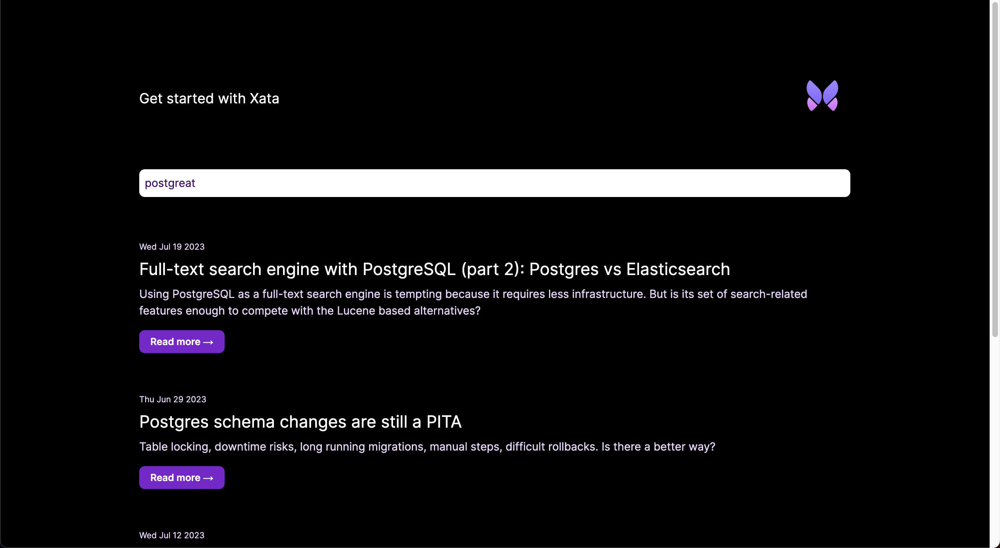

In this guide, you'll learn how to add Xata database and search functionality to a [SolidStart][2] application.
You'll build the following basic blog application features:

1.  List all blog posts
2.  Retrieve and view a single blog post
3.  Full-text fuzzy search of blog posts

Although this application is a simple blog, you can apply these basics to other types of SolidStart applications.

<ArticleVideo
  platform="html"
  src="https://github.com/xataio/mdx-docs/raw/main/020-Getting-started/videos/getting-started-app.mp4"
/>

The completed [SolidStart and Xata code](https://github.com/xataio/examples/tree/main/apps/solidstart-getting-started) for this
guide is available via the [Xata `examples` repo](https://github.com/xataio/examples) on GitHub.

## Before you begin

Install the Xata CLI:

```sh
npm install -g @xata.io/cli
```

Once installed, authenticate the Xata CLI with your Xata account. If you don't already have an account, you can use the
same workflow to sign up for a new account. Run the following command to begin the authentication workflow:

```sh
xata auth login
```

On completion, the command will create a new API key for your user account, which you should see in the [account
settings page within the Xata UI][1]. That key will also be stored locally on your computer (the location might vary for
each OS). It looks like this:

```toml
# .config/xata/credentials
[default]
apiKey=YOUR_API_KEY_HERE
```

## Create a new SolidStart app

Begin by creating a new SolidStart application, accepting the default prompt options:

```sh
npm create solid@latest xata-solidstart
```

<Expand title="npm create solid@latest output">

```sh
$ npm create solid@latest xata-solidstart
Need to install the following packages:
  create-solid@0.3.3
Ok to proceed? (y)

create-solid version 0.2.31

Welcome to the SolidStart setup wizard!

There are definitely bugs and some feature might not work yet.
If you encounter an issue, have a look at https://github.com/solidjs/solid-start/issues and open a new one, if it is not already tracked.

✔ Which template do you want to use? › bare
✔ Server Side Rendering? … yes
✔ Use TypeScript? … yes
found matching commit hash: b2a09b38f13024b706fe71e572c4231c92d4d15b
downloading https://github.com/solidjs/solid-start/archive/b2a09b38f13024b706fe71e572c4231c92d4d15b.tar.gz to /Users/leggetter/.degit/github/solidjs/solid-start/b2a09b38f13024b706fe71e572c4231c92d4d15b.tar.gz
extracting /examples/bare from /Users/leggetter/.degit/github/solidjs/solid-start/b2a09b38f13024b706fe71e572c4231c92d4d15b.tar.gz to /Users/leggetter/tmp/xata/run-through-1/xata-solidstart/.solid-start
cloned solidjs/solid-start#main to /Users/leggetter/tmp/xata/run-through-1/xata-solidstart/.solid-start
✔ Copied project files

Next steps:
  1: cd xata-solidstart
  2: npm install
  3: npm run dev -- --open

To close the dev server, hit Ctrl-C
```

</Expand>

Once the command has completed, go to the `xata-solidstart` directory, install the dependencies, and run the application:

```sh
cd xata-solidstart
npm install
npm run dev
```

By default, the application will run on `http://localhost:3000`.

## Create a new database

With the Xata CLI installed and logged in and a new SolidStart application in place, use the Xata CLI to create a new
database. Accept all the prompt defaults for the following command except for the region selection, where
you should choose the region closest to your application users:

```sh
xata init
```

<Expand title="xata init output">

```sh
xata init
🦋 Initializing project... We will ask you some questions.

You have a single workspace, using it by default: xata-workspace-hc84d7
✔ Select a database or create a new one › <Create a new database>
✔ New database name … xata-solidstart
✔ Select a region › eu-west-1
✔ Add .env to .gitignore? … yes
✔ Generate code and types from your Xata database › TypeScript
✔ Choose the output path for the generated code … src/xata.ts

Setting up Xata...

Created Xata config: .xatarc

Creating .env file
  set XATA_API_KEY=xau_*********************************
  set XATA_BRANCH=main

Added .env file to .gitignore

i Running npm install --save @xata.io/client

added 1 package, and audited 384 packages in 8s

51 packages are looking for funding
  run `npm fund` for details

found 0 vulnerabilities

No new migrations to pull from main branch
Generated Xata code to ./src/xata.ts

✔ Project setup with Xata 🦋

i Setup tables and columns at https://app.xata.io/workspaces/xata-workspace-hc84d7/dbs/xata-solidstart:eu-west-1

i Use xata pull main to regenerate code and types from your Xata database
```

</Expand>

On completion, the CLI will create `.env`, `.xatarc`, and `src/xata.ts` files within your project folder with the
correct credentials to access your database.

Your `.env` file should look something like this:

```bash title=".env"
XATA_API_KEY=YOUR_API_KEY_HERE
XATA_BRANCH=main
```

To inform the TypeScript typechecking about these new environment variables, update `src/env.d.ts` as follows:

```ts title="src/env.d.ts"
interface ImportMetaEnv {
  readonly XATA_API_KEY: string;
  readonly XATA_BRANCH?: string;
}

interface ImportMeta {
  readonly env: ImportMetaEnv;
}
```

Since you selected TypeScript support, it also created files that provide typings and functions to call using Xata's
TypeScript SDK. This will additionally be referenced in the `.xatarc` file as follows:

```json
{
  "databaseUrl": "https://my-xata-app-database-url",
  "codegen": {
    "output": "src/xata.ts"
  }
}
```

The `src/xata.ts` file includes generated code you should typically never touch manually.

## Define the database schema and import CSV data

You can use the [Xata UI][0] to manually define your schema and add data. However, for this guide, you'll use
the Xata CLI and a CSV file to:

1.  Auto-generate a schema based on column headings for names and data types inferred from the column values
2.  Import data to the database

First, download the
[example blog posts CSV file](https://raw.githubusercontent.com/xataio/examples/main/seed/blog-posts.csv).
You can either do this manually or by running the following command:

```sh
curl --create-dirs -o seed/blog-posts.csv https://raw.githubusercontent.com/xataio/examples/main/seed/blog-posts.csv
```

Next, import the CSV:

```sh
xata import csv seed/blog-posts.csv --table Posts --create
```

<Expand title="xata import csv output">

```sh
$ xata import csv seed/blog-posts.csv --table Posts --create
i 45 rows successfully imported 0 errors. 100% complete
✔ Completed
```

</Expand>

Now, if you open up the [Xata UI][1] and navigate to your database, you will see the **Posts** table. Alternatively,
you can run the command `xata browse` to open a browser window:


Click **Schema** to see the schema definition with the inferred data types:


You'll also see `xata.*` [special columns](/docs/concepts/data-model#special-columns) automatically
created and maintained by Xata.

With the database schema in place, the final step is to generate the code that allows you to access and query the data
from your SolidStart application. To do this, run:

```sh
xata pull main
```

<Expand title="xata pull main output">

```sh
$ xata pull main
Successfully pulled 1 migrations from main branch
Running codegen...
Generated Xata code to ./src/xata.ts
```

</Expand>

This updates the contents of `src/xata.ts` based on the schema defined on the `main` branch of your database. So, if you
make any further changes to the schema, run `xata pull <branch>` to update the auto-generated code.

## Basic styling and layout

The first step to add some styling to the application is to add Tailwind CSS.

Install and initialize Tailwind CSS:

```sh
npm install -D tailwindcss postcss autoprefixer
npx tailwindcss init -p
```

Update the `content` property in `tailwind.config.js`:

```js title="tailwind.config.js" {3}
/** @type {import('tailwindcss').Config} */
module.exports = {
  content: ['./src/**/*.{js,jsx,ts,tsx}'],
  theme: {
    extend: {}
  },
  plugins: []
};
```

Next, replace the contents of `src/root.css` with the following:

```css title="src/root.css"
@tailwind base;
@tailwind components;
@tailwind utilities;

:root {
  --foreground-rgb: 0, 0, 0;
  --background-start-rgb: 214, 219, 220;
  --background-end-rgb: 255, 255, 255;
}

@media (prefers-color-scheme: dark) {
  :root {
    --foreground-rgb: 255, 255, 255;
    --background-start-rgb: 0, 0, 0;
    --background-end-rgb: 0, 0, 0;
  }
}

body {
  color: rgb(var(--foreground-rgb));
  background: linear-gradient(to bottom, transparent, rgb(var(--background-end-rgb))) rgb(var(--background-start-rgb));
}
```

Finally, update `src/root.tsx` to add some shared structure across application pages. The code will end up as follows:

```tsx title="src/root.tsx"
// @refresh reload
import { Suspense } from 'solid-js';
import { Body, ErrorBoundary, FileRoutes, Head, Html, Meta, Routes, Scripts, Title } from 'solid-start';
import './root.css';

export default function Root() {
  return (
    <Html lang="en">
      <Head>
        <Title>Get started with Xata and SolidStart</Title>
        <Meta charset="utf-8" />
        <Meta name="viewport" content="width=device-width, initial-scale=1" />
      </Head>
      <Body>
        <main class="flex flex-col justify-center items-center p-8 lg:p-24 min-h-screen">
          <div class="z-10 h-50 w-full max-w-5xl items-center justify-between text-xl lg:flex">
            <p class="fixed left-0 top-0 flex w-full justify-center pb-6 pt-8 lg:static lg:w-auto bg-gradient-to-b from-white via-white via-65% dark:from-black dark:via-black lg:bg-none">
              <a href="/">Get started with Xata and SolidStart</a>
            </p>
            <div class="fixed bottom-0 left-0 flex w-full items-end justify-center bg-gradient-to-t from-white via-white dark:from-black dark:via-black lg:static lg:h-auto lg:w-auto lg:bg-none">
              <a href="https://xata.io" class="w-20">
                
              </a>
            </div>
          </div>
          <Suspense>
            <ErrorBoundary>
              <Routes>
                <FileRoutes />
              </Routes>
            </ErrorBoundary>
          </Suspense>
          <Scripts />
        </main>
      </Body>
    </Html>
  );
}
```

You may need to start and stop your development server for the Tailwind CSS changes to be picked up.

## Query and list the posts

Now, you are ready to integrate Xata into the SolidStart codebase. Start by stripping back the landing page,
`src/routes/index.tsx`, to a bare template:

```tsx title="src/routes/index.tsx"
export default function Home() {
  return (
    <>
      <div class="w-full max-w-5xl mt-16">List of blog posts</div>
    </>
  );
}
```

Next, update the page to get all the posts using Xata, and
list them within the page:

```tsx title="src/routes/index.tsx" {1-3,5-17,19-54}
import { Match, Switch, For } from 'solid-js';
import { useRouteData } from 'solid-start';
import { createServerData$ } from 'solid-start/server';

import { XataClient } from '~/xata';

export function routeData() {
  return createServerData$(async () => {
    const xata = new XataClient({
      apiKey: import.meta.env.XATA_API_KEY,
      branch: import.meta.env.XATA_BRANCH
    });

    let posts = await xata.db.Posts.getAll();
    return { posts };
  });
}

export default function Home() {
  const resource = useRouteData<typeof routeData>();
  const data = resource();
  const posts = data?.posts;

  return (
    <>
      <div class="w-full max-w-5xl mt-16">
        <Switch>
          <Match when={!posts}>
            <p>No blog posts found</p>
          </Match>
          <Match when={posts && posts.length > 0}>
            <For each={posts}>
              {(post) => (
                <div class="mb-16">
                  <p class="text-xs mb-2 text-purple-950 dark:text-purple-200">{post.pubDate?.toDateString()}</p>
                  <h2 class="text-2xl mb-2">
                    <a href={`posts/${post.slug}`}>{post.title}</a>
                  </h2>
                  <p class="text-purple-950 dark:text-purple-200 mb-5">{post.description}</p>
                  <a
                    href={`posts/${post.slug}`}
                    class="px-4 py-2 font-semibold text-sm bg-purple-700 text-white rounded-lg shadow-sm w-fit"
                  >
                    Read more &rarr;
                  </a>
                </div>
              )}
            </For>
          </Match>
        </Switch>
      </div>
    </>
  );
}
```

The breakdown of what's happening in the code above is as follows.

Import [`Match` and `Switch`](https://www.solidjs.com/docs/latest/api#switchmatch), and
[`For`](https://www.solidjs.com/docs/latest/api#for) from Solid to be used when rendering the UI. Then import
[`useRouteData`](https://start.solidjs.com/api/useRouteData) and the server-only
[`createServerData$`](https://start.solidjs.com/api/createServerData) function to be used when retrieving data from Xata.

```tsx
import { Match, Switch, For } from 'solid-js';
import { useRouteData } from 'solid-start';
import { createServerData$ } from 'solid-start/server';
```

Next, define and export a `routeData` function. This returns a call to `createServerData$`, a SolidStart function
specifically for accessing resources only available on the server, like databases. This function provides data to the route when rendering.
Within that function, create an instance of the `XataClient`, passing in the values stored in environment variables for `apiKey` and `branch`. Then,
use the `xata` client instance to get all the posts stored in the database. You achieve this via the auto-generated `Posts` property,
which exposes a number of helper functions. In this case, use the
[`getAll`](/docs/sdk/get#the-typescript-sdk-functions-for-querying) function to get
all the Post records. Finally, return the `posts` as the function return value.

```tsx
import { XataClient } from '~/xata';

export function routeData() {
  return createServerData$(async () => {
    const xata = new XataClient({
      apiKey: import.meta.env.XATA_API_KEY,
      branch: import.meta.env.XATA_BRANCH
    });

    let posts = await xata.db.Posts.getAll();
    return { posts };
  });
}
```

<Alert status="warning">
  `getAll()` returns all the records in the query results. This is dangerous on large tables (more than 10,000 records),
  as it will potentially load a lot of data into memory and create a lot of requests to the server. In most situations,
  you should use `getMany()` or `getPaginated()`. See the [querying
  documentation](/docs/sdk/get#the-typescript-sdk-functions-for-querying) for more information.
</Alert>

Finally, use the `useRouteData` hook within the `Home` function to retrieve the `posts` data.

Then, update the UI to display the results. Make use of Solid's `Switch` control flow component in combination with `Match`;
If no records are present, show a message saying, "No blog posts found". Otherwise, loop through the `posts` using `<For>`
and access the columns of each Post record using their properties: `pubDate` to show the date the blog post was published,
`slug` to link to individual blog posts (which will be used use later), `title` for the title of
the post, and `description` for the textual description of the post:

```tsx
export default function Home() {
  const resource = useRouteData<typeof routeData>();
  const data = resource();
  const posts = data?.posts;

  return (
    <>
      <div class="w-full max-w-5xl mt-16">
        <Switch>
          <Match when={!posts}>
            <p>No blog posts found</p>
          </Match>
          <Match when={posts && posts.length > 0}>
            <For each={posts}>
              {(post) => (
                <div class="mb-16">
                  <p class="text-xs mb-2 text-purple-950 dark:text-purple-200">{post.pubDate?.toDateString()}</p>
                  <h2 class="text-2xl mb-2">
                    <a href={`posts/${post.slug}`}>{post.title}</a>
                  </h2>
                  <p class="text-purple-950 dark:text-purple-200 mb-5">{post.description}</p>
                  <a
                    href={`posts/${post.slug}`}
                    class="px-4 py-2 font-semibold text-sm bg-purple-700 text-white rounded-lg shadow-sm w-fit"
                  >
                    Read more &rarr;
                  </a>
                </div>
              )}
            </For>
          </Match>
        </Switch>
      </div>
    </>
  );
}
```

This results in the page looking like the following:


You'll notice that the post heading and "Read more →" text use the `slug` property to link to a page that doesn't
presently exist. That's the next step in this guide.

## Query and show a single posts

To handle the single posts identified by a `slug`, make use of SolidStart
dynamic [routing](https://start.solidjs.com/core-concepts/routing).

Create a new file, `src/routes/posts/[slug].tsx`, where the SolidStart framework uses the filename segment `[slug]` to capture
the name of the slug:

```tsx title="src/routes/posts/[slug].tsx"
import { Title } from 'solid-start';
import { useParams, useRouteData } from 'solid-start';
import { createServerData$ } from 'solid-start/server';

import { XataClient } from '~/xata';

export function routeData() {
  return createServerData$(async () => {
    const xata = new XataClient({
      apiKey: import.meta.env.XATA_API_KEY,
      branch: import.meta.env.XATA_BRANCH
    });

    const params = useParams();
    return await xata.db.Posts.filter({ slug: params.slug }).getFirst();
  });
}

export default function Post() {
  const data = useRouteData<typeof routeData>();
  const post = data();

  return (
    <>
      <Title>{post?.title}</Title>

      <div class="w-full max-w-5xl mt-16">
        <p class="mb-2">
          <a href="/" class="text-purple-600">
            &larr; Back to blog
          </a>
        </p>

        <h1 class="text-3xl mb-2">{post?.title}</h1>
        <p class="text-sm mb-4 text-purple-950 dark:text-purple-200">{post?.pubDate?.toDateString()}</p>
        <p class="text-xl">{post?.description}</p>
      </div>
    </>
  );
}
```

Here's a walkthrough of what this does.

Import `useParams` to enable access to the value of the `slug`. Import `useRouteData` and `createServerData$` to enable
data to be loaded.

```tsx
import { Title } from 'solid-start';
import { useParams, useRouteData } from 'solid-start';
import { createServerData$ } from 'solid-start/server';
```

The `Title` component is imported from `solid-start` to allow the page title to be set. The `routeData` and
`createServerData$` functions do the same job as the landing page.

Instantiate a new `XataClient` instance, get the page parameters using the `useParams` hook, and then use the
[`filter` function](/docs/sdk/get#the-typescript-sdk-functions-for-querying) on the
auto-generated `Posts` property to perform a query on the Posts table and find the
record where the `slug` column equals the value of `params.slug`. Use the
[`getFirst` function](/docs/sdk/get#the-typescript-sdk-functions-for-querying) to access
the first (and only) Post result and return the post as the `createServerData$` return value.

```tsx
import { XataClient } from '~/xata';

export function routeData() {
  return createServerData$(async () => {
    const xata = new XataClient({
      apiKey: import.meta.env.XATA_API_KEY,
      branch: import.meta.env.XATA_BRANCH
    });

    const params = useParams();
    return await xata.db.Posts.filter({ slug: params.slug }).getFirst();
  });
}
```

Finally, retrieve the `post` data using the `useLoaderData` hook. Then, use the `post` data to set
the page title via `<Title />` and update the rest of the page UI to contain all the information for the single Post:

```tsx
export default function Post() {
  const data = useRouteData<typeof routeData>();
  const post = data();

  return (
    <>
      <Title>{post?.title}</Title>

      <div class="w-full max-w-5xl mt-16">
        <p class="mb-2">
          <a href="/" class="text-purple-600">
            &larr; Back to blog
          </a>
        </p>

        <h1 class="text-3xl mb-2">{post?.title}</h1>
        <p class="text-sm mb-4 text-purple-950 dark:text-purple-200">{post?.pubDate?.toDateString()}</p>
        <p class="text-xl">{post?.description}</p>
      </div>
    </>
  );
}
```

You may need to restart your development server to see the changes.

The single blog post page will look as follows:


## Search posts

The last piece of functionality to add to the application is full-text fuzzy search of blog posts.

When you insert data into a Xata database, it is automatically indexed for full-text search. So you don't need to change
any configuration to enable search, you just need to use the
[TypeScript SDK search feature](/docs/sdk/search).

Add this functionality to the landing page:

```tsx title="src/routes/index.tsx" {1,15-24,32,36-45}
import { useLocation } from '@solidjs/router';
import { Match, Switch, For } from 'solid-js';
import { useRouteData } from 'solid-start';
import { createServerData$ } from 'solid-start/server';

import { XataClient } from '~/xata';

export function routeData() {
  return createServerData$(async () => {
    const xata = new XataClient({
      apiKey: import.meta.env.XATA_API_KEY,
      branch: import.meta.env.XATA_BRANCH
    });

    const location = useLocation();
    const search = location.query.q;

    let posts = null;
    if (search) {
      posts = await xata.db.Posts.search(search, { fuzziness: 2 });
    } else {
      posts = await xata.db.Posts.getAll();
    }
    return { posts, search };
  });
}

export default function Home() {
  const resource = useRouteData<typeof routeData>();
  const data = resource();
  const posts = data?.posts;
  const search = data?.search || '';

  return (
    <>
      <div class="w-full max-w-5xl mt-16">
        <form action="/">
          <input
            name="q"
            value={search}
            placeholder="Search..."
            class="w-full rounded-lg border-2 p-2 dark:text-purple-950"
          />
        </form>
      </div>
      ...
    </>
  );
}
```

Here are all the changes made in the above code.

First, import `useLocation` from `@solidjs/router` and use it within `createServerData$` to retrieve the
value of a `q` querystring parameter, assigned to a variable named `search`.

The landing page should list all blog posts if `search` is an empty string. However, if
the search has a non-empty string value, a search is performed on the Posts table using the
[`search` function](/docs/sdk/search#searching-in-a-single-table) exposed on the
auto-generated `Posts` property. Pass `search` as the text value to search for, and use a
second options parameter with `fuzziness` set to `2`, which informs the fuzzy search behavior to allow for two
letters changed/added/removed. See
[fuzziness and typo tolerance](/docs/sdk/search#fuzziness-and-typo-tolerance) for more
details.

Update the return value to include the `search` value in addition to the `posts`.

```tsx {1, 15-16,17-24}
import { useLocation } from '@solidjs/router';
import { Match, Switch, For } from 'solid-js';
import { useRouteData } from 'solid-start';
import { createServerData$ } from 'solid-start/server';

import { XataClient } from '~/xata';

export function routeData() {
  return createServerData$(async () => {
    const xata = new XataClient({
      apiKey: import.meta.env.XATA_API_KEY,
      branch: import.meta.env.XATA_BRANCH
    });

    const location = useLocation();
    const search = location.query.q;

    let posts = null;
    if (search) {
      posts = await xata.db.Posts.search(search, { fuzziness: 2 });
    } else {
      posts = await xata.db.Posts.getAll();
    }
    return { posts, search };
  });
}
```

The last change enables the user to input and submit a search.

Begin by retrieving the `search` value from the `resource` returned via the `useRouteData` hook.

Next, add a `<form>` to the page to allow a search value to be entered and submitted. Set the `value` of the `<input name="q" />`
to be the value of `search` so if there is an active search, the user has some UI feedback.

The default submit behavior of a form is to perform a `GET` request to the current URL with any form inputs added to the
querystring in the format `{url}/?{input-name}={input-value}`. For our search form, the result of a submission is
a `GET` request in the format `?q={q-value}`. Since this is precisely the behavior required, and the check for the `q`
querystring search value has been implemented already, everything is in place.

```tsx {5,9-18}
export default function Home() {
  const resource = useRouteData<typeof routeData>();
  const data = resource();
  const posts = data?.posts;
  const search = data?.search || '';

  return (
    <>
      <div class="w-full max-w-5xl mt-16">
        <form action="/">
          <input
            name="q"
            value={search}
            placeholder="Search..."
            class="w-full rounded-lg border-2 p-2 dark:text-purple-950"
          />
        </form>
      </div>
      ...
    </>
  );
}
```

The result of the changes means your landing page UI looks like this:



The application now supports listing posts, viewing single posts via a dynamic segment, and full-text fuzzy search of
posts.

## What you've learned

In this guide, you've learned that SolidStart applications and Xata are a powerful combination. You created an
application from scratch that lists blog posts, supports viewing a single blog post, and performs full-text fuzzy search
on all posts.

You walked through setting up the Xata CLI and using it to:

- Create a new Xata project
- Create a database schema and populate it with data from an imported CSV file
- Update the auto-generated code (in `src/xata.ts`) using `xata pull main` to reflect the updated schema

You then updated the landing page to list all blog posts, making use of the auto-generated `xata.db.Posts.getAll`
function. You also added the single post page making use of SolidStart dynamic routes where a `slug` was passed and used
with `xata.db.Posts.filter({ slug: params.slug }).getFirst()`.

Finally, you added full-text fuzzy search functionality to the landing page, leveraging Xata's automatic table
indexing. The search used a `q` query string and the auto-generated `xata.db.Posts.search` function.

## Learn more

If you enjoyed this guide, you could continue working on improving the application. Here are some suggestions:

- Add [pagination](/docs/sdk/get#paginating-results) for the blog post listing
- Add [pagination](/docs/sdk/search#pagination) for blog post search results
- Handle single post view page not finding a result for a `slug`
- Add a `body` field to the database schema to contain the full text of the blog post and update the single page view to
  use that new field.

You can also explore some of the features we've covered in more detail:

- [Getting records](/docs/sdk/get)
- [Filtering records](/docs/sdk/filtering)
- [Searching records](/docs/sdk/search)

Or dive into some of Xata's more advanced features, such as:

- [Aggregations](/docs/sdk/aggregate)
- [Transactions](/docs/sdk/transaction)
- [Vector search](/docs/sdk/vector-search)

[0]: https://app.xata.io
[1]: https://app.xata.io/settings
[2]: https://start.solidjs.com
