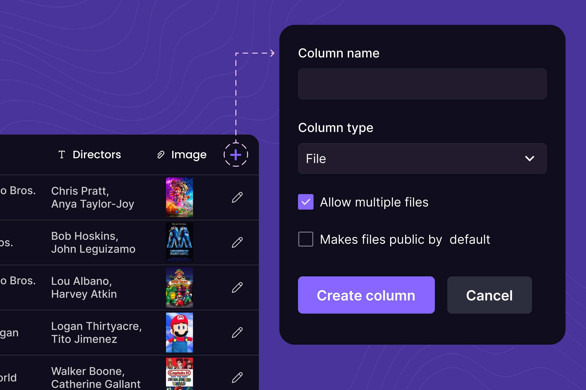
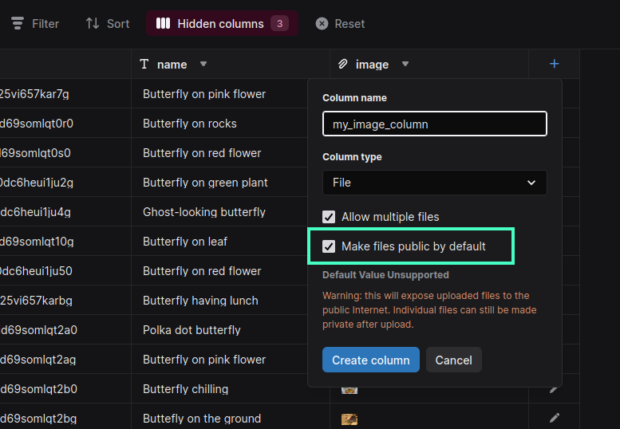

Xata offers general purpose file attachment capabilities. In order to simplify the management of large binary objects and to improve the developer experience, Xata integrates files support directly into the database itself. The aim is to offer a unified, seamless experience by exposing file support under one API, security model, and SDK. Using this approach, the queries, filters, summaries, aggregations from the SDK can also be used on the files' metadata. The metadata (file name, media type, tags) is also indexed for search so it can be included in search results.



## Schema

To support file attachments, Xata provides two column types:

- [`file` column type](/docs/concepts/data-model#file)
  - The column stores file objects, which are JSON objects with a pre-defined schema.
  - Since the column stores a single file object, the file metadata fields can be used in query filters or in summary queries.
  - Files stored in this column type do not get a file id assigned, as they can be referenced by the record id and column name.
- [`file[]` (file array) column type](/docs/concepts/data-model#file)
  - The column stores an array of file item objects.
  - As the column may store an arbitrary number of files, this content cannot be used in query filters or in summary queries.
  - Files stored in this array column type carry a file id so they can be referenced in endpoints such as the binary File API.

A full breakdown of the `file` and `file[]` column types can be found on the [data model](/docs/data-model#file) page.

## Content delivery network (CDN)

File attachments are delivered through an integrated content delivery network (CDN) which minimizes access latency by using regional caches.

Caching is enabled for all signed and public URLs. This is to avoid caching data that is secured by API key permissions. This feature is enabled by default and doesn't require any configuration. Content from publicly accessible and signed URLs is cached for a duration of 4 hours.

As with all cache systems, the fundamental problem is cache invalidation - maintaining cache access performance while ensuring updated content and preventing outdated entries. In its architectural approach, Xata addresses the issue of cache invalidation by treating file content as dynamic - analogous to data within a database.

Consequently, it's recommended that clients dynamically obtain access URLs from the database, rather than persisting them in static resources. When the target file is modified, URLs can become invalid, resulting in access disruptions if stored externally to the database.

Through the process of generating a new URL after each update, the system prevents the delivery of outdated and stale content, regardless of any caches or proxies between the client and storage service. For the client application, this translates to no need for cache time-to-live (TTL) or waiting for cache invalidation. When the URL is fetched directly from the database, it is guaranteed to retrieve the most recent version of the file available.

## File access URLs

Xata provides three ways to expose a file's URL to any request. This should allow you to build a range of products from public facing websites, to more security minded applications that need to think through authentication. Files are secure by default, with action required through these methods to provide access.


### Authenticated URLs

Authenticated URLs are private URLs that can be used to access a file with a valid Xata API Key. They are available in the `url` field of a file object if the file is not configured for public access.

This URLs are recommended to access the file from a secure environment where an API Key is available and you require cached, high throughput, high concurrency download access.

<TabbedCode tabs={['TypeScript', 'Python']}>

```ts
// Allow this User photo to be accessed publicly at any time by the URL alone
const user = await xata.db.Users.update('record_id', {
  photo: {
    enablePublicUrl: false
  }
});

// Retrieve the private URL on the file in the "photo" column
const { url } = user.photo.transform({ quality: 50 });
```

```python
user = xata.records().update("Users", "record_id", {
  "photo": {
    "enablePublicUrl": True
  }
})
```

</TabbedCode>

### Public URLs

A Xata file can be configured for public access, resulting in an URL that is publicly available without the need of an api key or a signature. A public URL does not expire and offers access until the file is reconfigured to remove public access. The public access is configured per file by setting the file field `enablePublicUrl` to `true`. The recommended scenarios for public access are public websites and public content sharing.

A public URL can be called directly without need of code. For example:

https://us-east-1.storage.xata.sh/s38lomas915pn3vetrp1gomd7g is availble publicly

<TabbedCode tabs={['TypeScript', 'Python']}>

```ts
// Allow this User photo to be accessed publicly at any time by the URL alone
const user = await xata.db.Users.update('record_id', {
  photo: {
    enablePublicUrl: true
  }
});

// Retrieve the public URL on the file in the "photo" column
const { url } = user.photo.transform({ quality: 50 });
```

```python
user = xata.records().update("Users", "record_id", {
  "photo": {
    "enablePublicUrl": True
  }
})
```

</TabbedCode>



### Signed URLs

A signed URL offers authenticated access to a file without requiring an API key. The URL contains the key (signature) within it, so anyone holding the URL can get access to the file. The signed URL has a configurable time to live (TTL), which specifies when access to the URL expires. To avoid permanent public access, the TTL can be set to a maximum of 24h.

You can modify the timeout duration of the signed URL for each file by adjusting the `signedUrlTimeout` field within the file object. The default value is 1 minute. A file's signed URL can be retrieved by reading or querying the `signedUrl` field of a file object. Use signed URLs when you need temporary access without revealing the API key, such as rendering an image without disclosing a permanent image URL.

```ts
// Set the timeout to be 10 minutes for this user's photo
const user = await xata.db.Users.update('record_id', {
  photo: {
    signedUrlTimeout: 600 // In seconds
  }
});

// Retrieve the signed URL on the file in the "photo" column
const { signedUrl } = user.photo.transform({ quality: 50 });
```
