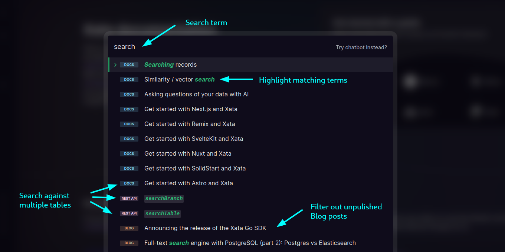

Xata natively provides text-based search for your database with the following core features:

- Fuzzy matching for typo tolerance in search queries
- Targets allow isolation of specific tables and columns in search queries
- Pre-search filters for searching within specific data subsets
- Weights and boosts to influence the relevance of search scores based on certain columns
- Highlight markup in search results to emphasize partial matches in returned content

Search runs in the optional Search store which is eventually consistent. You can choose to opt-out from the Search store at the branch level in the Web UI. The search API and features described in this page require the Search store to be enabled.



As you insert records into Xata tables, they are automatically replicated from the Transactional store to the eventually consistent Search store.

You can run a search using one of the SDKs or the [REST endpoint directly](/docs/api-reference/db/db_branch_name/tables/table_name/search#free-text-search-in-a-table). The REST API provides two endpoints behind the scenes to power our SDK:

- The `/query` allows search at the table level.
- The `/search` endpoint exists both at the database branch and the table level, and it allows searching across multiple tables. While powerful, searching this way does not follow links across tables, other than returning the linked ID. You will need subsequent queries (likely using `.get()`) to pull data from a linked ID.

## Searching across tables

The format of a search request at the branch level (across tables) has the following shape:

<TabbedCode tabs={['TypeScript', 'Python', 'Go', 'JSON']}>

```ts
const results = await xata.search.all("search phrase", {
  tables: [
    {
      table: "Actor",
      target: ["name"],
      filter: {"city": "New York"},
      boosters: [{ numericBooster: { column: 'lifetimeBoxOffice', factor: 3 } }]
    },
    { ... },
  ],
  fuzziness: 1,
  prefix: "phrase"
});
```

```python
results = xata.data().search_branch({
  "query": "search phrase",
  "tables": [{
    "table": "Actor",
    "target": ["name"],
    "filter": {"city": "New York"},
    "boosters": [{ "numericBooster": { "column": "lifetimeBoxOffice", "factor": 3 } }]
  }, {
    ...
  }],
  "fuzziness": 1,
  "prefix": "phrase"
})
```

```go
searchClient, _ := xata.NewSearchAndFilterClient()
prefix := xata.PrefixExpressionPhrase
results, _ := searchClient.SearchBranch(context.TODO(), xata.SearchBranchRequest{
  Payload: xata.SearchBranchRequestPayload{
    Query:  *xata.String("<search phrase>"),
    Tables: []*xata.SearchBranchRequestTablesItem{
      // ..
    },
    Fuzziness: xata.Int(1),
    Prefix:    &prefix,
  },
})
```

```jsonc
// POST https://{workspace}.{region}.xata.sh/db/{db}:{branch}/search

{
  "query": "<search phrase>",
  "tables": [{
    "table": "Actor",
    "target": ["name"],
    "filter": {"city": "New York"},
    "boosters": [{ "numericBooster": { "column": "lifetimeBoxOffice", "factor": 3 } }]
  }, {
    ...
  }],
  "fuzziness": 1,
  "prefix": "phrase"
}
```

</TabbedCode>

At its simplest, a search for the term `New York` against all tables in your database looks like this:

<TabbedCode tabs={['TypeScript', 'Python', 'Go', 'JSON']}>

```ts
const results = await xata.search.all('new york');
```

```python
results = xata.data().search_branch({"query": "new york"})
```

```go
searchClient, _ := xata.NewSearchAndFilterClient()
results, _ := searchClient.SearchBranch(context.TODO(), xata.SearchBranchRequest{
  Payload: xata.SearchBranchRequestPayload{
    Query: "new york",
  },
})
```

```jsonc
// POST https://{workspace}.{region}.xata.sh/db/{db}:{branch}/search

{
  "query": "new york"
}
```

</TabbedCode>

### Search response with highlight markup

Regardless of client, the above search will return results in the below shape. Each result adds an additional `xata` object which contains metadata about the search that includes:

- The `table` where the result was found.
- The relevancy `score` of the result. See [Relevancy control](#relevancy-control) for more information.
- The `version` of the record.
- The `highlight` field, which contains the highlighted search terms.
- The `totalCount`, which is the total number of matches for a search query.

Note the `xata.highlight` field in the example below which marks the search term `New York` with surrounding `<em>` tags.

```json {12-14}
{
  "totalCount": 1,
  "records": [
    {
      "name": "Keanu Reeves",
      "id": "rec_c8stghniqa4ckd0ao9q0",
      "city": "New York City",
      "country": "United States",
      "email": "keanu@example.com",
      "lifetimeBoxOffice": 500000000,
      "xata": {
        "highlight": {
          "city": ["<em>New York</em> City"]
        },
        "score": 0.2876821,
        "table": "Actors",
        "version": 0
      }
    }
  ]
}
```

## Restrict searches to specific tables

If you want to search only some tables in the database, provide the `tables` parameter as part of the request. It expects an array, for example:

<TabbedCode tabs={['TypeScript', 'Python', 'Go', 'JSON']}>

```ts {2}
const results = await xata.search.all('search term', {
  tables: ['Actors', 'Movies']
});

// equivalent to:
const results = await xata.search.all('search term', {
  tables: [{ table: 'Actors' }, { table: 'Movies' }]
});
```

```python {3}
results = xata.data().search_branch({
  "query": "search term",
  "tables": ["Actors", "Movies"]
})

# equivalent to:
results = xata.data().search_branch({
  "query": "search term",
  "tables": [
    {"table": "Actors"},
    {"table": "Movies"}
  ]
})
```

```go {5-8}
searchClient, _ := xata.NewSearchAndFilterClient()
results, _ := searchClient.SearchBranch(context.TODO(), xata.SearchBranchRequest{
  Payload: xata.SearchBranchRequestPayload{
    Query:  "search term",
    Tables: []*xata.SearchBranchRequestTablesItem{
      xata.NewSearchBranchRequestTablesItemFromString("Actors"),
      xata.NewSearchBranchRequestTablesItemFromString("Movies"),
    },
  },
})
```

```jsonc {5}
// POST https://{workspace}.{region}.xata.sh/db/{db}:{branch}/search

{
  "query": "search term",
  "tables": ["Actors", "Movies"]
}

// equivalent to:
{
  "query": "search term",
  "tables": [
    { "table": "Actors" },
    { "table": "Movies" }
  ]
}
```

</TabbedCode>

## Search a single table only

If you want to search in a single table only, it can be easier to search off the table object directly. In this case `xata.db.Actors` searches against the `Actors` table.

<TabbedCode tabs={['TypeScript', 'Python', 'Go', 'JSON']}>

```ts {1}
const results = await xata.db.Actors.search("search term", {
  target: [...],
  filter: {...},
  boosters: [...],
  fuzziness: 1,
  prefix: "phrase",
  highlight: {...}
});
```

```python {1}
results = xata.data().search_table("Actors", {
  "query": "search term",
  "filter": {...},
  "target": [...],
  "boosters": [...],
  "fuzziness": 1,
  "prefix": "phrase",
  "highlight": {...}
})
```

```go
searchClient, _ := xata.NewSearchAndFilterClient()
prefix := xata.PrefixExpressionPhrase
results, _ := searchClient.SearchTable(context.TODO(), xata.SearchTableRequest{
  Payload: xata.SearchTableRequestPayload{
    Query:  *xata.String("search term"),
    Filter: &xata.FilterExpression{
      // ..
    },
    Target: []*xata.TargetExpressionItem{
      // ..
    },
    Boosters: []*xata.BoosterExpression{
      // ..
    },
    Fuzziness: xata.Int(1),
    Prefix:    &prefix,
    Highlight: &xata.HighlightExpression{
      // ..
    },
  },
})
```

```jsonc {1}
// POST https://{workspace}.{region}.xata.sh/db/{db}:{branch}/tables/{table}/search
{
  "query": "search term",
  "filter": {...},
  "target": [...],
  "boosters": [...],
  "fuzziness": 1,
  "prefix": "phrase",
  "highlight": {...}
}
```

</TabbedCode>

In other words, the table level settings from the branch-level search API (`filter`, `target`, `boosters`) are top level settings in the per-table search API.

### Search response with file attachments

File attachment metadata is available by default in [search](/docs/sdk/search) results. All metadata fields including the `url`,`signedUrl` and `uploadUrl` are returned as part of matching documents, but not the file content. Note that the `url` value is accessible only when [enablePublicUrl](/docs/concepts/file-attachments#public-urls) is set to `true` in the file's configuration.

<details open>
  <summary>Example Search response</summary>
```json {9-24}
{
  "totalCount": 1,
  "records": [
    {
      "table": "Users",
      "record": {
        "id": "rec_cn2baqiit8nelj83jag0",
        "name": "Keanu Reeves",
        "photo": {
          "name": "img.jpg",
          "mediaType": "image/jpeg",
          "enablePublicUrl": true,
          "signedUrlTimeout": 600,
          "uploadUrlTimeout": 86400,
          "size": 1,
          "version": 0,
          "url": "https://us-east-1.storage.xata.sh/f13f4im2411tpd9njp32mgt9fc",
          "signedUrl": "https://us-east-1.xata.sh/file/...",
          "uploadUrl": "https://q867qv.us-east-1.upload.xata.sh/file/...",
          "attributes": {
            "height": 3205,
            "width": 2561
          }
        },
        "xata": {
          "createdAt": "2024-02-08T11:05:14.344Z",
          "highlight": {
            "name": [
              "<em>Keanu</em> Reeves"
            ]
          },
          "score": 0.2876821,
          "table": "Users",
          "updatedAt": "2024-02-08T12:03:57.044Z",
          "version": 1
        }
      }
    }
  ]
}
```
</details>

## Fuzziness and typo tolerance

By default, Xata searches tolerates typos of one character. You can control this behavior by setting the `fuzziness` parameter, which represents the maximum [Levenshtein distance](https://en.wikipedia.org/wiki/Levenshtein_distance) for the search terms. Informally, the Levenshtein distance between two words is the minimum number of single-character edits (insertions, deletions or substitutions) required to change one word into the other. Xata accepts 3 possible values:

- `0`: no typo tolerance
- `1`: one letter changed/added/removed (default)
- `2`: two letters changed/added/removed

For example, instead of `Keanu` you can search for `kaanu` (one letter replaced) or `kenu` (one letter missing) and still get the same result:

<TabbedCode tabs={['TypeScript', 'Python', 'Go', 'JSON']}>

```ts
const results = await xata.search.all('kaanu');
```

```python
results = xata.data().search_branch({"query": "kaanu"})
```

```go
searchClient, _ := xata.NewSearchAndFilterClient()
results, _ := searchClient.SearchBranch(context.TODO(), xata.SearchBranchRequest{
  Payload: xata.SearchBranchRequestPayload{
    Query: "kaanu",
  },
})
```

```jsonc
// POST https://{workspace}.{region}.xata.sh/db/{db}:{branch}/search

{
  "query": "kaanu"
}
```

</TabbedCode>

The above matches `Keanu`. You can disable this typo tolerance by setting the `fuzziness` field to 0:

<TabbedCode tabs={['TypeScript', 'Python', 'Go', 'JSON']}>

```ts
const results = await xata.search.all('kaanu', { fuzziness: 0 });
```

```python
results = xata.data().search_branch({
  "query": "kaanu",
  "fuzziness": 0
})
```

```go
searchClient, _ := xata.NewSearchAndFilterClient()
results, _ := searchClient.SearchBranch(context.TODO(), xata.SearchBranchRequest{
  Payload: xata.SearchBranchRequestPayload{
    Query:     "kaanu",
    Fuzziness: xata.Int(0),
  },
})
```

```jsonc
// POST https://{workspace}.{region}.xata.sh/db/{db}:{branch}/search

{
  "query": "kaanu",
  "fuzziness": 0
}
```

</TabbedCode>

With the `fuzziness` set to `0` the misspelling will no longer match for `Keanu`. You can also increase the `fuzziness` to accept a larger amount of typos.

<TabbedCode tabs={['TypeScript', 'Python', 'Go', 'JSON']}>

```ts
const results = await xata.search.all('kaano', { fuzziness: 2 });
```

```python
results = xata.data().search_branch({
  "query": "kaano",
  "fuzziness": 2
})
```

```go
searchClient, _ := xata.NewSearchAndFilterClient()
results, _ := searchClient.SearchBranch(context.TODO(), xata.SearchBranchRequest{
  Payload: xata.SearchBranchRequestPayload{
    Query:     "kaano",
    Fuzziness: xata.Int(2),
  },
})
```

```jsonc
// POST https://{workspace}.{region}.xata.sh/db/{db}:{branch}/search

{
  "query": "kaano",
  "fuzziness": 2
}
```

</TabbedCode>

The above will match records containing `Keanu`.

## Filter records before search is performed

Filtering allows you to filter out records before passing them through the search algorithm. The filtering syntax is the same as for the query API, with the limitation that you cannot filter by linked columns.

The filtering is applied at the table level. For example:

<TabbedCode tabs={['TypeScript', 'Python', 'JSON']}>
```ts {5-7}
const results = await xata.search.all("Search term", {
tables: [
    {
      table: "Actors",
      filter: {
        "city": "New York",
      },
    },
  ],
});
```

```python {6-8}
results = xata.data().search_branch({
  "query": "Search term",
  "tables": [
    {
      "table": "Actors",
      "filter": {
        "city": "New York"
      }
    }
  ]
})
```

```jsonc {8-10}
// POST https://{workspace}.{region}.xata.sh/db/{db}:{branch}/search

{
  "query": "new york",
  "tables": [
    {
      "table": "Actors",
      "filter": {
        "city": "New York"
      }
    }
  ]
}
```

</TabbedCode>

## Target specific columns

By default, Xata searches across all columns from the selected tables. You can restrict the search to specific columns by using the `target` field.

<TabbedCode tabs={['TypeScript', 'Python', 'Go', 'JSON']}>

```ts {5}
const results = await xata.search.all('search term', {
  tables: [
    {
      table: 'Actors',
      target: ['name', 'city']
    }
  ]
});
```

```python {6}
results = xata.data().search_branch({
  "query": "search term",
  "tables": [
    {
      "table": "Actors",
      "target": ["name", "city"]
    }
  ]
})
```

```go {5-8}
searchClient, _ := xata.NewSearchAndFilterClient()
results, _ := searchClient.SearchTable(context.TODO(), xata.SearchTableRequest{
  Payload: xata.SearchTableRequestPayload{
    Query:  *xata.String("search term"),
    Target: []*xata.TargetExpressionItem{
      xata.NewTargetExpression("name"),
      xata.NewTargetExpression("city"),
    },
  },
})
```

```jsonc {8}
// POST https://{workspace}.{region}.xata.sh/db/{db}:{branch}/search

{
  "query": "new york",
  "tables": [
    {
      "table": "Actors",
      "target": ["name", "city"]
    }
  ]
}
```

</TabbedCode>

## Pagination

The search API provides a configurable page size and offset-based pagination. To skip pages set the offset to a multiple of the page size. For example, here we retrieve the second page of up to `10` search results:

<TabbedCode tabs={['TypeScript', 'Python', 'JSON']}>

```ts {8-11}
const results = await xata.search.all('search term', {
  tables: [
    {
      table: 'Actors',
      target: ['name', 'city']
    }
  ],
  page: {
    size: 10,
    offset: 10
  }
});
```

```python {9-12}
results = xata.data().search_branch({
  "query": "search term",
  "tables": [
    {
      "table": "Actors",
      "target": ["name", "city"]
    }
  ],
  "page": {
    "size": 10,
    "offset": 10
  }
})
```

```jsonc {11-14}
// POST https://{workspace}.{region}.xata.sh/db/{db}:{branch}/search

{
  "query": "new york",
  "tables": [
    {
      "table": "Actors",
      "target": ["name", "city"]
    }
  ],
  "page": {
    "size": 10,
    "offset": 10
  }
}
```

</TabbedCode>

## Relevancy control

When using the search API, Xata assigns a relevancy score to each result and the results are returned sorted by their relevancy to the provided query. Behind the scenes,
Xata uses a [BM25](https://en.wikipedia.org/wiki/Okapi_BM25) algorithm to rank the results. The algorithm takes into account the frequency of the search terms in the document, the length of the document, and the frequency of the search terms in the database.

The relevancy score is returned for each result in the metadata. See [Searching across tables](#searching-across-tables) for sample responses.

You can fine-tune the relevancy of your searches by using column weights and boosters. We recommend using the web UI to experiment with these settings, then use the "Get Code Snippet" button to get the code to use in your app.

### Column weights

You can assign an integer weight to each column. The default weight is 1. The higher the weight, the higher the relevancy score will be for matches in that column.

<TabbedCode tabs={['TypeScript', 'Python', 'JSON']}>

```ts {5}
const results = await xata.search.all('search term', {
  tables: [
    {
      table: 'Movies',
      target: [{ column: 'title', weight: 5 }, { column: 'genre', weight: 2 }, '*']
    }
  ]
});
```

```python {6-16}
results = xata.data().search_branch({
  "query": "search term",
  "tables": [
    {
      "table": "Movies",
      "target": [
        {
          "column": "title",
          "weight": 5
        },
        {
          "column": "genre",
          "weight": 2
        },
        "*"
      ]
    }
  ]
})
```

```jsonc {8-18}
// POST https://{workspace}.{region}.xata.sh/db/{db}:{branch}/search

{
  "query": "search term",
  "tables": [
    {
      "table": "Movies",
      "target": [
        {
          "column": "title",
          "weight": 5
        },
        {
          "column": "genre",
          "weight": 2
        },
        "*"
      ]
    }
  ]
}
```

</TabbedCode>

In the above example, all columns are still targeted (`*` is included in `target`) but the `title` and `genre` columns are boosted.

### Numeric booster

The numeric booster allows making use of numeric columns to influence the relevancy score. This is particularly useful when you have columns that contain metrics relevant to the score, like "number of stars", or "number of views'.

<TabbedCode tabs={['TypeScript', 'Python', 'JSON']}>

```ts {5}
const results = await xata.search.all('search term', {
  tables: [
    {
      table: 'Movies',
      boosters: [{ numericBooster: { column: 'views', factor: 3 } }]
    }
  ]
});
```

```python {6-13}
results = xata.data().search_branch({
  "query": "search term",
  "tables": [
    {
      "table": "Movies",
      "boosters": [
        {
          "numericBooster": {
            "column": "views",
            "factor": 3
          }
        }
      ]
    }
  ]
})
```

```jsonc {8-15}
// POST https://{workspace}.{region}.xata.sh/db/{db}:{branch}/search

{
  "query": "search term",
  "tables": [
    {
      "table": "Movies",
      "boosters": [
        {
          "numericBooster": {
            "column": "views",
            "factor": 3
          }
        }
      ]
    }
  ]
}
```

</TabbedCode>

In this example, the `views` column is multiplied with the factor of 3 and then added to the relevancy score.

Additionally, the numeric booster can be configured with the `modifier` parameter which applies on the factor and value of the column before adding it to the item score.

The formula for the application of the modifier in combination with the factor is: `modifier(factor*value)+base_score`

The modifier parameter options are:

- `none`: default
- `log`: common logarithm (base 10).
- `log1p`: add 1 then take the common logarithm. This ensures that the output is positive if the value is between 0 and 1.
- `ln`: natural logarithm (base e).
- `ln1p`: add 1 then take the natural logarithm. This ensures that the output is positive if the value is between 0 and 1.
- `square`: raise the value to the power of two.
- `sqrt`: take the square root of the value.
- `reciprocal`: reciprocate the value (if the value is `x`, the reciprocal is `1/x`).

<TabbedCode tabs={['TypeScript', 'Python', 'JSON']}>

```ts {5}
const results = await xata.search.all('search term', {
  tables: [
    {
      table: 'Movies',
      boosters: [{ numericBooster: { column: 'views', factor: 3, modifier: 'square' } }]
    }
  ]
});
```

```python {6-14}
results = xata.data().search_branch({
  "query": "search term",
  "tables": [
    {
      "table": "Movies",
      "boosters": [
        {
          "numericBooster": {
            "column": "views",
            "factor": 3,
            "modifier": "square"
          }
        }
      ]
    }
  ]
})
```

```jsonc {8-16}
// POST https://{workspace}.{region}.xata.sh/db/{db}:{branch}/search

{
  "query": "search term",
  "tables": [
    {
      "table": "Movies",
      "boosters": [
        {
          "numericBooster": {
            "column": "views",
            "factor": 3,
            "modifier": "square"
          }
        }
      ]
    }
  ]
}
```

</TabbedCode>

In this example, the `views` column is multiplied with the factor of 3, then the result is squared and finally added to the relevancy score.

### Exact value booster

The exact value booster allows boosting the relevancy of records that have an exact value in a column. This can be useful to boost, for example, movies in a given genre. A common scenario is to use exact value boosts to "pin" a particular result at the top of the results.

<TabbedCode tabs={['TypeScript', 'Python', 'JSON']}>

```ts {5}
const results = await xata.search.all('search term', {
  tables: [
    {
      table: 'Movies',
      boosters: [{ valueBooster: { column: 'genre', value: 'action', factor: 5 } }]
    }
  ]
});
```

```python {6-14}
results = xata.data().search_branch({
  "query": "search term",
  "tables": [
    {
      "table": "Movies",
      "boosters": [
        {
          "valueBooster": {
            "column": "genre",
            "value": "action",
            "factor": 5
          }
        }
      ]
    }
  ]
})
```

```jsonc {8-16}
// POST https://{workspace}.{region}.xata.sh/db/{db}:{branch}/search

{
  "query": "search term",
  "tables": [
    {
      "table": "Movies",
      "boosters": [
        {
          "valueBooster": {
            "column": "genre",
            "value": "action",
            "factor": 5
          }
        }
      ]
    }
  ]
}
```

</TabbedCode>

In the above example, records that have the value `action` in the `genre` column will receive a boost factor of 5 added to their relevancy score.

### Date booster

The date booster allows boosting the relevancy of records that have a date in a column depending on the proximity of the matching date to a provided date. This can be used to boost, for example, more recent movies added to the database. In the below example we'll use Xata's internal `xata.createdAt` object that is available on all records.

<TabbedCode tabs={['TypeScript', 'Python', 'JSON']}>

```ts {7-12}
const results = await xata.search.all('search term', {
  tables: [
    {
      table: 'Movies',
      boosters: [
        {
          dateBooster: {
            column: 'xata.createdAt',
            decay: 0.5,
            scale: '30d',
            factor: 10
          }
        }
      ]
    }
  ]
});
```

```python {8-13}
results = xata.data().search_branch({
  "query": "search term",
  "tables": [
    {
      "table": "Movies",
      "boosters": [
        {
          "dateBooster": {
            "column": "xata.createdAt",
            "decay": 0.5,
            "scale": "30d",
            "factor": 10
          }
        }
      ]
    }
  ]
})
```

```jsonc {10-15}
// POST https://{workspace}.{region}.xata.sh/db/{db}:{branch}/search

{
  "query": "search term",
  "tables": [
    {
      "table": "Movies",
      "boosters": [
        {
          "dateBooster": {
            "column": "xata.createdAt",
            "decay": 0.5,
            "scale": "30d",
            "factor": 10
          }
        }
      ]
    }
  ]
}
```

</TabbedCode>

The date booster is configured via `origin`, `scale`, and `decay` parameters. The further away from the `origin`,
the more the score decays. The decay function uses an exponential function. The exponential function returns a value between 0 and 1, which is added to the score. This value can be multiplied by the `factor` parameter in order to provide a bigger impact.

With the parameters applied from the previous example this will boost movies from 30 days ago by 50% of what
the equivalent post from today would score.

The parameter definitions are:

- `column`: the column in which to look for the value.
- `origin`: The datetime from where to apply the score decay function. If it is not specified, the current date and time is used.
- `scale`: The duration at which distance from origin the score is decayed with factor, using an exponential function. It is formatted as number + unit of time, for example: `5d`, `20m`, `10s`.
- `decay`: The decay factor to expect at "scale" distance from the "origin".
- `factor`: The factor to multiply the decayed boost with.

## Known issues

Default values added to existing records by creating new columns with default values, are not available in Search.
These default values are available for new records and become accessible in existing records only in case of a subsequent record update.
