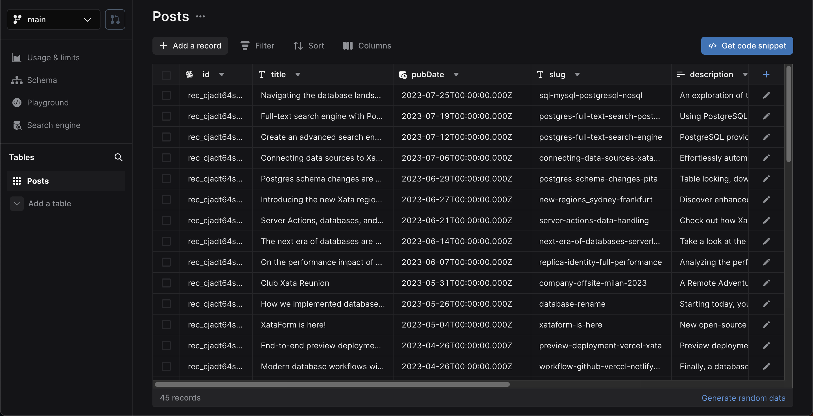

In this guide, you'll learn how to add Xata database and search functionality to a [SvelteKit][2] application.
You'll build the following basic blog application features:

1.  List all blog posts
2.  Retrieve and view a single blog post
3.  Full-text fuzzy search of blog posts

Although this application is a simple blog, you can apply these basics to other types of SvelteKit applications.

<ArticleVideo
  platform="html"
  src="https://github.com/xataio/mdx-docs/raw/main/010-Getting-started/videos/getting-started-app.mp4"
/>

The completed [SvelteKit and Xata code](https://github.com/xataio/examples/tree/main/apps/getting-started-sveltekit) for this
guide is available via the [Xata `examples` repo](https://github.com/xataio/examples) on GitHub.

## Before you begin

Install the Xata CLI:

<TabbedCode tabs={['Shell', 'PowerShell']}>

```sh
npm install -g @xata.io/cli
```

```sh
npm install -g '@xata.io/cli'
```

</TabbedCode>

Once installed, authenticate the Xata CLI with your Xata account. If you don't already have an account, you can use the
same workflow to sign up for a new account. Run the following command to begin the authentication workflow:

```sh
xata auth login
```

On completion, the command will create a new API key for your user account, which you should see in the [account
settings page within the Xata UI][1]. That key will also be stored locally on your computer (the location might vary for
each OS). It looks like this:

```toml
# .config/xata/credentials
[default]
apiKey=YOUR_API_KEY_HERE
```

## Create a new SvelteKit app

Begin by creating a new SvelteKit application, accepting the default prompt options:

```sh
npm init @svelte-add/kit@latest xata-sveltekit -- --with typescript+tailwindcss
```

<Expand title="Output for command: npm init @svelte-add/kit@latest">

```sh
$ npm init @svelte-add/kit@latest xata-sveltekit -- --with typescript+tailwindcss
Need to install the following packages:
  @svelte-add/create-kit@2023.8.20-0.0
Ok to proceed? (y)
➕ Svelte Add's SvelteKit app initializer (Version 2023.08.200.00)
🪄 Your TypeScript + PostCSS + Tailwind CSS SvelteKit app is ready!
  1. cd xata-sveltekit
  2. pnpm run dev -- --open  # start developing with a browser open
```

</Expand>

Once the command has completed, go to the `xata-sveltekit` directory and run the application:

```sh
cd xata-sveltekit
npm run dev
```

By default, the application will run on `http://localhost:5173/`.

## Create a new database

Once you have the Xata CLI installed, are logged in, and have set up a new SvelteKit application, you are ready to use the Xata CLI to generate a new database. Accept all the prompt defaults for the following command except for the region selection, where
you should choose the region closest to your application users:

```sh
xata init
```

<Expand title="Output for command: xata init">

```sh
xata init
🦋 Initializing project... We will ask you some questions.

You have a single workspace, using it by default: my-workspace-123456
✔ Select a database or create a new one › <Create a new database>
✔ New database name … xata-sveltekit
✔ Select a region › eu-west-1
✔ Add .env to .gitignore? … yes
✔ Generate code and types from your Xata database › TypeScript
✔ Choose the output path for the generated code … src/xata.ts

Setting up Xata...

Created Xata config: .xatarc

Creating .env file
  set XATA_API_KEY=xau_*********************************
  set XATA_BRANCH=main

Added .env file to .gitignore

i Running npm install --save @xata.io/client

added 1 package, and audited 965 packages in 1m

245 packages are looking for funding
  run `npm fund` for details

found 0 vulnerabilities

dependencies:
+ @xata.io/client 0.25.2

Done in 3m 29.4s

No new migrations to pull from main branch
Generated Xata code to ./src/xata.ts

✔ Project setup with Xata 🦋

i Setup tables and columns at https://app.xata.io/workspaces/my-workspace-123456/dbs/xata-sveltekit:eu-west-1

i Use xata pull main to regenerate code and types from your Xata database
```

</Expand>

On completion, the CLI will create `.env`, `.xatarc`, and `src/xata.ts` files within your project folder with the
correct credentials to access your database.

Your `.env` file should look something like this:

```bash title=".env"
XATA_API_KEY=YOUR_API_KEY_HERE
XATA_BRANCH=main
```

Vite is used as the development server, and it will only load environment variables prefixed with `VITE_`. So, update
the environmental variables:

```bash title=".env"
VITE_XATA_API_KEY=YOUR_API_KEY_HERE
VITE_XATA_BRANCH=main
```

<Alert status="info">
  For more information on Vite's handling of environment variables and the need for the `VITE_` prefix, read the [Vite
  environment variable docs](https://vitejs.dev/guide/env-and-mode.html).
</Alert>

Since you selected TypeScript support after running `xata init`, it also created files that provide typings and functions to call using Xata's
TypeScript SDK. This will additionally be referenced in the `.xatarc` file as follows:

```json
{
  "databaseUrl": "https://my-xata-app-database-url",
  "codegen": {
    "output": "src/xata.ts"
  }
}
```

The `src/xata.ts` file includes generated code you should typically never touch manually.

## Define the database schema and import CSV data

You can use the [Xata UI][0] to manually define your schema and add data. However, for this guide, you'll use
the Xata CLI and a CSV file to:

1.  Auto-generate a schema based on column headings for names and data types inferred from the column values
2.  Import data to the database

First, download the
[example blog posts CSV file](https://raw.githubusercontent.com/xataio/examples/main/seed/blog-posts.csv).
You can either do this manually or by running the following command:

<TabbedCode tabs={['Shell', 'PowerShell']}>

```sh
curl --create-dirs -o seed/blog-posts.csv https://raw.githubusercontent.com/xataio/examples/main/seed/blog-posts.csv
```

```sh
curl.exe --create-dirs -o seed/blog-posts.csv https://raw.githubusercontent.com/xataio/examples/main/seed/blog-posts.csv
```

</TabbedCode>

Next, import the CSV:

```sh
xata import csv seed/blog-posts.csv --table Posts --create
```

<Expand title="Output for command: xata import csv">

```sh
$ xata import csv seed/blog-posts.csv --table Posts --create
i 45 rows successfully imported 0 errors. 100% complete
✔ Completed
```

</Expand>

Now, if you open up the [Xata UI][1] and navigate to your database, you will see the **Posts** table. Alternatively,
you can run the command `xata browse` to open a browser window:



Click **Schema** to see the schema definition with the inferred data types:


You'll also see `xata.*` [special columns](/docs/concepts/data-model#special-columns) automatically
created and maintained by Xata.

With the database schema in place, the final step is to generate the code that allows you to access and query the data
from our SvelteKit application. To do this, run:

```sh
xata pull main
```

<Expand title="Output for command: xata pull main">

```sh
$ xata pull main
Successfully pulled 1 migrations from main branch
Running codegen...
Generated Xata code to ./src/xata.ts
```

</Expand>

This updates the contents of `src/xata.ts` based on the schema defined on the `main` branch of your database. So, if you
make any further changes to the schema, run `xata pull <branch>` to update the auto-generated code.

## Basic styling and layout

Add the following global styling to the scaffolded `src/app.postcss`:

```css title="src/app.postcss" {5-26}
@tailwind base;
@tailwind components;
@tailwind utilities;

:root {
  --foreground-rgb: 0, 0, 0;
  --background-start-rgb: 214, 219, 220;
  --background-end-rgb: 255, 255, 255;
}

@media (prefers-color-scheme: dark) {
  :root {
    --foreground-rgb: 255, 255, 255;
    --background-start-rgb: 0, 0, 0;
    --background-end-rgb: 0, 0, 0;
  }
}

body {
  color: rgb(var(--foreground-rgb));
  background: linear-gradient(to bottom, transparent, rgb(var(--background-end-rgb))) rgb(var(--background-start-rgb));
}
```

Finally, update `src/routes/+layout.svelte` to add some shared structure across application pages. The code will end up as follows:

```tsx title="src/routes/+layout.svelte" {4-22}
<script>
  import '../app.postcss';
</script>
<svelte:head>
    <title>Get started with Xata and SvelteKit</title>
</svelte:head>

<main class="flex flex-col items-center p-8 lg:p-24 min-h-screen">
  <div class="z-10 h-50 w-full max-w-5xl items-center justify-between text-xl lg:flex">
    <p class="fixed left-0 top-0 flex w-full justify-center pb-6 pt-8 lg:static lg:w-auto bg-gradient-to-b from-white via-white via-65% dark:from-black dark:via-black lg:bg-none">
      <a href="/" data-sveltekit-reload>Get started with Xata and SvelteKit</a>
    </p>
    <div class="fixed bottom-0 left-0 flex w-full items-end justify-center bg-gradient-to-t from-white via-white dark:from-black dark:via-black lg:static lg:h-auto lg:w-auto lg:bg-none">
      <a href="https://xata.io" class="w-20">
        
      </a>
    </div>
  </div>

  <slot />

</main>
```

Ensure the `<slot />` component is before the closing `</main>` element.

## Query and list the posts

The SvelteKit app is now ready for the Xata integration into the codebase.

Start by making use of
[SvelteKit's loading data mechanism](https://kit.svelte.dev/docs/load) to retrieve all the blog posts from Xata
and make them available within the landing page. Create `src/routes/+page.server.ts` with the following contents:

```ts title="src/routes/+page.server.ts"
import type { PageServerLoad } from './$types';

import { XataClient } from '../xata';

const xata = new XataClient({
  apiKey: import.meta.env.VITE_XATA_API_KEY,
  branch: import.meta.env.VITE_XATA_BRANCH
});

export const load: PageServerLoad = async () => {
  const posts = await xata.db.Posts.getAll();

  return {
    posts
  };
};
```

Begin by importing the `PageServerLoad` type definition from the SvelteKit generated `$types` module.

Then, import `XataClient` from the auto-generated `src/xata.ts` and create a new instance, passing in
the updated environment variables, `VITE_XATA_API_KEY` and `VITE_XATA_BRANCH`.

Define and export a `load` function. Within this function, use the `xata` client instance to get all the posts stored in the database.
Achieve this via the auto-generated `Posts` property, which exposes a number of helper functions. In this case, use the
[`getAll`](/docs/sdk/get#the-typescript-sdk-functions-for-querying) function to get
all the Post records. Finally, return the `posts` as part of the `load` function return value.

<Alert status="warning">
  `getAll()` returns all the records in the query results. This is dangerous on large tables (more than 10,000 records),
  as it will potentially load a lot of data into memory and create a lot of requests to the server. In most situations,
  you should use `getMany()` or `getPaginated()`. See the [querying
  documentation](/docs/sdk/get#the-typescript-sdk-functions-for-querying) for more information.
</Alert>

Next, update the landing page to load the data and render the list of blog posts:

```svelte title="src/routes/+page.svelte"
<script lang="ts">
  import type { PageData } from './$types';

  export let data: PageData;
</script>

<div class="w-full max-w-5xl mt-16">
  {#if data.posts.length === 0}
    <p>No blog posts found</p>
  {/if}
  {#each data.posts as post}
    <div class="mb-16">
      <p class="text-xs mb-2 text-purple-950 dark:text-purple-200">
        {post.pubDate?.toDateString()}
      </p>
      <h2 class="text-2xl mb-2">
        <a href={`posts/${post.slug}`}>{post.title}</a>
      </h2>
      <p class="text-purple-950 dark:text-purple-200 mb-5">
        {post.description}
      </p>
      <a
        href={`posts/${post.slug}`}
        class="px-4 py-2 font-semibold text-sm bg-purple-700 text-white rounded-lg shadow-sm w-fit"
      >
        Read more &rarr;
      </a>
    </div>
  {/each}
</div>
```

Here's a walkthrough of the code above.

First, import the `PageData` type. Then, define a `data` variable of type `PageData`. The value of this
variable is automatically assigned by the framework.

Next, update the logic within the UI. If no records are present, show a message saying, "No blog posts found". Otherwise, loop through the
`data.posts` using Svelte's [each logic block](https://svelte.dev/docs/logic-blocks#each) and access the columns of
each Post record using their properties: `pubDate` to show the date the blog post was published, `slug` to link to individual
blog posts (which will be used use later), `title` for the title of the post, and `description` for the textual description of
the post.

This results in the page looking like the following:


You'll notice that the post heading and "Read more →" text use the `slug` property to link to a page that doesn't
presently exist. That's the next step in this guide.

## Query and show a single posts

To handle the single posts identified by a `slug`, make use of [SvelteKit page](https://kit.svelte.dev/docs/routing#page-page-js)
parameters that are defined and passed based on file and directory naming conventions for SvelteKit pages.

Create new files, `src/routes/posts/[slug]/+page.server.ts` and `src/routes/posts/[slug]/+page.svelte`,
where the SvelteKit framework uses the directory `[slug]` to capture the name of the slug.

As with the landing page, use `+page.server.ts` to load data on the server. In this case, use the `slug` value to retrieve the
details for the single blog post:

```tsx title="src/routes/posts/[slug]/+page.server.ts"
import type { PageServerLoad } from './$types';

import { XataClient } from '../../../xata';

const xata = new XataClient({
  apiKey: import.meta.env.VITE_XATA_API_KEY,
  branch: import.meta.env.VITE_XATA_BRANCH
});

export const load: PageServerLoad = async ({ params }) => {
  const post = await xata.db.Posts.filter({ slug: params.slug }).getFirst();

  return {
    post
  };
};
```

Create a new instance of the `XataClient` client, and then use the
[`filter` function](/docs/sdk/get#the-typescript-sdk-functions-for-querying) on the
auto-generated `Posts` property to perform a query on the Posts table and find the
record where the `slug` column equals the value of `params.slug`. Use the
[`getFirst` function](/docs/sdk/get#the-typescript-sdk-functions-for-querying) to access
the first (and only) Post result and return the `post` as a property on the return value.

Next, update the contents of `src/routes/posts/[slug]/+page.svelte` as follows to render the Post data within the UI:

```svelte title="src/routes/posts/[slug]/+page.svelte"
<script lang="ts">
  import type { PageData } from './$types';

  export let data: PageData;
</script>

<svelte:head>
    <title>{data.post?.title}</title>
</svelte:head>

<div class="w-full max-w-5xl mt-16">
  <p class="mb-2">
    <a href="/" class="text-purple-600">
      &larr; Back to blog
    </a>
  </p>
  <h1 class="text-3xl mb-2">
    {data.post?.title}
  </h1>
  <p class="text-sm mb-4 text-purple-950 dark:text-purple-200">
    {data.post?.pubDate?.toDateString()}
  </p>
  <p class="text-xl">
    {data.post?.description}
  </p>
</div>
```

In this page, first import the `PageData` type and the `data` value is automatically assigned by the framework. Then, use the value of
`data.post?.title` to set the page title using the `<svelte:head>` element. Finally, the UI is updated to show the
`title`, `pubDate`, and `description`.

The single blog post page will look as follows:


## Search posts

The last piece of functionality to add to the application is full-text fuzzy search of blog posts.

When you insert data into a Xata database, it is automatically indexed for full-text search. So you don't need to change
any configuration to enable search, just need to use the
[TypeScript SDK search feature](/docs/sdk/search).

Add this functionality to the landing page server functionality:

```tsx title="src/routes/+page.server.ts" {10-19,23}
import type { PageServerLoad } from './$types';

import { XataClient } from '../xata';

const xata = new XataClient({
  apiKey: import.meta.env.VITE_XATA_API_KEY,
  branch: import.meta.env.VITE_XATA_BRANCH
});

export const load: PageServerLoad = async ({ request }) => {
  const url = new URL(request.url);
  const search = url.searchParams.get('q');

  let posts = null;
  if (search) {
    const { records } = await xata.db.Posts.search(search, { fuzziness: 2 });
    posts = records;
  } else {
    posts = await xata.db.Posts.getAll();
  }

  return {
    posts,
    search
  };
};
```

Update the `load` function to take an argument and deconstruct the `request` property from that argument.
Create a new `URL` instance and get the `q` query string from the URL using `url.searchParams.get('q')`, assigning
the result to a variable named `search`.

The landing page should list all blog posts if `search` is an empty string. However, if
the search has a non-empty string value, a search is performed on the Posts table using the
[`search` function](/docs/sdk/search#searching-in-a-single-table) exposed on the
auto-generated `Posts` property. Pass `search` as the text value to search for, and use a
second options parameter with `fuzziness` set to `2`, which informs the fuzzy search behavior to allow for two
letters changed/added/removed. See
[fuzziness and typo tolerance](/docs/sdk/search#fuzziness-and-typo-tolerance) for more
details.

Update the `load` return value to include `search` in addition to the `posts` result.

The last change enables the user to input and submit a search. Add a `<form>` to the page to allow a search value
to be entered and submitted:

```svelte title="src/routes/+page.svelte" {7-16}
<script lang="ts">
  import type { PageData } from './$types';

  export let data: PageData;
</script>

<div class="w-full max-w-5xl mt-16">
  <form data-sveltekit-reload>
    <input
      name="q"
      placeholder="Search..."
      value={data.search}
      class="w-full rounded-lg border-2 p-2 dark:text-purple-950"
    />
  </form>
</div>

<div class="w-full max-w-5xl mt-16">
  {#if data.posts.length === 0}
    <p>No blog posts found</p>
  {/if}
  {#each data.posts as post}
    <div class="mb-16">
      <p class="text-xs mb-2 text-purple-950 dark:text-purple-200">{post.pubDate?.toDateString()}</p>
      <h2 class="text-2xl mb-2">
        <a href={`posts/${post.slug}`}>{post.title}</a>
      </h2>
      <p class="text-purple-950 dark:text-purple-200 mb-5">{post.description}</p>
      <a
        href={`posts/${post.slug}`}
        class="px-4 py-2 font-semibold text-sm bg-purple-700 text-white rounded-lg shadow-sm w-fit"
      >
        Read more &rarr;
      </a>
    </div>
    {/each}
</div>
```

The `data.search` value is used as the default value of the `<input name="q" />` field to inform the user of the current
search.

The default behavior of a form is to submit a `GET` request to the current URL with any form inputs added to the query
string in the format `{url}/?{input-name}={input-value}`. For our search form, the result of a form submission is
a `GET` request in the format`?q={q-value}`. To allow this default browser behavior to take place, add the
[`data-sveltekit-reload` attribute](https://kit.svelte.dev/docs/link-options#data-sveltekit-reload) to the `<form />` element.
With the browser default behavior set and the check for the `q` querystring search value already implemented, everything is in place.


The application now supports listing posts, viewing single posts via a `slug` page parameter, and full-text fuzzy search of
posts.

## What you've learned

In this guide, you've learned that SvelteKit applications and Xata are a powerful combination. You created an
application from scratch that lists blog posts, supports viewing a single blog post, and performs full-text fuzzy search
on all posts.

You walked through setting up the Xata CLI and using it to:

- Create a new Xata project
- Create a database schema and populate it with data from an imported CSV file
- Update the auto-generated code (in `src/xata.ts`) using `xata pull main` to reflect the updated schema

You then updated the landing page to list all blog posts, making use of the auto-generated `xata.db.Posts.getAll`
function. You also added the single post page making use of SvelteKit page parameters where a `slug` was passed and used
with `xata.db.Posts.filter({ slug: params.slug }).getFirst()`.

Finally, you added full-text fuzzy search functionality to the landing page, leveraging Xata's automatic table
indexing. The search used a `q` query string and the auto-generated `xata.db.Posts.search` function.

## Learn more

If you enjoyed this guide, you could continue working on improving the application. Here are some suggestions:

- Add [pagination](/docs/sdk/get#paginating-results) for the blog post listing
- Add [pagination](/docs/sdk/search#pagination) for blog post search results
- Handle single post view page not finding a result for a `slug`
- Add a `body` field to the database schema to contain the full text of the blog post and update the single page view to
  use that new field

You can explore some of the features covered in more detail:

- [Getting records](/docs/sdk/get)
- [Filtering records](/docs/sdk/filtering)
- [Searching records](/docs/sdk/search)

Or dive into some of Xata's more advanced features, such as:

- [Aggregations](/docs/sdk/aggregate)
- [Transactions](/docs/sdk/transaction)
- [Vector search](/docs/sdk/vector-search)

[0]: https://app.xata.io
[1]: https://app.xata.io/settings
[2]: https://kit.svelte.dev/