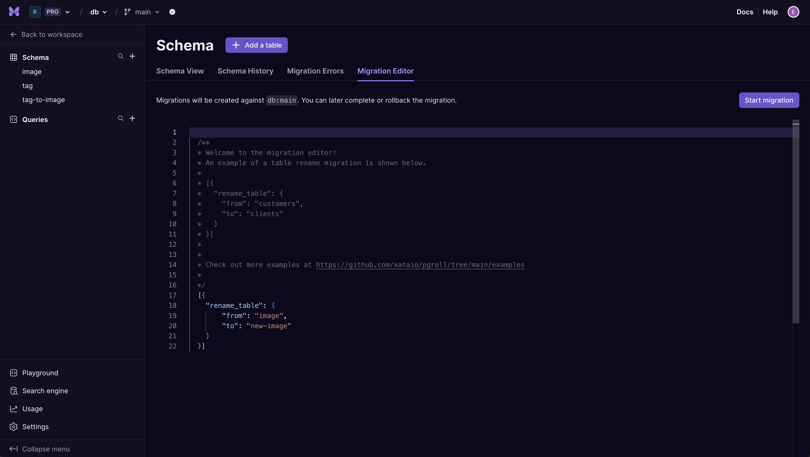
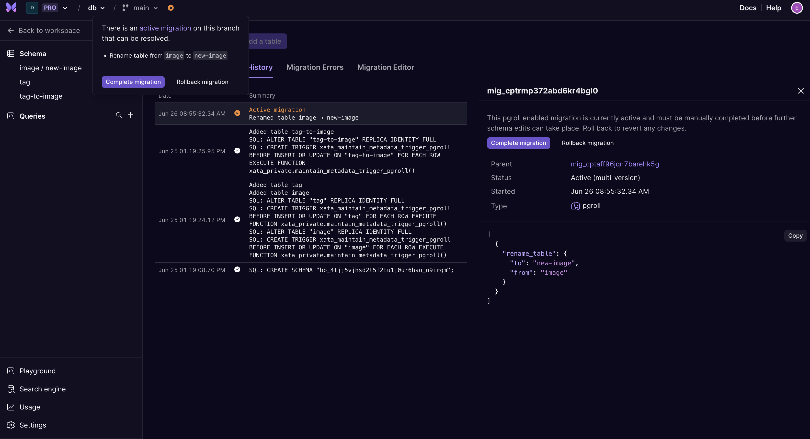
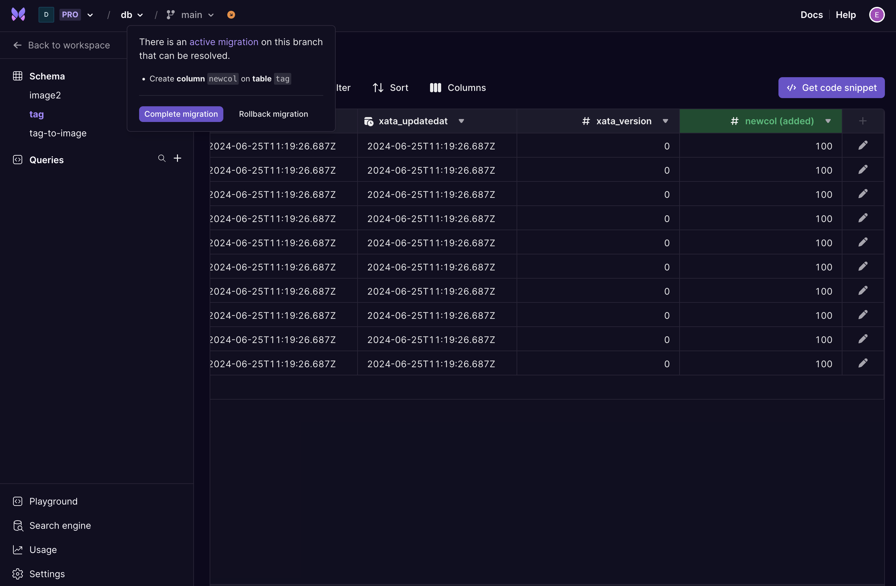
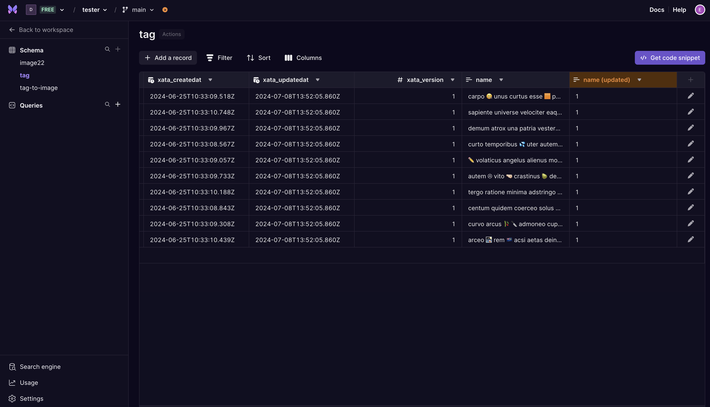
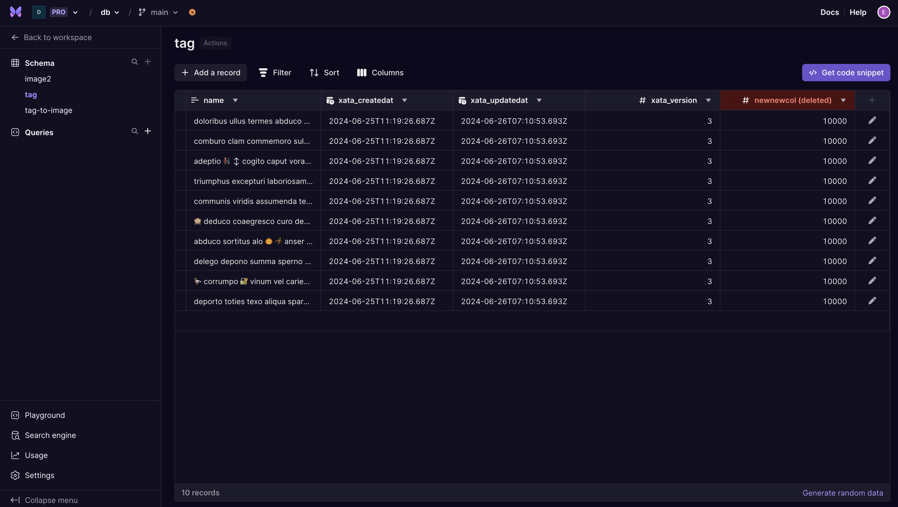
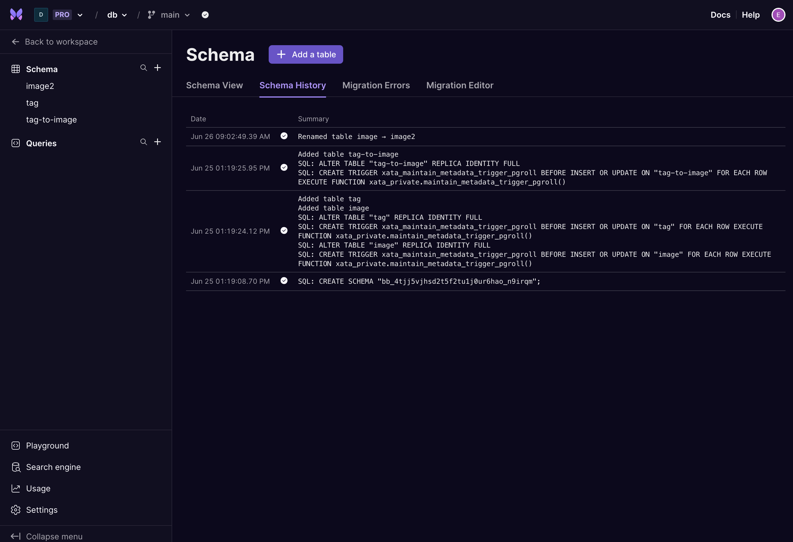
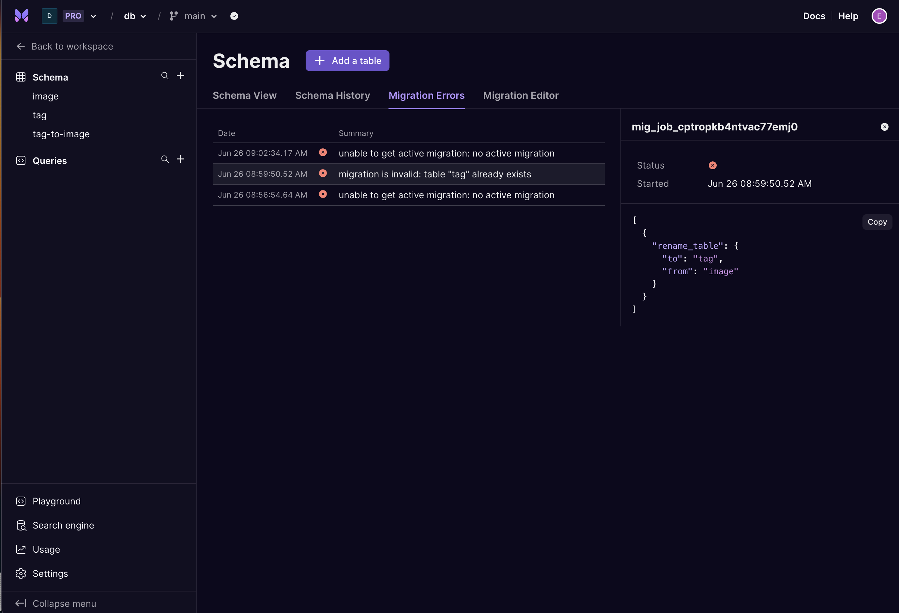

Xata runs migrations on your database branch anytime the schema is changed. You can find a log of these changes within the UI on the <strong>Schema history</strong> page. The [CLI](/docs/getting-started/cli) provides commands to `push` and `pull` these updates to and from remote to your local project. The files generated live in the `.xata` folder and can and should be committed with your source code.

- The `xata pull [branch]` command pulls migrations from your branch and updates the `.ledger` file. It will also run any optional `codegen` (ex: TypeScript types) provided by your SDK of choice.
- The `xata push [branch]` command pushes your migrations to a defined branch.

Each migration file holds a JSON object containing the migration record, and list of operations. The file structure for beta [Postgres enabled](/docs/postgres) projects utilizes [pgroll](https://github.com/xataio/pgroll) migration formats. Generally speaking you should not need to worry about these files unless you plan to build automation tools around migrations. For example our [PR based workflow](/docs/getting-started/workflow) uses these files to perform migrations on PR merges.

<TabbedCode tabs={["Migration example in production", "Migration example with Postgres enabled (beta)"]}>

```json
{
  "id": "mig_cnphjtbsf1h6sr9v804g",
  "parentID": "mig_cnphjr3sf1h6sr9v803g",
  "checksum": "1:f606134f7472a748c0f96f9505fe01d2045f4728761257b11101c1f39ab41238",
  "operations": [
    {
      "addColumn": {
        "column": {
          "name": "description",
          "type": "string"
        },
        "table": "items"
      }
    }
  ]
}
```

```json
{
  "done": true,
  "migration": {
    "name": "mig_cnphg3rsf1h6sr9v7vug",
    "operations": [
      {
        "add_column": {
          "table": "items",
          "column": {
            "pk": false,
            "name": "description",
            "type": "text",
            "check": {
              "name": "items_xata_string_length_description",
              "constraint": "LENGTH(\"description\") <= 2048"
            },
            "unique": false,
            "comment": "{\"xata.type\":\"string\"}",
            "nullable": true
          }
        }
      }
    ]
  },
  "migrationType": "pgroll",
  "name": "mig_cnphg3rsf1h6sr9v7vug",
  "parent": "mig_cnphecjsf1h6sr9v7vt0",
  "startedAt": "2024-03-14T15:30:24.782767Z"
}
```

</TabbedCode>

Migration files should not be modified. If externally modified, the record will become invalid. Xata keeps track of all migrations within a database and attempting to push a modified migration file to another branch will result in an error.

Migrations must be ordered. Ordering is guaranteed by the `parent` and the ledger file, which is stored in `.xata/migrations/.ledger`. The ledger file is an append only file that lists all migration files in the correct order.

## Multi-version Schema Migrations (Postgres enabled only)

For Postgres enabled branches, Xata provides a Migration Editor to create [multi-version schema migrations](https://xata.io/blog/schema-multi-version-launch-week) using [pgroll](https://github.com/xataio/pgroll) operations.

Multi-version schema migrations address the pain point of having to keep your application code in sync with your database schema by allowing you two active database schemas at once. With multi-version schema migrations, running a migration means being able to preview the new version of your schema alongside the old one. Reading and writing data in both schemas continues to work normally. As a result of having two active schema versions, rollbacks become seamless operations which is particularly useful in the case of an unwanted schema change or backfill.

<Alert status="warning">
  Currently multi-version schema migrations are only supported via the Migration Editor. Migrations made via
  the Table View and Schema View will complete automatically.
</Alert>



Some common schema operations are:

<TabbedCode tabs={['create_table', 'add_column', 'rename_table', 'alter_column', 'drop_table', 'drop_column']}>
```jsonc
[{
  "create_table": {
    "name": "customers",
    "columns": [
      {
        "name": "id",
        "type": "integer",
        "pk": true
      },
    ]
  }
}]
```
```jsonc
[{
  "add_column": {
    "table": "customers",
    "up": "UPPER(name)",
    "column": {
      "name": "full_name",
      "type": "varchar(255)",
      "nullable": true
    }
  }
}]
```
```jsonc
[{
  "rename_table": {
    "from": "customers",
    "to": "clients"
  }
}]
```
```jsonc
[{
  "alter_column": {
    "table": "clients",
    "column": "full_name",
    "name": "new_full_name",
    "up": "(SELECT CASE WHEN full_name IS NULL OR LENGTH(full_name) <= 3 THEN 'placeholder' ELSE full_name END)",
    "down": "full_name"
  }
}]
```
```jsonc
[{
  "drop_table": {
    "name": "clients"
  }
}]
```
```jsonc
[{
  "drop_column": {
    "table": "clients",
    "column": "full_name",
    "down": "''"
  }
}]
```
</TabbedCode>

See the [pgroll Operations Reference](https://github.com/xataio/pgroll/blob/main/docs/README.md#operations-reference) for the list of supported migration operations.

## Lifecycle

A multi-version schema migration's life cycle consists of `start`, `complete`, and `rollback` steps.

### Start Step

After a migration is started it is considered `active`. One active migration per branch is possible. This is reflected in disabled buttons and inputs while a migration is ongoing. From there you can decide whether to `complete` or `rollback` the active migration.

You can view the submitted migration under the Schema History tab while it is `active`.



As more data is added to the table through either the old or the new version of the schema, the ‘other’ column is automatically updated by `pgroll` by the `up` or `down` triggers. Data in each version of the column remains editable.



Migrations that involve more than one operation may result in a temporary additional column. This frequently occurs with alter column operations that change multiple properties. This column will disappear after the schema migration is completed or rolled back.





### Complete Step

Successfully completed migrations can be viewed under the Schema History tab in the Schema View.


If a migration fails, the submitted migration and failure reason can be viewed under the Migration Errors tab in the Schema View.


### Rollback Step

You can cancel a migration that has not yet been completed by rolling back. This is useful if the backfill or schema changes are unwanted. After a rollback, the schema changes from the migration will not be applied and the new schema will be deleted.

## Connecting via Wire Proxy

If there is no active migration, the database will contain two schemas.

1. The first schema will be the base schema and contain the underlying tables.
2. The second schema will have a `_create_table` suffix and contain views on all the tables inside the first schema.

If there is an active migration there will be an additional third schema. The third schema is for the latest version and will also contain views on all tables in the first schema.

## Limitations

- Currently we only support rolling back the latest migration. Rolling back a migration after it has been "completed" is not currently possible.
