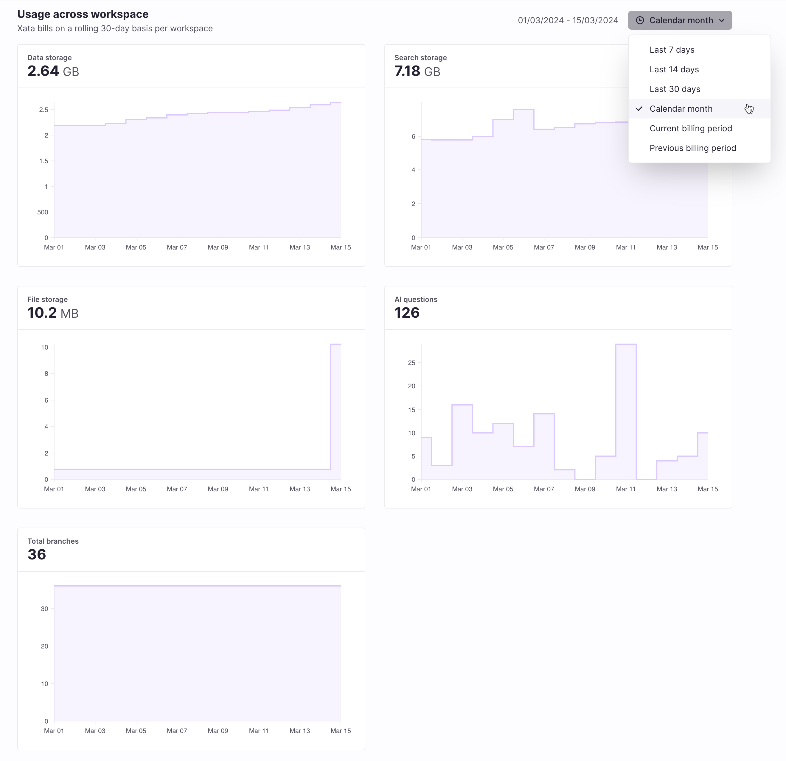
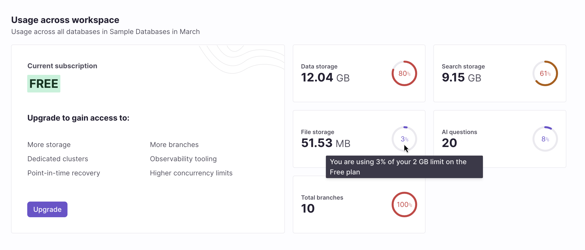

Xata tracks usage of a variety of metrics at the workspace level. Pro plan workspaces include an upgraded experience that allows for more granular monitoring of your usage over time.

The following metrics are tracked:

- Data storage: The storage on disk all databases in your workspace consume.
- Search storage: The storage on disk dedicated to the search and analytics engine. If you don't plan on using it, you may disable the search engine within the **database settings** page.
- File storage: The storage on disk your file attachments consume.
- AI questions: The number of questions asked to the `ask` endpoint. AI questions are an opt-in integration with OpenAI and ChatGPT.
- Total branches: The total number of of database branches in your workspace.

For now, Xata captures metrics usage at the workspace level only.

## Pro plan metrics

[Pro plan](/docs/concepts/pricing#pro-plan) workspaces include a Usage page showing detailed metrics over a variety of time periods.

A higher-level metrics summary is available on the workspace landing page.

## Free plan metrics

[Free plan](/docs/concepts/pricing#free-plan) workspaces highlight the percentage of available [usage limits](/docs/concepts/pricing#pricing-plans) consumed over the current calendar month.

