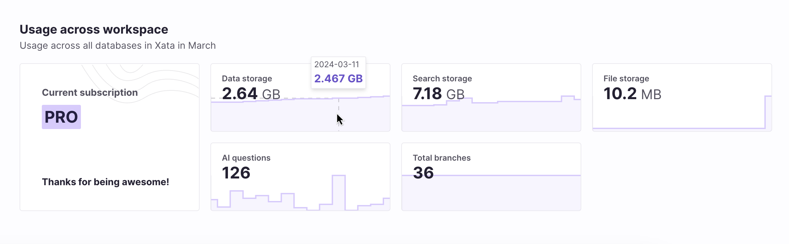

This new feature visualizes your usage of the Xata resources and features available to you at a workspace level.

The following metrics are covered:

- Data storage: The storage on disk all databases in your workspace consume.
- Search storage: The storage on disk dedicated to the search and analytics engine. The search feature can be disabled in your database settings if you don't plan on using it.
- File storage: The storage on disk your file attachments consume.
- AI questions: The number of questions asked to the `ask` endpoint. AI questions are an opt-in integration with OpenAI and ChatGPT.
- Total branches: The total number of of database branches in your workspace.

We are actively working on enhancing this feature by exposing metrics on a database branch. We will also release more metrics in time.

### Pro usage metrics
For our [pro plan](/docs/concepts/pricing#pro-plan) users, Xata provides a Usage page showing detailed metrics over a number of time ranges to choose from. Additionally, we show a higher-level metrics summary for the current calendar month on the workspace landing page.

### Free usage metrics
[Free plan](/docs/concepts/pricing#free-plan) users also receive a summary view on the workspace landing page. This concisely shows the percentage of available [free tier resources](/docs/concepts/pricing#pricing-plans) that have been used in the current calendar month.

