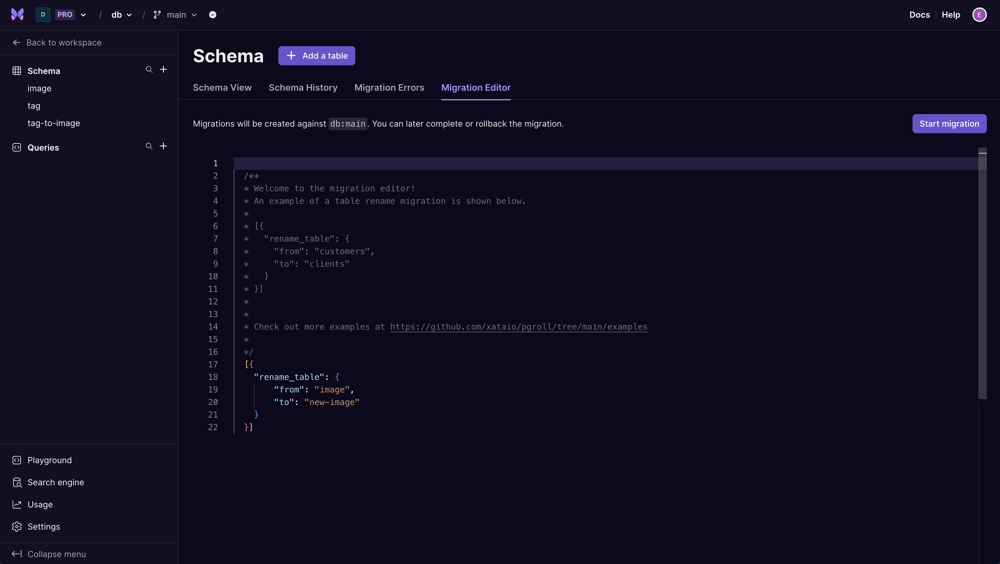

On Posgres enabled branches (beta) support for schema multi-version in the UI is enabled by default. This allows you to have 2 active schemas accessible at the same time - one new and one old. This behaviour is available through the Migration editor.

Like regular Postgres enabled branch migrations, each migration file holds a JSON object containing the migration record, and list of operations. The file structure for beta [Postgres enabled](/docs/postgres) projects utilizes [pgroll](https://github.com/xataio/pgroll) migration formats.

- Schema operations via the table and schema views complete automatically and cannot be rolled back. These migrations require no manual intervention apart from starting.

## Multi Schema Migration Steps

- The following steps only apply to migrations made through the Migration Editor.

A migration's life cycle consists of `start`, `complete`, and `rollback` steps.

### Start

After a migration is started it is considered `active`. During this time, further schema modifications are not possible. This is reflected in disabled buttons and inputs in the UI while a migration is ongoing. While in it’s active state, the submitted migration will be viewable in the Schema History tab.

As more data is added to the table through either the old or the new version of the schema, the ‘other’ column is automatically updated by `pgroll` by the `up` or `down` triggers. Data in each version of the column remains editable.

New columns will be showed side by side other columns in an “exploded” view.

- Migrations that involve or require more than one operation may result in a temporary additional column in the UI prefixed with `*pgroll_new_[columnname]*`. This frequently occurs with alter column operations that change multiple fields. This column will disappear after the schema migration is completed or rolledback.

## Complete

Successfully completed migrations can be viewed under the Schema History tab in the schema view.

If a migration fails, the log and failure reason can be viewed under the Migration Errors tab in the schema view.

## Rollback

Instead of completing a migration, there is also the option to rollback. This is essentially cancelling the migration and is useful if the user finds something wrong with the new schema or backfill. After a rollback, the schema changes from the migration will not be applied.

## Direct SQL Wire Proxy Access

When connecting to your database directly over SQL, you may see up to 3 schemas during a migration. If there is no migration in progress, only 2 schemas will be shown.

There will always be one base schema with all the underlying tables.

There may be a second schema and third schema when a migration is in progress (true?)

If you want to connect to a specific schema, you will need to use search_path parameter. EXAMPLE

## Additional information

- Schema multi-version support is not yet supported with the CLI
