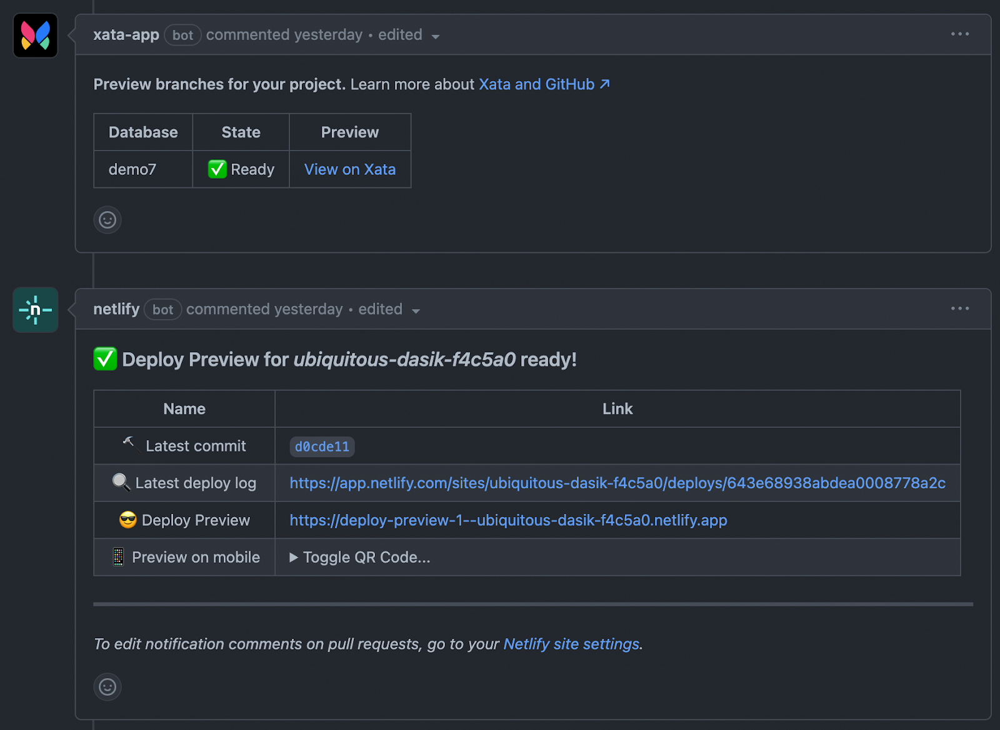

# Netlify

[Netlify](https://https://www.netlify.com/) is a platform for hosting and deploying web applications that offers continuous deployment, build automation, and team collaboration.

Xata provides a first-class integration with Netlify and its [deploy previews](https://www.netlify.com/products/deploy-previews/).

The Xata + Netlify integration simplifies database development and provides an efficient workflow for production databases at scale. Xata offers a single service for all capabilities, accessed through a type-safe SDK, to help teams manage multiple data stores, such as search engines and relational databases.

## Integrating into your front-end developer workflow

Xata automatically creates preview branches for every Netlify deploy preview and integrates directly into your GitHub workflow.

When a pull request is created, a preview branch for your database is also created, containing a copy of the data from your main database. Any changes made will be automatically applied to the main database through migration, after a pull request is merged.

## Using Xata in your front-end application

In just a few steps, you’ll be up and running with this brand new workflow.

1. Install the Xata app for GitHub.
1. Install the Xata integration and plugin for Netlify.
1. Start building with your typical GitHub + Netlify developer workflow.

This walkthrough assumes you have an application using Xata in a GitHub repository and that you have already configured the Netlify site.

### Install the Xata app for GitHub

1. Navigate to the Settings page for your Xata database.
1. Click the GitHub icon and select the repository. The Xata GitHub app listens to commit and pull requests events and reads the migration files stored in the repository.

### Install the Xata - Netlify integration

1. From the Settings page, click **Back to integration list**.
1. Add the listed Netlify integration.
1. Select the Netlify site you wish to connect.

The Xata Netlify integration configures the Xata API key and other required environment variables in your Netlify site, so you won’t have to manually copy & paste settings.

### Install the Xata Netlify plugin

In order to select the correct Xata branch for the deployment previews, Xata uses a Netlify plugin that’s easy to install:

1. In the terminal, enter the following command:
   ```bash
   npm install @xata.io/netlify
   ```
   **Note:** The plugin should not be installed as a `devDependency`. On production, Netlify does not install `devDependencies` in `package.json` and deployments won't use the correct branch.
1. Add the following to the `netlify.toml` file:
   ```bash
   [[plugins]]
   package = "@xata.io/netlify"
   ```

### Create a git branch with schema changes

When working on a new feature that requires schema changes, create a git branch and open a pull request as you normally would. Because you are planning schema changes, also create a new Xata database branch.
Modify the schema via the Xata Schema editor and then pull the schema changes to your repository:

1. Enter the following command to checkout the branch:

   ```bash
   git checkout -b feature1
   ```

1. Pull changes from the branch:

   ```bash
   xata pull feature1
   ```

1. Commit and push changes to GitHub, and open a pull request.

### Preview and test the deploy

The Xata GitHub app reacts to commits and pull requests just like the Netlify app, with comments and status checks:



If you click the **View on Xata** preview link, you’ll see that:

- Xata has created a `preview-feature1` branch just for this deployment preview.
- Xata has automatically copied the data from the main branch to this preview branch.

If you click the Netlify deploy preview link, you will notice that the deploy preview is connected to the Xata preview branch and uses the new schema. This means that the reviewers can modify the data using the preview while testing and they won’t affect the data in production.

The pull request contains the schema changes so you can tag reviewers to merge using your typical GitHub + Netlify workflow.

### Merge the pull request

You can bring your schema changes back to your production database by merging the GitHub pull request.

When a pull request is merged, the Xata GitHub app sees that the Xata migration files have changed from the main branch and migrates the main branch accordingly. Netlify sees the new commits to main and triggers a new build.

Following this procedure, you will have made changes to your database and updated your application without any impact to your production environment or end users.

If you have any questions or feedback about this integration, post in our [Discord channel](https://xata.io/discord)!
