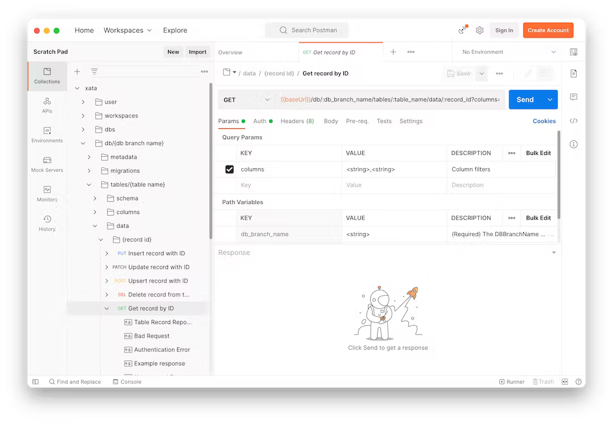
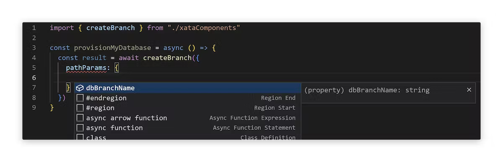

Most Xata API operations occur within the context of a _workspace_, which can be thought of as a "organization" in which all of your databases live. Some things though, are not _part_ of a workspace, but adjacent to workspaces&mdash;like _other workspaces_. Because of this, Xata offers different API hosts depending on your usage contexts. We explain this more in the following sections.

## Core API

The Core API is accessible at the origin `https://api.xata.io` and is responsible for operations on all Xata properties that are not bound to a specific workspace. These include:

- `/user`: Since one user can belong to multiple workspaces, a `user` is not bound to a workspace.
- `/workspaces`: A workspace is equivalent to an organization or team, and cannot be a child of another workspace. Workspaces are top-level entities, so workspaces are managed with the Core API.

Everything else that falls under the context of a workspace is operable with Xata's workspace-bound APIs.

## Workspace API

Bound by the [REST API limits](/rest-api/limits), each workspace in Xata can contain a number of databases and each database can have a number of tables and branches . When interacting with Xata properties within the bounds of a workspace, we use the workspace-level API. This is accessible at a domain that is visible to you in your workspace's management section.


For example, the general form of the database API is:

```text
https://{workspace-display-name}-{workspace-id}.{region}.xata.sh/db/{dbname}
```

An example of this is:

```text
https://my-workspace-123456.us-east-1.xata.sh/db/yourdatabase
```

In the above:

- `{workspace-display-name}` is the display name of the workspace and is used to make identifying the workspace easier. It is ignored by the API.
- `{workspace-id}` is the unique ID of the workspace, currently consisting of 6 alphanumeric characters.
- `{region}` is the region in which the database is hosted. Note that the region can be configured per database, and this value must match the database region configuration.
- `{dbname}` is the name of the database you are interacting with.

You can find your workspace domain by navigating to the **Configuration** tab in the Xata Web UI, or in the **Get Code Snippet** under **Set up Xata Project**.

## OpenAPI specifications

To provide an easy way to use your favorite tools for exploring the Xata API, you can use the [OpenAPI](https://www.openapis.org/) specification:

- [Core API spec](https://xata.io/api/openapi?scope=core)
- [Workspace API spec](https://xata.io/api/openapi?scope=workspace)

## Tool recommendations

The following are tools for API development and management. Insomnia serves as an open-source API client and design platform, enabling developers to send requests, view responses, and document APIs. Postman streamlines API development and testing by simplifying request creation, automating testing, and facilitating collaboration. OpenAPI Codegen automates the generation of client code from OpenAPI specifications. Together, these tools empower developers to design, test, document, and generate code for APIs.

### Insomnia

[Insomnia](https://insomnia.rest/) is a leading open-source API Client, and collaborative API design platform for REST, SOAP, GraphQL, and GRPC.


### Postman

[Postman](https://www.postman.com/) makes API development easy, offering tools to simplify each step of the API building process and streamlines collaboration so you can test APIs faster.



> To authenticate using Postman, select the authorization type `Bearer Token` and paste your Xata API key in the _Token_ section.

### OpenAPI Codegen

With [OpenAPI Codegen](https://github.com/fabien0102/openapi-codegen) you can generate TypeScript fetcher functions or typed react-query hooks from your OpenAPI schema.

> ⚠️ Using generated react-query components in this context will leak your API key! The REST API must always be called in a server-side environment!


