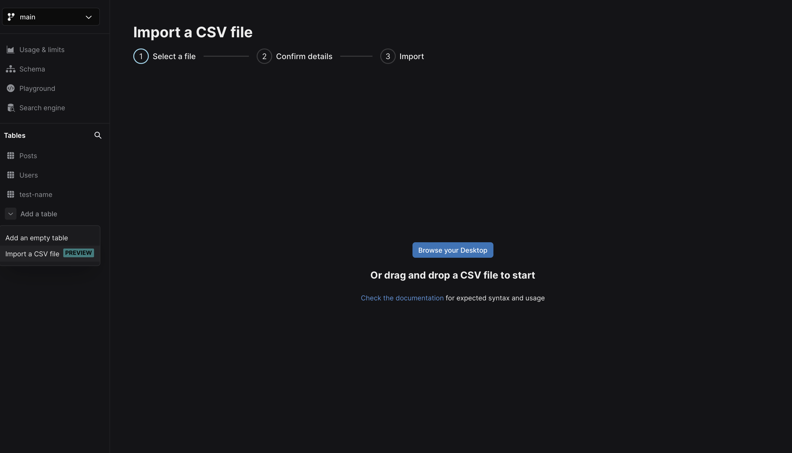
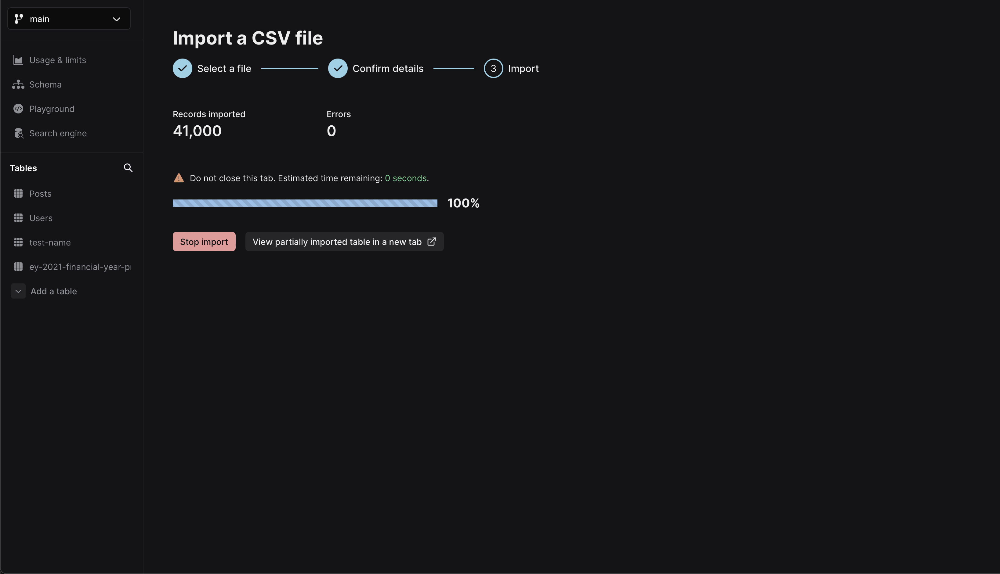
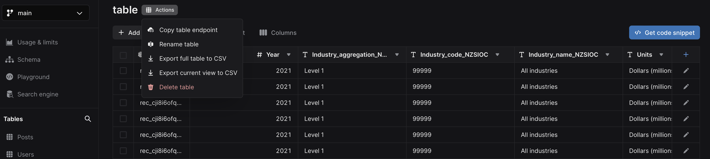

## Overview

A CSV file is a standard text file where data fields are typically divided by commas (,), and saved with the `.csv` extension.
You can import and work with CSV file data in your Xata database.

**NOTE:** While CSV files are explicity mentioned, Xata supports the import of various file formats, including tab-separated values (TSV), comma-separated values (CSV), delimiter-separated values (DSV), and plain text data. This covers a range of extensions including `.tsv`, `.csv`, `.dsv`, and `.txt` formats.

You can import CSVs using the following methods:

- [Import a CSV file using the Xata UI](/docs/csv-data/import-data#import-a-csv-file-using-the-ui) (recommended)
- [Import a CSV file using the Xata CLI](/docs/csv-data/import-data#import-csv-data-with-the-cli)

### Considerations

- Decide if you are using the Xata UI (Workspace) or CLI to import CSV files. Using the UI is the recommended option, but you can use both to edit records after importing.
- Ensure your file's accuracy before importing. Certain values may become uneditable after importing. For errors in the imported file, you'll need to delete the table, edit the CSV file, and try importing again.

## Formatting data

When importing CSV files into Xata, ensure the data aligns with the correct format for the database. You can add additional columns and specify data types after importing data.

### Format types

Choose a format that matches the data you're entering. Xata columns support the following formats:

| Format type   | Description                                                                            | Example formats                                                   |
| ------------- | -------------------------------------------------------------------------------------- | ----------------------------------------------------------------- |
| String        | Text with or without quotes, less than 180 characters.                                 | `"Value"` or `Value`                                              |
| Text          | Text with or without quotes, longer than 180 characters.                               | `"Hello world and welcome to Xata"`                               |
| Integer       | Whole numbers without decimal points                                                   | `42`                                                              |
| Float         | Numbers with decimal points                                                            | `3.14`                                                            |
| Boolean       | Represents true or false values                                                        | `true`                                                            |
| Datetime      | Date and time information. Our CSV importer will attempt to parse all common datetimes | `2023-08-30T00:00:00.000Z` or `26-02-88` or any other date format |
| Link to Table | ID of a record in another table                                                        | `rec_xyz` or `usr_xyz`if using custom IDs                         |
| Email         | Email addresses                                                                        | `user@example.com`                                                |
| Multiple      | Multiple values separated by a comma or a JSON array                                   | `Red,Green` or `["Red", "Green"]`                                 |
| File          | Not supported                                                                          |                                                                   |
| Vector        | Not supported                                                                          |                                                                   |

### Filename formatting

- Ensure that the imported filename/table name is limited to 64 characters or fewer.
- The table name should consist of alphanumeric characters, hyphens (-), and underscores(\_). Special characters are not allowed.

### Column name restrictions

Xata reserves the `xata_` column prefix for special columns such as record id and timestamp metadata. The CSV importer will automatically ignore columns with this naming pattern in CSV files.
While it is possible to create columns named after this prefix and import data into them via the wire protocol, it is strongly advised to avoid this column naming pattern to avoid conflicts with internal Xata handling.

### Column type consistency

Once you define the column type during the initial configuration, it cannot be changed afterward. This ensures data consistency and accuracy within your table. You can add more columns, after importing, if you need to expand your table.

### Delimiter

A delimiter acts as dividers and distinguishes individual data fields within a CSV file. They are useful in structuring the data, allowing for accurate interpretation and parsing.

- The CSV import function has the capability to automatically identify the delimiter used in your CSV file. In case your file follows an uncommon format, you have the option to adjust the delimiter using the Xata UI.
- The CSV import functionality supports common delimiters such as commas `,`, semicolons `;`, quotes `"`, `'`, braces `{`, `}`, pipes `|`, or slashes `/`, `\`. You can modify the delimiter in the UI, when importing the CSV file data.

## Import a CSV file using the UI

Xata offers an import tool directly within your dashboard Workspace. This tool allows you to import exist files into the Xata database without causing any downtime. As an alternative, you also have the option to import CSV data using the CLI; however, it's worth noting that the UI method is the recommended approach.
Importing the CSV file involves establishing a schema and then transferring data. Once imported, the data in the CSV file will be accessible as a table in your database table.

1.  Log in to your Xata account and go to the desired Workspace and database. If you haven't created a Workspace as yet, click **Add a Workspace** to do so.
2.  Choose the preferred branch for your work.
3.  In the left-hand menu under "Tables," click **Add a table** > **Import a CSV file**.
    
4.  Select **Browse Desktop** to choose a supported file to import. Ensure the filename adheres to the formatting recommendations.
5.  The Xata importer can guess column types from your data. If needed, choose a column type from the drop-down list and rename columns. The column type cannot be changed after import. You can edit column names after importing.
6.  Click **Begin import** to initiate the import. You'll have access to partially imported records as the process completes.

<Alert status="warning">
  To ensure all data from the chosen CSV file is imported successfully, keep the tab open until the import process
  finishes.
</Alert>



## Import CSV data with the CLI

The Xata CLI provides the capability to import records from a local CSV file into a Xata database table.

In the CLI, you can find the options relevant to importing records from a CSV file using the command `xata import csv --help`.

The CLI tool can optionally create your table and its [schema](/docs/concepts/data-model#schema), or you can use an already existing table in Xata.

### Import data with an auto-generated schema

You can use the Xata CLI import tool to create a table and schema. After following the [getting started](/docs/getting-started/cli) guide to install and log in with the CLI, create a Workspace, a database and a branch (or use the default `main` branch).

In the following example, assume that the Workspace name is `my_workspace`, the database name is `my_database` and the branch is `main`.

The following is example content for a file which is named `file.csv`:

```csv
name,team,contributions,is_member
Mary,Development,1000,true
```

To ingest the content of this file, run the following command:

```shell
xata import csv file.csv --create --table my_first_table
```

The interactive menu will allow you to select the Workspace, database, and branch in which the table `my_first_table` will be created:

```shell
? Select a workspace ›
❯   my_workspace - my-workspace-123456

? Select a database ›
❯   my_database

? Select a branch ›
❯   main
```

The CLI provides the number of rows that were processed and notifies you that processing has completed:

```shell
1 rows processed
Finished
```

By running the CLI command `xata schema dump` and selecting the same workspace, database and branch, you will retrieve the schema which was automatically generated by Xata for the table. This is done by Xata figuring out the appropriate column types based on the shape of your values. The columns `name` and `team` are created as `string`, while the `contributions` column is identified as `int` and the `is_member` column is created as `bool`.

```shell
xata schema dump
✔ Select a workspace › my_workspace
✔ Select a database › my_database
✔ Select a branch › main
{
  "tables": [
    {
      "name": "my_first_table",
      "columns": [
        {
          "name": "name",
          "type": "string"
        },
        {
          "name": "team",
          "type": "string"
        },
        {
          "name": "contributions",
          "type": "int"
        },
        {
          "name": "isMember",
          "type": "bool"
        }
      ]
    }
  ]
}
```

Now that you have a table, you can continue inserting more records to it, following the same schema without using the create option:

```shell
xata import csv another_file.csv --table my_first_table
```

### Import data with an explicitly defined schema

It's also possible to instruct the CLI to create specific column types with the combination of `--columns` and `--types` arguments, in the order they appear in the CSV file.

Using the following command you could, for example, instead create the `team` column as a `text` field instead of `string`:

```shell
xata import csv file.csv --create --table my_second_table --columns=name,team,contributions,is_member --types=string,text,int,bool
```

For more details on the available column types, you can refer to the [Data Model](/docs/concepts/data-model#column-types) page.

You can verify the resulting schema for this table in the output of `xata schema dump`.
It is also possible to skip importing certain columns from your CSV file, by not specifying them in the columns option.

In case your CSV file also contains an `id` column, such as:

```csv
id,name,team,contributions,is_member
user1,Mary,Development,1000,true
```

Then the CSV import will automatically use this column to set record IDs, instead of leaving it to Xata to autogenerate them.
In our example, since you are explicitly defining the column names and types to be used in Xata, you'll include the `id` column of `string` type in the import command's parameters:

```shell
xata import csv my.csv --create --table my_second_table --columns=id,name,team,contributions,is_member --types=string,string,text,int,bool
```

With this method, each record's unique ID will be set using the `id` column from our CSV file. You should ensure that the id values are unique in the CSV file, otherwise the rows with the same id will be overwritten in the order they are read from the file.

To link records across tables, specify the `link` column type. The name of the column must match the name of an existing table and the column's values must exist as record IDs in the linked table.

```shell
xata import csv my.csv --create --table my_second_table --columns=id,my_first_table --types=string,link
```

### Tips for working with CSV files

- Xata continues to enrich the Xata CLI with new features and improvements so make sure you [install](/docs/getting-started/cli) the latest version.
- As different solutions often make their own choices and conventions, it may be possible that a CSV export from another database or tool requires some processing and adjustments to work with the Xata CLI.
- Check the help output `xata import csv --help` for the list of available options (configurable batch size, custom delimiter and more).
- If you have any questions, don't hesitate to [reach out to us](https://support.xata.io/hc/en-us/requests/new)!

## Export data

To download your table as a `.csv` file, click **Action** next to your table name:



You can choose to download your table from the drop-down list.

There are two options for downloading a CSV file:

### Export full table to CSV

This action generates a CSV file of all rows contained within your table. This is valuable for generating backups, transferring data to alternative systems, or importing data into another Xata table.

### Export current view to CSV

This action generates a CSV file that copies your present table view, including all filters, columns, and sorting preferences. This is particularly useful for data sharing purposes or importing a specific subset of rows into a spreadsheet for analysis.
