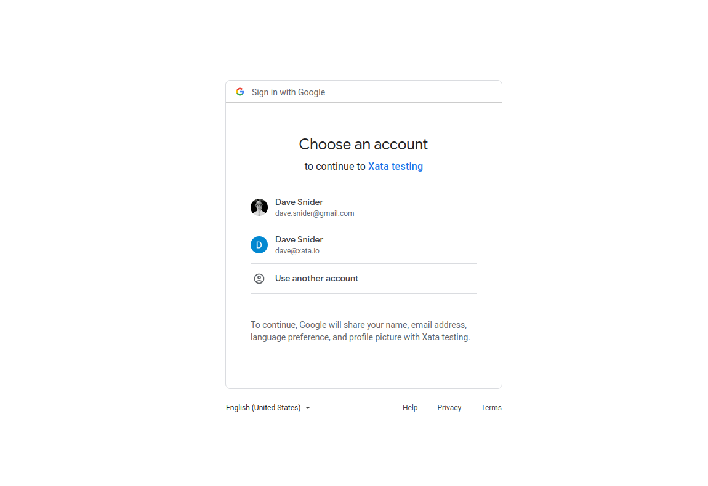

[Auth JS][0] (also known as Next Auth) is a popular open-source library to provide login support to Javascript based applications. It works within the OAuth specification to provide easy to use social login for popular providers like Google, GitHub, Facebook, and others. Xata provides an official adapter that works with Next Auth to allow you to map these logins to a user table within a Xata database.

## Set up a new project using the Auth JS example

For the benefit of this tutorial we're going to use the official [Auth JS example][1] and modify it to work with the Xata adapter. This should provide a basic understanding of how the two systems work together, which you can later modify to apply to your own application. First, create a new application using the template Next Auth provides.

```bash
git clone https://github.com/nextauthjs/next-auth-example.git
```

## Install and configure the Xata adapter

Navigate to wherever you cloned the example and add the `@next-auth/xata-adapter` to your application.

```bash
cd ~/path/to/next-auth-example
npm install @next-auth/xata-adapter
```

If you haven't already, make sure you have the Xata CLI installed and have authenticated yourself.

```bash
# Install the xata cli
npm install -g @xata.io/cli

# Authenticate yourself with Xata
xata auth login
```

At this point we're ready to create the database we'll use to map against our social logins. To do this quickly, make a new `schema.json` file in the root of your application (though it can be anywhere you want) with the following content.

```json
{
  "tables": [
    {
      "name": "nextauth_users",
      "columns": [
        {
          "name": "email",
          "type": "email"
        },
        {
          "name": "emailVerified",
          "type": "datetime"
        },
        {
          "name": "name",
          "type": "string"
        },
        {
          "name": "image",
          "type": "string"
        }
      ]
    },
    {
      "name": "nextauth_accounts",
      "columns": [
        {
          "name": "user",
          "type": "link",
          "link": {
            "table": "nextauth_users"
          }
        },
        {
          "name": "type",
          "type": "string"
        },
        {
          "name": "provider",
          "type": "string"
        },
        {
          "name": "providerAccountId",
          "type": "string"
        },
        {
          "name": "refresh_token",
          "type": "string"
        },
        {
          "name": "access_token",
          "type": "string"
        },
        {
          "name": "expires_at",
          "type": "int"
        },
        {
          "name": "token_type",
          "type": "string"
        },
        {
          "name": "scope",
          "type": "string"
        },
        {
          "name": "id_token",
          "type": "text"
        },
        {
          "name": "session_state",
          "type": "string"
        }
      ]
    },
    {
      "name": "nextauth_verificationTokens",
      "columns": [
        {
          "name": "identifier",
          "type": "string"
        },
        {
          "name": "token",
          "type": "string"
        },
        {
          "name": "expires",
          "type": "datetime"
        }
      ]
    },
    {
      "name": "nextauth_users_accounts",
      "columns": [
        {
          "name": "user",
          "type": "link",
          "link": {
            "table": "nextauth_users"
          }
        },
        {
          "name": "account",
          "type": "link",
          "link": {
            "table": "nextauth_accounts"
          }
        }
      ]
    },
    {
      "name": "nextauth_users_sessions",
      "columns": [
        {
          "name": "user",
          "type": "link",
          "link": {
            "table": "nextauth_users"
          }
        },
        {
          "name": "session",
          "type": "link",
          "link": {
            "table": "nextauth_sessions"
          }
        }
      ]
    },
    {
      "name": "nextauth_sessions",
      "columns": [
        {
          "name": "sessionToken",
          "type": "string"
        },
        {
          "name": "expires",
          "type": "datetime"
        },
        {
          "name": "user",
          "type": "link",
          "link": {
            "table": "nextauth_users"
          }
        }
      ]
    }
  ]
}
```

Next we'll use the Xata CLI to initialize a new project, creating a database with the above schema for a `nextauth_users` table. The CLI will walk you through a setup process where you choose a workspace and an appropriate database. Going with the defaults is OK here. We do recommend using a fresh database for this, as we'll augment it with tables that Auth JS needs.

```bash
xata init --schema=./path/to/your/schema.json
```

Going to the [Xata web application][1] you should see your new, empty database and table. At this point we now need to set up the API routes to talk to the Xata client. Since this is a Next.js application, we'll do that by adding a new file called `/pages/api/auth/[...nextauth].ts` with the following content.

```tsx
import NextAuth from 'next-auth';
import GoogleProvider from 'next-auth/providers/google';
import { XataAdapter } from '@next-auth/xata-adapter';
// When you ran `xata init` it created a `src/xata.ts` that exports the client
import { XataClient } from '../../../src/xata';
const client = new XataClient();

export default NextAuth({
  adapter: XataAdapter(client),
  providers: [
    // Auth JS provides many providers, but we'll only use Google for this demo
    GoogleProvider({
      clientId: process.env.GOOGLE_ID,
      clientSecret: process.env.GOOGLE_SECRET
    })
  ]
});
```

## Set up your env keys

You may have noticed in the last code block that we'll need some environment keys for google to make this all work. The [Auth JS example][1] repository recommends copying their `.env.local.example` file to `.env.local`. When we ran `xata init` in this repository we also set up a `.env` file that contains our `XATA_API_KEY`. To make this easy, let's just continue to use the `.env` file. These are the only settings we need.

```sh
XATA_API_KEY=#your_xata_key_here

NEXTAUTH_URL=http://localhost:3000
# Generate a key with https://generate-secret.now.sh/32
NEXTAUTH_SECRET=#your_generated_key

GOOGLE_ID=#your_google_oath_client_id
GOOGLE_SECRET=#your_google_oath_secret
```

If this is your first time working with the Google OAuth client you may be wondering where to get these keys. Head over to https://console.developers.google.com/apis/credentials

1. Create or select an existing project
2. Click `OAuth Client ID` from the dropdown
3. Make sure your `Authorized redirect URIs` include `http://localhost:3000/api/auth/callback/google` (or whichever port you'll be on)
4. On completion, make sure to snag the `Client ID` and `Client Secret`
5. Paste these values into the `.env` file we set up earlier


## Test the application

At this point we have everything set up and can run the application.

```bash
npm run dev
```

This should bring up the Auth JS example site. Clicking the sign in button should allow us to log in with our google account and return us back to the homepage.




## Verify the Xata database contains a user reference

The [Xata web application][2] should now show a new record in the `nextauth_users` table. At this point we can tie the user to other content within our database. Consult the [Auth JS][0] docs for more configuration options. You can set up social and email logins for just about anything.


[0]: https://next-auth.js.org/
[1]: https://github.com/nextauthjs/next-auth-example
[2]: https://app.xata.io
