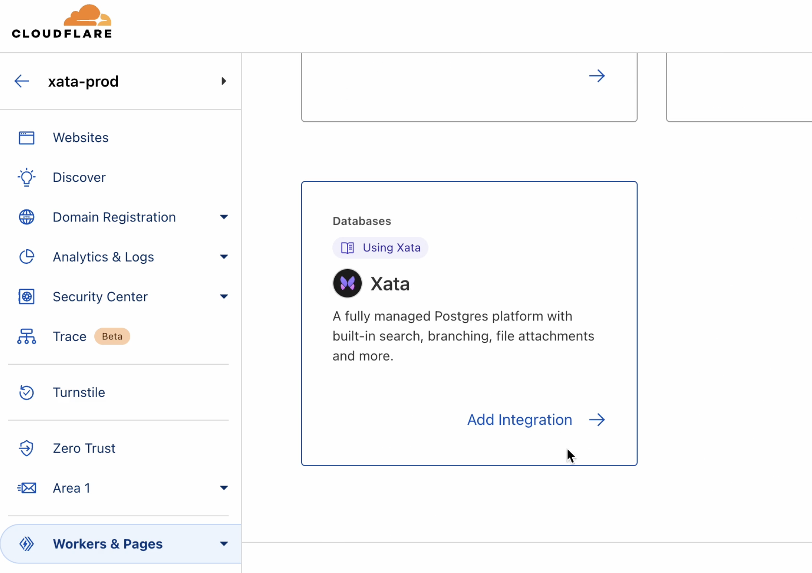
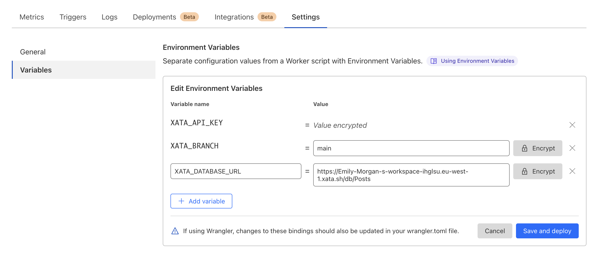

[Cloudflare](https://www.cloudflare.com/en-gb/) is a content delivery and security service that optimizes website performance and mitigates security risks for sites. [Cloudflare Workers](https://workers.cloudflare.com/) enable you to run code directly on Cloudflare's global network to reduce latency and improve performance and can be used for tasks like customizing web content, handling API requests, and modifying web traffic, for overall faster response times.

The completed [Cloudflare and Xata code](https://github.com/xataio/examples/tree/main/apps/getting-started-cloudflare-workers) is available in the [Xata `examples` repo](https://github.com/xataio/examples) on GitHub.

### Before you begin

- Ensure you [install the Xata CLI and authenticate](https://xata.io/docs/getting-started/installation)

- Ensure you have a [basic project with Cloudflare workers running](https://xata.io/docs/integrations/cloudflare#create-a-new-cloudflare-app-optional)

### Install the Xata client

Run the following command in the root directory of your project:

```sh
xata init
```

Accept the default settings during the configuration process. After completion, a `.env` file will be generated in your app's folder. This file includes the necessary credentials for your Cloudflare Worker to access your database. Add the following credentials to your `.env` file:

```bash title=".env"
XATA_API_KEY=<YOUR_API_KEY_HERE>
XATA_BRANCH=<YOUR_BRANCH_HERE>
```

A file called `.xatarc` should also be generated at the project root, with the following contents:

```base title=".xatarc"
{
  "databaseURL": <YOUR_DATABASE_URL_HERE>,
  "codegen": {
    "output": "src/xata.ts"
  }
}
```

> **Warning**: You'll need to move these vars into a file called `.dev.vars` at your project root for local development. This file enables Cloudflare to access these values when running in development mode. For more information, see their [documentation](https://developers.cloudflare.com/workers/configuration/environment-variables/#interact-with-environment-variables-locally).

You should end up with a `.dev.vars` file that looks like this:

```bash title=".dev.vars"
XATA_API_KEY=<YOUR_API_KEY_HERE>
XATA_BRANCH=<YOUR_BRANCH_HERE>
XATA_DATABASE_URL=<YOUR_DATABASE_URL_HERE>
```

### Initialize Xata client

There are two methods for initializing the Xata client in Cloudflare Workers:

- ES modules syntax (recommended): This is the current, recommended method for apps that are being developed or maintained actively.
- Service workers syntax (deprecated): This older method is still available but not recommended for new projects.

#### ES modules syntax (recommended)

```ts title="src/index.ts"
import { XataClient } from './xata';

export interface Env {
  XATA_BRANCH: string;
  XATA_API_KEY: string;
  XATA_DATABASE_URL: string;
}

export default {
  async fetch(request: Request, env: Env, ctx: ExecutionContext): Promise<Response> {
    const xata = new XataClient({
      apiKey: env.XATA_API_KEY,
      branch: env.XATA_BRANCH,
      databaseURL: env.XATA_DATABASE_URL
    });
    // Note that the table name "Posts" may vary
    // depending on the shape of your schema
    const posts = await xata.db.Posts.getAll();
    return new Response(`Total Posts: ${posts.length}`);
  }
};
```

#### Service workers syntax (deprecated)

```ts title="src/index.ts"
import { XataClient } from './xata';

async function handler(request: Request) {
  const xata = new XataClient({
    apiKey: XATA_API_KEY,
    branch: XATA_BRANCH,
    databaseURL: XATA_DATABASE_URL
  });
  // Note that the table name "Posts" may vary
  // depending on the shape of your schema
  const posts = await xata.db.Posts.getAll();
  return new Response(`Total Posts: ${posts.length}`);
}

// Initialize Worker
addEventListener('fetch', (event) => {
  event.respondWith(handler(event.request));
});
```

### Remote environment variables

To make The environment variables accessible in your Worker when it is deployed remotely, you have the following options:

- Use the one-click guided workflow provided in the Cloudflare dashboard (recommended).
- Alternatively, you can set the variables manually via the Cloudflare dashboard.

#### One click guided workflow (recommended)

Going through this flow automatically sets the environment variables necessary to interact with your database from a remote Cloudflare worker.

1.  Navigate to the Cloudflare dashboard.
2.  Click **Workers & Pages**.
3.  Navigate to your corresponding Worker.
4.  Click **Integrations**
5.  Select Xata.



Your endpoint response should be available remotely at `<YOUR_WORKER>.<YOUR_SUBDOMAIN>.workers.dev.`

#### Manually adding environment variables

Follow [Cloudflare's docs](https://developers.cloudflare.com/workers/configuration/environment-variables/#add-environment-variables-via-the-dashboard) for manually adding environment variables via the dashboard.



### Create a new Cloudflare app (optional)

<Expand title="Hello world example">

Choose the "Hello World" Worker example and accept the default prompt options.

```sh
npm create cloudflare@latest getting-started-cloudflare-workers
```

After the command has completed, navigate to the `getting-started-cloudflare-workers` directory, and run the application locally:

```sh
cd getting-started-cloudflare-workers
npm run wrangler dev
```

By default, the application runs on `http://localhost:8787`, where "Hello World" is displayed in your browser.

### Deploy your app remotely

```sh
npx wrangler deploy
```

Preview your Worker at `<YOUR_WORKER>.<YOUR_SUBDOMAIN>.workers.dev`, where "Hello World" is displayed in the browser.

</Expand>
