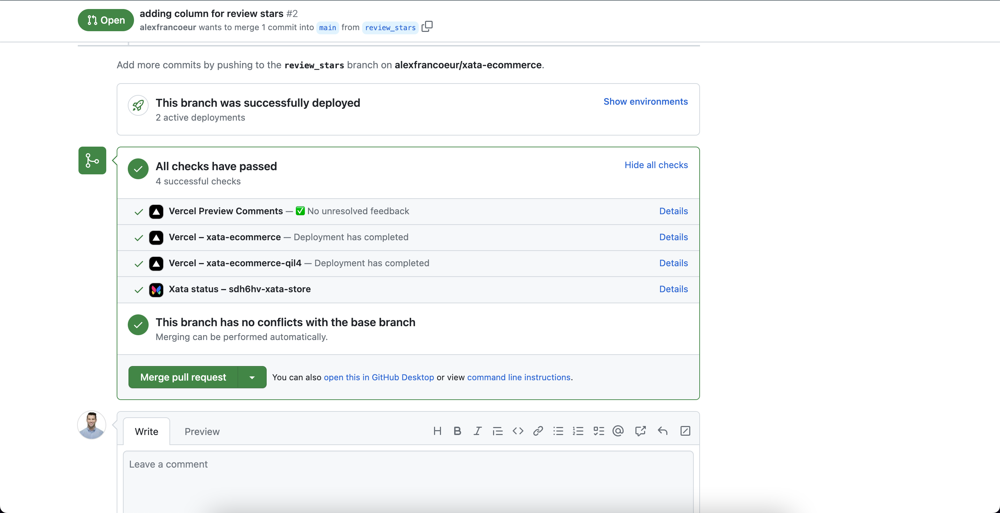

# Vercel

Vercel transforms application development for modern developers with efficient workflows through preview deployments.

Xata, using [preview branches](https://xata.io/docs/getting-started/workflow), a [Vercel integration](https://vercel.com/integrations/xata), and an [application for GitHub](https://github.com/apps/xata-app), completes the Vercel workflow by pairing each pull request and Vercel preview with a preview branch of the production database.

## Working Xata and Vercel

The following is an example workflow for adding a star rating to each product review in an e-commerce application.

To get started using example workflow, ensure you [sign up](https://app.xata.io/signin) and follow the [step-by-step](https://xata.io/docs/getting-started/workflow) instructions to install the GitHub and Vercel integrations.

### Create branches for local development

Start by creating a branch for local development. The `xata branch create my_feature` creates a new branch off of the `main` database in Xata.

1. Enter the following commands to checkout a new branch for reviews:
   ```bash
   git checkout -b review_stars
   xata branch create review_stars
   ```
1. Add a new column called `review_rating` for new review ratings:

   ```bash
   xata pull review_stars
   ```

   `xata pull` pulls the changes locally, along with a ledger and migration file, to ensure the branch stays in sync with any changes made to `main`. This mirrors typical Git workflows.

   

### Create a pull request with your changes

1. Add changes and commit your changes to the branch:
   ```bash
    git add .
    git commit -m 'add rating column to db'
   ```
1. Push the changes up to your remote branch and create a pull request:

   ```bash
   git push --set-upstream origin review_stars
   ```

   When the pull request is created, you’ll see a comment with the current state of your preview branch along with the Vercel comment.

   

   Each preview branch will be automatically populated with data from `main`. In this example, the preview branch includes an empty column for `review_ratings`. With the integration with Vercel, every preview automatically uses the preview branch from Xata. This provides a secure and isolated environment to iterate and ship with every pull request.

### Merge the pull request to main

You don't have to worry about migrating any changes. Xata will perform a number of checks with each commit to ensure your pull request does not have any migration errors. In case errors are detected, Xata will provide a comment with details and block the merging of the pull request until the migration failures have been addressed.

On merge, Xata will migrate the schema changes from the preview branch into the `main` database with zero downtime. The preview branch will automatically be deleted along with the Vercel preview deployment.



Without any changes to your current workflow, you’ve added in an isolated database branch for each preview deployment.
