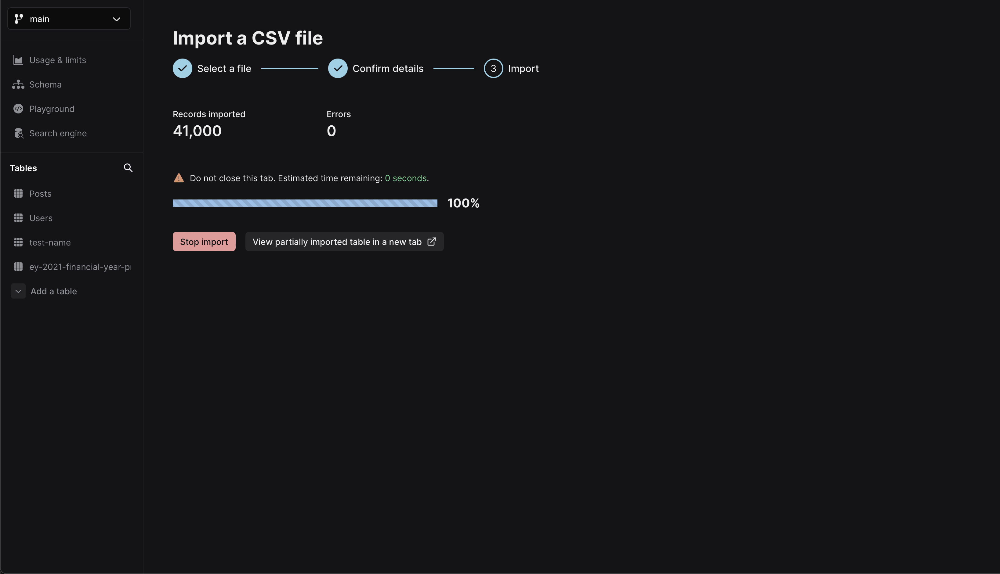

## Overview

A CSV file is a standard text file where data fields are typically divided by commas (,), and saved with the `.csv` extension.
You can import and work with CSV file data in your Xata database.

**NOTE:** While CSV files are explicity mentioned, Xata supports the import of various file formats, including tab-separated values (TSV), comma-separated values (CSV), delimiter-separated values (DSV), and plain text data. This covers a range of extensions including `.tsv`, `.csv`, `.dsv`, and `.txt` formats.

You can import CSVs using the following methods:

- [Import a CSV file using the Xata UI](/docs/csv-data/import-data#import-a-csv-file-using-the-ui) (recommended)
- [Import a CSV file using the Xata CLI](/docs/csv-data/import-data-cli)

### Considerations

- Decide if you are using the Xata UI (Workspace) or CLI to import CSV files. Using the UI is the recommended option, but you can use both to edit records after importing.
- Ensure your file's accuracy before importing. Certain values may become uneditable after importing. For errors in the imported file, you'll need to delete the table, edit the CSV file, and try importing again.

## Formatting data

When importing CSV files into Xata, ensure the data aligns with the correct format for the database. You can add additional columns and specify data types after importing data.

### Format types

Choose a format that matches the data you're entering. Xata columns support the following formats:

| Format type   | Description                                                                            | Example formats                                                   |
| ------------- | -------------------------------------------------------------------------------------- | ----------------------------------------------------------------- |
| String        | Text with or without quotes, less than 180 characters.                                 | `"Value"` or `Value`                                              |
| Text          | Text with or without quotes, longer than 180 characters.                               | `"Hello world and welcome to Xata"`                               |
| Integer       | Whole numbers without decimal points                                                   | `42`                                                              |
| Float         | Numbers with decimal points                                                            | `3.14`                                                            |
| Boolean       | Represents true or false values                                                        | `true`                                                            |
| Datetime      | Date and time information. Our CSV importer will attempt to parse all common datetimes | `2023-08-30T00:00:00.000Z` or `26-02-88` or any other date format |
| Link to Table | ID of a record in another table                                                        | `rec_xyz` or `usr_xyz`if using custom IDs                         |
| Email         | Email addresses                                                                        | `user@example.com`                                                |
| Multiple      | Multiple values seperated by a comma or a JSON array                                   | `Red,Green` or `["Red", "Green"]`                                 |
| File          | Not supported                                                                          |                                                                   |
| Vector        | Not supported                                                                          |                                                                   |

### Filename formatting

- Ensure that the imported filename/table name is limited to 64 characters or fewer.
- The table name should consist of alphanumeric characters, hyphens (-), and underscores(\_). Special characters are not allowed.

### Column type consistency

Once you define the column type during the initial configuration, it cannot be changed afterward. This ensures data consistency and accuracy within your table. You can add more columns, after importing, if you need to expand your table.

### Delimiter

A delimiter acts as dividers and distinguishes individual data fields within a CSV file. They are useful in structuring the data, allowing for accurate interpretation and parsing.

- The CSV import function has the capability to automatically identify the delimiter used in your CSV file. In case your file follows an uncommon format, you have the option to adjust the delimiter using the Xata UI.
- The CSV import functionality supports common delimiters such as commas `,`, semicolons `;`, quotes `"`, `'`, braces `{`, `}`, pipes `|`, or slashes `/`, `\`. You can modify the delimiter in the UI, when importing the CSV file data.

## Import a CSV file using the UI

Xata offers an import tool directly within your dashboard Workspace. This tool allows you to import exist files into the Xata database without causing any downtime. As an alternative, you also have the option to import CSV data using the CLI; however, it's worth noting that the UI method is the recommended approach.
Importing the CSV file involves establishing a schema and then transferring data. Once imported, the data in the CSV file will be accessible as a table in your database table.

1.  Log in to your Xata account and go to the desired Workspace and database. If you haven't created a Workspace as yet, click **Add a Workspace** to do so.
2.  Choose the preferred branch for your work.
3.  In the left-hand menu under "Tables," click **Add a table** > **Import a CSV file**.
    
4.  Select **Browse Desktop** to choose a supported file to import. Ensure the filename adheres to the formatting recommendations.
5.  The Xata importer can guess column types from your data. If needed, choose a column type from the drop-down list and rename columns. The column type cannot be changed after import. You can edit column names after importing.
6.  Click **Begin import** to initiate the import. You'll have access to partially imported records as the process completes.

<Alert status="warning">
  To ensure all data from the chosen CSV file is imported successfully, keep the tab open until the import process
  finishes.
</Alert>

