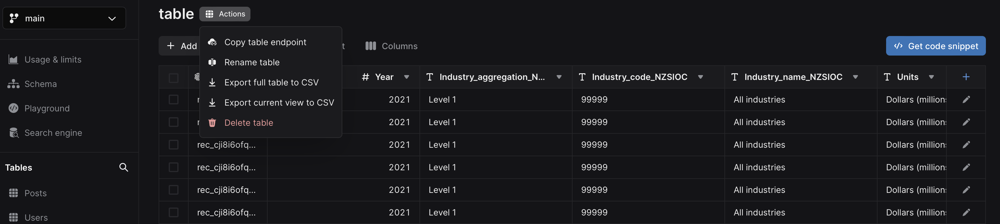

## Export data

To download your table as a `.csv` file, click **Action** next to your table name:

You can choose to download your table from the drop-down list.

There are two options for downloading a CSV file:

### **Export full table to CSV**

This action facilitates the export of all rows contained within your table. This is valuable for generating backups, transferring data to alternative systems, or seamlessly importing data into another Xata table.

### **Export current view to CSV**

This action generates a CSV file that copies your present table view, inluding all filters, columns, and sorting preferences. This is particularly useful for data sharing purposes or importing a specific subset of rows into a spreadsheet for analysis.
