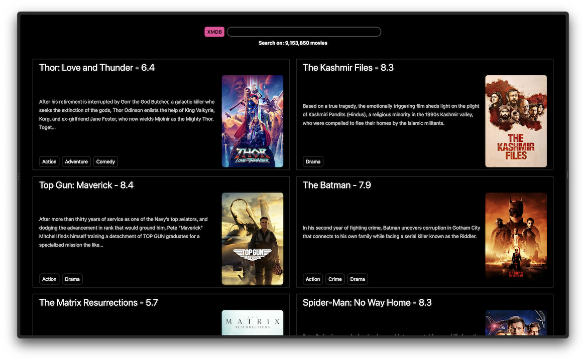

[XMDb](https://xmdb.vercel.app/) is a movie database application built Xata.

The [XMDb example](https://github.com/xataio/xmdb) highlights the remarkable scalability of Xata in handling large databases. By using XMDb, users can easily search for films by entering keywords or search terms, and the application presents a list of movies ranked by relevancy. This search functionality demonstrates how Xata excels in efficiently managing and supporting extensive databases in real-world scenarios. It showcases Xata's ability to handle vast amounts of data, ensuring optimal performance, and providing users with an enhanced experience.

## Stack

- [Zod](https://zod.dev) - TypeScript-first runtime validation library for schema validation.
- [Xata client](https://xata.io/docs/getting-started/cli)- Object-relational mapping (ORM) with the SDK to handle data manipulation, querying, and other database-related tasks.
- [Vercel/OG](https://vercel.com/docs/concepts/functions/edge-functions/og-image-generation#using-@vercel/o) - Open Graph (OG) image generation.
- [TailwindCSS](https://tailwindcss.com) - Utility-first CSS framework for style.
- [React icons](https://react-icons-kit.vercel.app) - SVG icons as React components.

## Features

- [Typo-tolerant, fuzzy search](/docs/sdk/search)
- [Aggregations](/docs/sdk/aggregate)
- [Type-safe SDK/ORM](/docs/sdk/typescript/overview) (schema-based types generation)
- Edge-ready

## Links

- [Explore the app](https://xata.io/chatgpt)
- [View the source code](https://github.com/xataio/xmdb)
