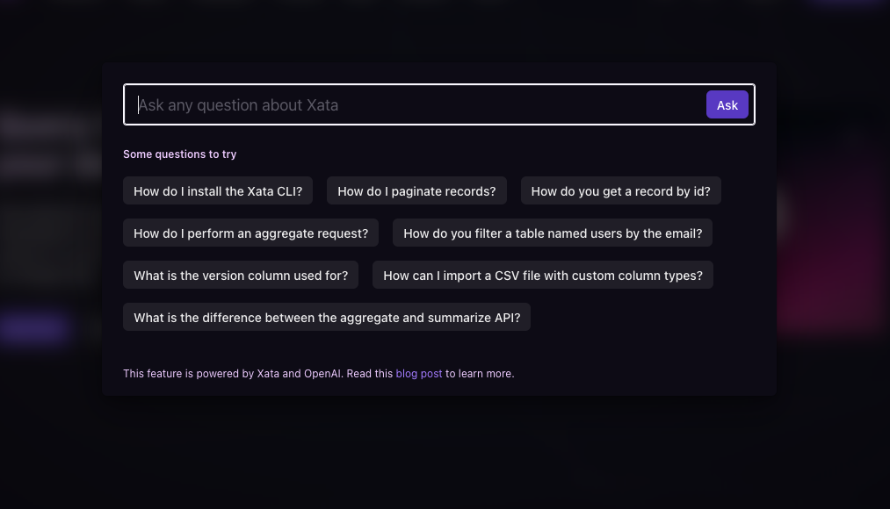

[Xata ChatGPT](https://xata.io/chatgpt) helps you easily build a Q&A bot to answer questions in your website, application, documentation or knowledge base.

- [Explore the app](https://xata.io/chatgpt)
- [View the source code](https://github.com/xataio/examples/tree/main/apps/sample-chatgpt)

## Stack

|                                                                               |                                                                            |
| ----------------------------------------------------------------------------- | -------------------------------------------------------------------------- |
| [xata-sample-chatgpt](https://github.com/xataio/examples/apps/sample-chatgpt) | The core repository for the sample ChatGPT application.                    |
| [Node.js](https://nodejs.org/en) and [npm](https://www.npmjs.com/)            | The runtime and package manager used to run JavaScript-based applications. |
| [Xata client library](https://xata.io/docs/getting-started/cli)               | A library for interacting with the Xata.io database.                       |

## Features

- **[Data aggregation](/docs/sdk/aggregate):** Consolidate data from various sources or groups to get a comprehensive view and make insightful analyses.
- **[Search functionality](/docs/sdk/search):** Locate specific data points in large datasets.
- **[Typo-tolerant, fuzzy search](/docs/sdk/search):** Search that's forgiving of minor typos, ensuring users find what they're looking for even with slight mistakes.

## More information

- [Ask AI docs](https://xata.io/docs/sdk/ask)
