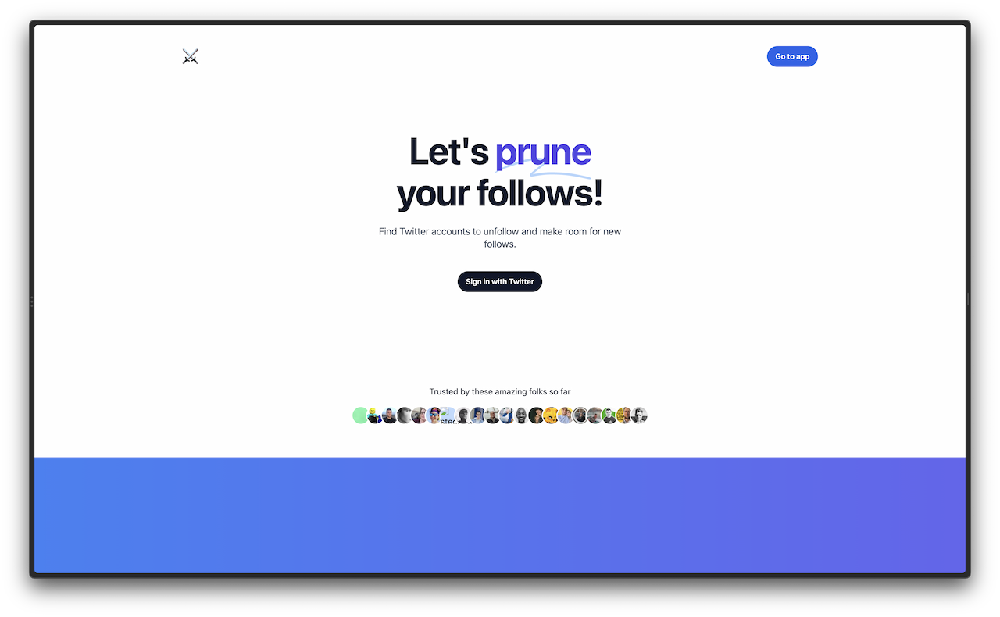

PruneYourFollows is a web app and was built Xata using GatsbyJS, NextAuth and Tailwind to let you find accounts on Twitter to unfollow. It uses Xata's search capabilities to find accounts that you follow that are inactive or stale and lets you unfollow them in bulk.

This app was contributed by [Lilly Labs](https://lillylabs.no/).

- [Visit the App](https://pruneyourfollows.com) to explore, or
- [View the Source Code](https://github.com/queen-raae/prune-your-follows) to learn.
