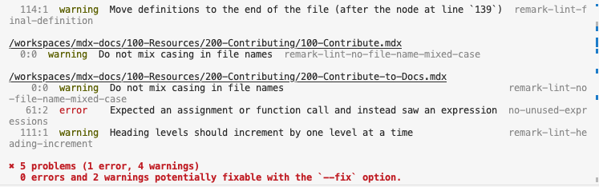
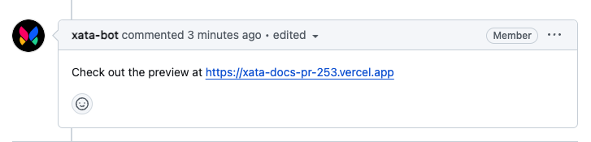

This guide is for anyone interested in improving existing Xata documentation or creating new information.

Xata's developer documentation follows a [docs-as-code](https://www.writethedocs.org/guide/docs-as-code/) approach, where documentation is crafted using tools similar to code development. To contribute, you can suggest changes by forking the documentation GitHub repositories and creating pull requests (PRs). This collaborative process allows for open contributions, testing, and review of the documentation.

<Alert status="info">
  The documentation site is hosted on Vercel and uses MDX syntax. It also employs various linters, including ES linter,
  Prettier, and Remark, to maintain code quality and consistency in the content. Basic Git and Markdown knowledge is
  assumed when working with this project.
</Alert>

## Submit a docs pull request

1.  **Fork repository:** Fork the [`mdx-docs`](https://github.com/xataio/mdx-docs) repository on GitHub to create your copy.
2.  **Clone repository:** Clone your forked repository to your local machine using Git. Navigate to the cloned `mdx-docs` repository and add the upstream repository as a remote using `git remote add upstream <upstream-repo-url>`.
3.  (_Optional_) **Install linter:** Run `pnpm install` to lint your code and align with style standards. If this is not done your pull request will fail some checks.
4.  **Create branch:** Create a new branch for your changes using `git checkout -b <my-docs-update>`. You can create any branch name, but including the issue number or a brief description is recommended.
5.  **Edit documentation:** Make necessary changes to documentation files, considering Markdown and MDX syntax.
6.  **Commit changes:** Add and commit your changes using `git add .` and `git commit -m "Update documentation"` with an informative commit message.
7.  **Push to fork:** Push changes to your forked repository with `git push origin my-docs-update`.
8.  **Create pull request:** Visit the `mdx-docs` repository on GitHub, and create a new pull request from your branch.
9.  **Provide details:** Add a clear title and description for your PR, explaining the purpose of your changes.
10. **Submit PR:** Submit the pull request, and it will be reviewed by the Xata Docs team.
11. **Collaborate:** Collaborate during the review process, make requested changes, and work towards PR approval.
12. **Approval and merge:** Once your PR meets all requirements and is approved by the team, it will be merged into the main branch, and your changes will become part of the official Xata documentation.

## Linting

Linting rules are enforced to ensure consistency and readability across the codebase. The documentation uses [ESLint](https://eslint.org/), [Prettier](https://prettier.io/docs/en/integrating-with-linters.html), and [Remark](https://www.npmjs.com/package/remark-lint) for linting. These tools are essential for keeping the code clean and consistent.

When you commit changes or create a pull request, linting is automatically applied. You can optionally run `pnpm install` in your local development environment. This step allows you to install and configure all necessary linting packages, allowing for real-time linting error detection.

### Apply the linter

You can optionally apply the linter by navigating to the root directory of the `mdx-docs` repository and running `pnpm install`.

### Troubleshoot linting

To fix issues from linting, review the error message that references the specific line number of the error. Examine the code or documentation related to the error and ensure the syntax and usage align with coding and documentation standards. If the error persists, contact us in [Discord](https://xata.io/discord) or use community resources for guidance.

After adding and committing code changes, the linter may identify errors. For instance, in the following example, an error is found on **line 62**, along with four additional warnings.

To resolve the issue, go to **line 62** in your code, correct the error, then add, commit, and push the changes to create a pull request.

## Build preview

After your pull request clears all checks, Vercel creates a build preview. The Xatabot then adds a link to this preview in your pull request. To review the changes you've made, click on the link, navigate to the **Docs** tab, and search for the page you've updated.

### Preview changes in Visual Studio Code

You can write documentation using [Visual Studio Code](https://code.visualstudio.com/) (VS Code) or any text editor of your choice. If you choose to use VS Code, it includes a built-in Markdown previewer that allows you to view your changes locally.

To access the Markdown Preview in Visual Studio Code, follow these steps:

Open the Markdown file you want to preview. Select from the following methods based on your operating system:

- **Mac OS:** Press **⌘** + **Shift** + **P**.
- **Linux:** Press **Ctrl** + **Shift** + **P**
- **Windows:** Press **Ctrl** + **Shift** + **P**

Type "Markdown Preview" and select **Markdown: Open Preview** from the list that appears. Click the **Open Preview** icon located in the top right corner of the editor title bar or right-click the Markdown file and select **Open Preview** from the context menu.

## Style guide

The style guide provides guidance on formatting and writing for Xata documentation. It focuses on visual presentation as well as addresses language, emphasizing clear, concise, and plain language.

### MDX syntax

Refer to the [docs repository](https://github.com/xataio/mdx-docs?tab=readme-ov-file) for guidance on how to create and format documents using MDX (Markdown Extended) for Xata's documentation. It covers some of the aspects of using frontmatter, structuring your documents effectively, and incorporating unique elements specific to MDX.

### Writing

The following section offers guidance on writing in our technical documentation. We follow common language rules found in standard [technical documentation style guides](https://github.com/MicrosoftDocs/microsoft-style-guide/tree/main).

#### Language and style

Use [American English spelling](https://www.merriam-webster.com/) is used consistently in the text. American English grammar is used consistently in the text. Refrain from using slang, idioms, phrasal verbs, or non-English words in the text.

#### Titles

When creating titles, use sentence case and maintain consistent styling for all titles and headings. Titles should prioritize user tasks rather than features and be descriptive yet concise. Aim for titles with 3-10 words, not exceeding 50 characters. For procedural headings, start with an action verb such, for example "Use," "Import", and "Install."

#### Date formats

Follow advice of "Month day, year" for date formats, for example, January 1, 2023.

#### Acronyms and abbreviations

Expand acronyms on first use. More common acronyms that may be general knowledge do not need to be expanded

#### Admonitions

Admonitions serve as cues to direct the reader's attention towards specific information. It's advisable to use admonitions sparingly and avoid clustering multiple admonitions closely together. If you find the need for multiple admonitions, consider reorganizing the content by integrating less critical points into the main narrative.

Here are the accepted types of admonitions forr Xata documentation:

- **Info:** This provides extra guidance or advice to enhance product setup, performance, or supportability. It conveys advisory details crucial for task completion, and users should pay close attention.

- **Warning:** This communicates potential risks such as system damage, data loss, or support-related issues if the reader ignores the admonition. It includes an explanation of the problem, its cause, and a viable solution. If possible, it offers preventive measures or directs users to additional resources.

- **Danger:** This suggests alternative approaches that may not be immediately apparent. It simplifies the application of described techniques and procedures, catering to specific requirements. While beneficial for users' understanding of the product's capabilities, it's not essential for product usage.

### Accessibility

##### Use clear and simple language

- **Avoid jargon:** Use plain language and define technical terms when they are first used.

- **Short sentences:** Keep sentences short and to the point to enhance readability. See the following example:

  - ❌ To initialize a PostgreSQL database, it is cruicial that one executes the `initdb` command, which establishes the necessary environment by creating the primary directory structure, generating the configuration files, and populating the database with the initial catalog.

  - ✅ To set up a PostgreSQL database, use the `initdb` command. This command creates the main directories, makes configuration files, and adds the starting catalog to the database.

##### Use structured and logical organization

- **Logical flow:** Organize content in a logical sequence, making it easier to follow.
- **Headings and subheadings:** Use descriptive headings and subheadings to break text into manageable sections, but do not make them too long.

##### Format text correctly

- **Bullet points and lists:** Use bullet points or numbered lists for step-by-step instructions or to highlight important points.

##### Include alternative text for media

- **Descriptive alt text:** Provide alternative text for images, diagrams, and videos to describe what the image represents, especially if it contains important information.

##### Inclusive and diverse representation

- **Avoid bias:** Be mindful of cultural diversity and inclusivity in language and examples.
